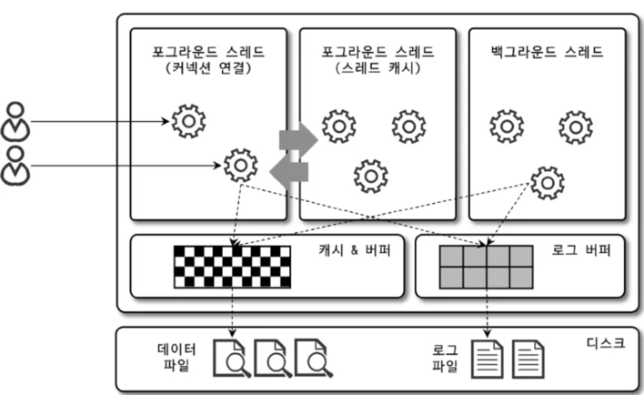
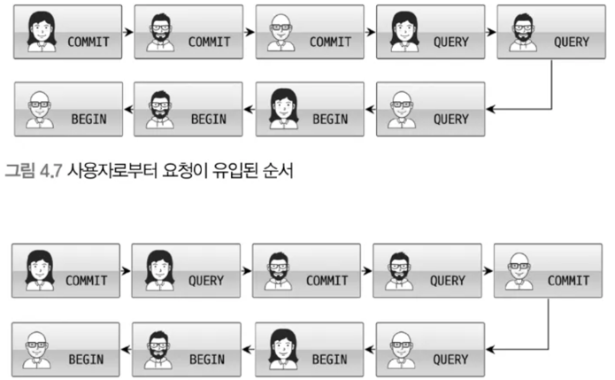

머리 - MySQL 엔진

손발 - 스토리지 엔진

# 🌟 MySQL 아키텍처 🌟


### MySQL 엔진

- 커넥션 핸들러 : 클라이언트로부터의 접속 요청 처리
- SQL 파서 & 전처리기 : 쿼리 요청 처리
- 옵티마이저 : 쿼리 최적화

### 스토리지 엔진

|  | **MyISAM** | **InnoDB** |
| --- | --- | --- |
| 특징 | 지원하는 기능이 많지 않아, 구조가 단순함 | 지원하는 기능이 많아 구조가 복잡하고, 자원을 많이 사용함 |
| 기능 지원 | Full-text 인덱싱 가능 | 인덱싱(Full-text 인덱싱 포함), 외래키, 제약조건, 동시성제어, 트랜잭션 지원 |
| Lock 단위 | Table level-lock | Row level-lock |
| 복구 능력 | 나쁨 | 좋음 |

> MySQL 서버는 다른 DBMS에 비해 구조가 상당히 독특하다. 사용자 입장에서 보면 거의 차이가 느껴지지 않지만 이러한 독특한 구조 때문에 다른 DBMS에선 가질 수 없는 엄청난 혜택을 누릴 수 있으며, 반대로 다른 DBMS에선 문제되지 않을 것들이 가끔 문제가 되기도한다.
> 

<aside>

>❓
Q. 어떤 식으로 다르길래 다른 DBMS에선 가질 수 없는 엄청난 혜택이 있는거지? 그리고 어떤 문제점이 있을까 ?
<br>A.<br> <h3>**MySQL만의 독특한 구조**</h3>1. **스토리지 엔진 플러그인 구조**<br>
    - MySQL 서버(Optimizer, Parser, Query Cache 등)와 실제 데이터를 다루는 스토리지 엔진(InnoDB, MyISAM, Memory 등)이 분리되어 있음.<br>
    - 즉, **하나의 서버에서 여러 엔진을 선택해 쓸 수 있음**. <br>
    (예: 트랜잭션이 필요한 건 InnoDB, 빠른 읽기 전용은 MyISAM, 임시 계산은 Memory 엔진)<br>
    - 다른 DBMS(Oracle, PostgreSQL 등)는 보통 하나의 스토리지 엔진만 제공 <br>
    → 선택권이 없음.<br>2. **엔진 간 기능 차이**<br>
    - 각 엔진이 같은 SQL을 처리하지만 내부 구현이 다름.<br>
        예) 외래키, 트랜잭션, 락킹 전략, 인덱스 구조(B-Tree vs Hash 등)가 엔진마다 다르게 동작.<br>3. **서버 계층과 엔진 계층의 유연한 역할 분담**<br>
    - SQL 파싱, 최적화, 캐시 등은 서버 계층에서 담당.<br>
    - 실제 데이터 저장/읽기는 엔진에서 담당.<br>
    - 이 덕분에 엔진을 교체해도 SQL 문법이나 클라이언트 라이브러리를 바꿀 필요가 없음.<br><hr><h3> 🌟 장점 (다른 DBMS에선 없는 혜택)</h3><br>1. **스토리지 엔진 교체 가능**<br>
    - 같은 MySQL 서버에서 InnoDB ↔ MyISAM을 바꾸면, 트랜잭션 지원/비지원 환경을 손쉽게 전환할 수 있음.<br>
    - 메모리 엔진으로 초고속 임시 테이블 만들고, InnoDB로는 중요한 데이터를 관리하는 식으로 혼합 가능.<br><br>2. **특정 목적에 최적화된 엔진 활용**<br>
    - 예: 로그성 데이터는 Archive 엔진, 지리 데이터는 Spatial 인덱스 지원하는 엔진 활용 가능.<br>
    - PostgreSQL이나 Oracle은 기본 엔진만 제공하므로 이런 자유도가 없음.<br>3. **확장성/실험성**<br>
    - 개발자가 직접 스토리지 엔진을 만들어 플러그인처럼 붙일 수 있음.<br>
    - 연구용, 특수 목적 DB 구축에 매우 유리.<br><hr> <h3> ⚠️ 단점 (다른 DBMS에선 문제 안 되는데 MySQL에서 생김)</h3>1. **엔진별 기능 불일치**<br>
    - InnoDB는 외래키 지원하지만 MyISAM은 안 됨.<br>
    - 트랜잭션, 락킹, 인덱스 등 기능이 엔진마다 달라서, 같은 SQL도 엔진에 따라 결과/동작이 다를 수 있음.<br><br>2. **일관성 관리 복잡**<br>
    - 서로 다른 엔진을 조합해서 쓰면 트랜잭션 일관성이 깨질 수 있음. (예: InnoDB+MyISAM 혼용 → MyISAM은 트랜잭션 롤백 불가)<br>3. **최적화기의 한계**<br>
    - 옵티마이저는 엔진 내부 구조를 완벽히 알지 못하기 때문에, 특정 엔진에서는 비효율적인 실행계획이 만들어질 수 있음.<br>4. **운영 상의 혼란**<br>
    - DBA나 개발자가 "이 테이블은 InnoDB인지, MyISAM인지" 알아야 함.<br>
    - 엔진 특성을 모르면 장애 상황에서 원인 파악이 힘듦. (예: InnoDB는 크래시 리커버리 되지만 MyISAM은 수동 복구 필요)<br>
</aside>

---

### 핸들러 api

핸들러 요청 : mysql 엔진의 쿼리 실행기에서 데이터를 쓰거나 읽어야 할 때는 write나 read를 각 스토리지 엔진에 요청한다. → 여기서 사용되는 api를 핸들러 api.

---

## MySQL 스레딩 구조



mysql 서버는 프로세스 기반이 아닌 스레드 기반으로 작동한다.

크게 foreground 스레드와 background 스레드로 구분한다.

실행중인 스레드의 목록은 performance_schema 데이터베이스의 threads 테이블을 통해 확인한다.

`SELECT thread_id, name, type, processlist_user, processlist_host FROM performance_schema ORDER BY type, thread_id;`

간혹 동일한 이름의 스레드가 2개 이상 보이는 것은 mysql 서버 설정에 따라 스레드들이 동일 작업을 병렬로 처리하는 경우다.

Sql 조회 해보면 processlist_host에 null이 아닌 localhost로 보이는 1개의 스레드가 보인다. 이는 실제 사용자의 요청을 처리하는 foreground 스레드다.

> 스레드 풀과 스레드 모델의 가장 큰 차이점<br>
→ “포그라운드 스레드와 커넥션의 관계”<br>
스레드 모델에선 커넥션별로 포그라운드 스레드가 하나씩 생성되고 할당된다.<br>
하지만, 스레드 풀에서는 커넥션과 포그라운드 스레드는 1:1 관계가 아니라 1개의 스레드가 M개의 커넥션 요청을 전담한다. (1:M 관계)
> 

---

### 포그라운드 스레드 (클라이언트 스레드)

MySQL 서버에 접속된 클라이언트의 수만큼 존재하며, 각 클라이언트가 요청하는 쿼리를 처리한다.

클라이언트가 작업을 마치고 커넥션을 종료하면 스레드 캐시로 되돌아간다.

이때 스레드 캐시에 대기중인 스레드가 일정 개수 이상이라면, 포그라운드 스레드는 스레드 캐시에 넣지 않고 종료된다.

포그라운드 스레드는 데이터를 데이터 버퍼나 캐시에서 가져오는데, 여기에 없는 경우 디스크 데이터나 인덱스 파일을 읽어 작업을 처리한다.

`MyISAM` 테이블은 디스크 쓰기 작업까지 `포그라운드 스레드` 가 처리하지만, `InnoDB` 테이블은 데이터 버퍼와 캐시까지만 처리하고, 그 이외에는 `백그라운드 스레드` 가 처리한다.

---

### 백그라운드 스레드

`MyISAM` 의 경우는 해당사항이 없고, `InnoDB` 는 다음과 같이 여러가지 작업이 백그라운드로 처리된다.

1. Insert buffer를 병합하는 스레드
2. 로그를 디스크로 기록하는 스레드 → Log 스레드
3. InnoDB 버퍼 풀의 데이터를 디스크에 기록하는 스레드 → write 스레드
4. 데이터를 버퍼로 읽어 오는 스레드
5. 잠금이나 데드락을 모니터링하는 스레드

여기서 더욱 중요한 것은 2, 3번이다.

MySQL 5.5버전부턴 write 스레드와 read 스레드의 개수를 2개 이상 지정할 수 있게 되었다.

`innodb_write_io_threads`, `innodb_read_id_threads` 시스템 변수로 스레드의 개수를 설정한다.

`InnoDB`에서도 읽기 작업은 포그라운드 스레드 에서 처리되기 때문에 많이 설정할 필요가 없다.
하지만 쓰기 작업은 아주 많은 작업을 백그라운드 로 처리하기 때문에, 일반적인 디스크를 사용할 때는 2~4 정도, DAS, SAN 같은 스토리지의 경우는 최적값을 찾아 설정하는것이 좋다.

---

### 메모리 할당 및 사용 구조


MySQL 에서 사용되는 메모리 공간은 크게 `글로벌 메모리 영역` 과 `로컬 메모리 영역` 으로 구분할 수 있다.

`글로벌 메모리 영역` 은 MySQL 서버가 시작되면서 운영체제로 부터 할당된다.

운영체제의 종류에 따라 메모리 관리 방법이 다를 수 있어, 사용되는 정확한 메모리 양을 측정하는것은 쉽지 않다.

→ MySQL의 시스템 변수로 설정해 둔 만큼 OS로부터 메모리를 할당받는다.고 생각하는게 좋다.

---

### 글로벌 메모리 영역

일반적으로, `클라이언트 스레드(포그라운드 스레드)` 의 수와 무관하게 하나만 할당됩니다.

필요에 따라 2개 이상이 할당될 수도 있지만, 생성된 글로벌 영역은 모든 스레드에게 공유됩니다.

대표적인 글로벌 메모리 영역은 아래와 같습니다.

- 테이블 캐시
- InnoDB 버퍼 풀
- InnoDB 어댑티브 해시 인덱스
- InnoDB 리두 로그 버퍼

---

### 로컬 메모리 영역

`세션 메모리 영역` 이라고도 부르며, `클라이언트 스레드` 가 쿼리를 처리하는데 사용하는 영역입니다.

대표적으로 위 그림의 **커넥션 버퍼**와 **정렬 버퍼**등이 있습니다.

`로컬 메모리 영역` 은 각 `클라이언트 스레드` 별로 독립적으로 할당됩니다.

중요한 특징은 각 쿼리의 용도로 필요할 때만 공간이 할당되고, 필요하지 않을때는 아예 할당되지 않을 수도 있습니다.

위에서 말한 **커넥션 버퍼**와 **정렬 버퍼**등이 이에 해당합니다.

그리고 세션(클라이언트와 MySQL 서버와의 커넥션)이 살아있는 동안 계속 할당된 채로 유지되는 공간도 있고, 쿼리를 실행하는 순간에만 할당되는 공간도 있고(커넥션 버퍼나 결과 버퍼), 그렇지 않고 쿼리를 실행하는 순간에만 할당헀다가 다시 해제하는 공간(소트 버퍼나 조인버퍼)도 있습니다.

대표적인 `로컬 메모리 영역` 은 아래와 같습니다.

- 정렬 버퍼
- 조인 버퍼
- 바이너리 로그 캐시
- 네트워크 버퍼

---

### **플러그인 스토리지 엔진 모델**

mysql의 독특한 구조 중 대표적인 “플러그인 모델”


스토리지 엔진, 검색어 파서, 인증 등등의 기능이 모두 플러그인 형태로 존재합니다.

이 중에서 스토리지 엔진을 살펴보면, 이미 MySQL 에서는 기본적으로 여러 스토리지 엔진을 제공합니다.

그러나 필요에 따라 직접 개발한 엔진을 사용할 수도 있습니다.

여기서 플러그인 모델의 장점이 드러납니다.

쿼리가 실행되는 과정에서 거의 대부분의 작업은 MySQL 엔진이 수행하고, **`데이터 읽기/쓰기`**작업만 스토리지 엔진이 수행합니다.

여기서 새로운 스토리지 엔진을 사용하더라도, 전체 기능에는 영향을 주지 않고 **`데이터 읽기/쓰기`**작업에만 영향을 주게 됩니다.

객체지향에서 `Interface`를 만들고 그 구현체를 바꿔끼우는것과 유사합니다.

> 사람이 핸들(운전대)을 이용해 자동차를 운전하듯이, 프로그래밍 언어에선 어떤 기능을 호출하기 위해 사용하는 운전대와 같은 역할을 하는 객체를 “핸들러”라고 한다.
MySQL 서버에서 MySQL 엔진은 “사람”역할을 하고 각 스토리지 엔진은 “자동차“ 역할을 하는데, MySQL 엔진이 스토리지 엔진을 조정하기 위해 핸들러라는 것을 사용하게 된다.
> 

→ MySQL 엔진이 각 스토리지 엔진에게 데이터를 read, 저장하도록 명령하면 반드시 “핸들러”를 통해야 한다.

→ 하나의 쿼리 작업은 여러 하위 작업으로 나뉘고, 각 하위 작업이 MySQL 엔진 영역에서 처리되는지 아니면 스토리지 엔진영역에서 처리되는지 구분할 줄 알아야한다.

---

### 🔥*컴포넌트* 🔥

MySQL 8.0부터는 기존의 플러그인 모델(플러그인 아키텍처)를 대체하기 위해서, 컴포넌트 아키텍처가 지원됩니다.

`컴포넌트 아키텍처`는 다음과 같은 `플러그인 모델` 의 단점을 개선하여 구현되었습니다.

- MySQL 서버와만 상호작용하고, 플러그인 간 통신 x
- MySQL 서버의 변수나 함수를 직접 호출(캡슐화 안됨)
- 플러그인간 상호 의존 관계 설정을 할 수 없어서, 초기화가 어려움

---

### 쿼리 실행 구조

쿼리를 실행하는 관점에서 표현한 mysql 구조


---

### 쿼리 파서

- 쿼리 문장을 MySQL 이 인식할 수 있는 최소 단위인 `토큰` 으로 만들고, 이를 바탕으로 파스 트리(신텍스 트리, Syntax Tree)를 생성합니다.
- 이 과정에서 쿼리 문장의 기본 문법 오류를 검출해 내고, 사용자에게 오류를 전달합니다.

### 전처리기

- 파서 과정에서 만들어진 쿼리 문장에 구조적인 문제점이 있는지 확인
- 테이블 이름, 칼럼 이름, 내장함수 이름 및 매개변수, 접근 권한 등을 확인하여 존재하지 않거나 권한 밖인지를 확인

### 옵티마이저

- 저렴한 비용(어떻게 하면 쿼리 문장을 리소스를 적게 사용하면서)으로 가장 빠르게 처리할지를 결정
- 보통 옵티마이저가 알아서 방법을 선택하지만, 사용자가 더 나은 선택을 하도록 유도할수도 있습니다. 
(MySQL Hint)

### 실행 엔진

- 옵티마이저가 사람의 “두뇌”에 해당, 실행 엔진과 핸들러는 “손,발”에 해당합니다.
- 아래는 옵티마이저가 `GROUP BY`를 처리하기 위해 임시 테이블을 사용하기로 결정했다는 가정 하의 시나리오 입니다.
    1. 실행 엔진이 핸들러에게 임시 테이블을 만들라고 요청
    2. 다시 실행 엔진은 `where` 절에 일치하는 레코드를 읽어오라고 핸들러에게 요청
    3. 읽어온 레코드들을 1번에서 준비한 임시 테이블로 저장하라고 다시 핸들러에게 요청
    4. 데이터가 준비된 임시 테이블에서 필요한 방식으로 데이터를 읽어 오라고 핸들러에게 다시 요청
    5. 최종적으로 실행 엔진은 결과를 사용자나 다른 모듈로 넘김

### 핸들러(스토리지 엔진)

- 핸들러는 읽어오는 역할 담당 = 스토리지 엔진

---

### 복제(Replication)

2대 이상의 DBMS 를 나눠서 데이터를 저장하는 방식입니다.

복제를 사용하기 위해서는 최소한 `Master`, `Slave` 를 구성해야합니다.

- Master : 데이터 변경 요청시 바이너리 로그(Binarylog)를 생성하여 Slave 서버로 전달합니다.
    - 데이터 변경 요청(Insert, Update, Delete)을 주로 처리합니다.
- Slave : 전달받은 바이너리 로그를 데이터로 반영합니다.
    - 데이터 읽기 요청을 주로 처리합니다,

복제를 사용하는 목적은 다음과 같습니다.

- 요청 부하 분산 : 변경 요청, 읽기 요청 분리
- 백업 데이터 : 서버에 장애가 발생했을 경우, 백업 데이터로 활용

참고 : [MySQL Replication - 단방향 이중화](https://server-talk.tistory.com/240)

---

### 쿼리 캐시

빠른 응답속도를 위해 쿼리 실행결과를 캐싱하는 기능입니다.
이전에 실행되었던 쿼리가 실행되면, 테이블을 읽지 않고 캐시를 읽어서 응답하여 매우 빠른 응답속도를 제공합니다.

그러나 캐시된 데이터의 실데이터에 변경이 발생할 경우, 관련 데이터를 모두 삭제(Invalidate)처리 해야합니다.
이 작업이 심각한 동시 처리 성능 저하를 일으키며, 또한 많은 버그의 원인이 되었다고 합니다.

그래서 MySQL 8.0부터는 쿼리 캐시 기능은 MySQL 서버에서 완전히 제거되었다고 합니다.

---

### 스레드 풀

사용자의 요청을 처리하는 스레드 개수를 줄여서 동시 처리되는 요청이 많다 하더라도 MySQL 서버의 CPU가 제한된 개수의 스레드 처리에만 집중할 수 있게 해서 서버의 자원 소모를 줄이는 것이 목적이다.

즉, `스레드 풀`이란 일정량을 스레드를 미리 생성해놓고, 스레드가 필요할때 미리 생성된 스레드를 제공하는 방식입니다. 이러한 방식을 사용하는 이유는 요청마다 스레드를 생성하는 경우 오버헤드가 많이 발생하기 때문에 이를 줄이기 위함입니다.

- 발생하는 오버헤드
    - 스레드 생성, 제거 비용
    - 컨텍스트 스위칭
    - 스레드 스케줄링 비용

MySQL Server Enterprise 에서는 `스레드 풀`을 제공하지만, Community 에서는 제공하지 않습니다.

그래서 Percona Server 에서 제공하는 `스레드 풀` 기능을 기준으로 기술하였습니다.

> Percona Server 란 ?
Percona 에서 만든 오픈 소스 MySQL 배포판입니다.
여기는 MySQL Enterprise 에서만 사용할 수 있는 다양한 확장성, 가용성, 보안 및 백업 기능이 포함되어있습니다.
> 

MySQL Enterprise 에는 스레드 풀이 내장되어있지만, Percona Server는 플러그인 형태로 작동하게 구현되어있습니다.

Percona Server 의 스레드 풀은 기본적으로 CPU 코어 개수만큼 스레드를 생성하여 사용합니다.

(thread_pool_size 시스템 변수를 변경하여 조정할 수 있음)

만약 모든 스레드가 작업중이라면, 스레드 풀은 새로운 스레드를 생성할지 기존 스레드의 종료를 기다릴지 판단해야합니다.

이때 스레드 풀의 타이머는 주기적으로 스레드들의 상태를 체크해서 일정 시간 이상 종료되는 스레드가 없으면 새로운 스레드를 생성합니다.

(이 시간은 thread_pool_stall_limit 시스템 변수로 설정할 수 있음)

하지만 `*`최대로 설정된 수(thread_pool_max_threads)이상으로 스레드를 생성할수는 없습니다.

Percona Server 의 스레드 풀은 선순위 큐와 후순위 큐를 이용해 특정 트랜잭션이나 쿼리를 우선적으로 처리할 수 있는 기능을 제공합니다.

먼저 시작된 트랜잭션 내의 쿼리를 우선적으로 처리하여, 잠금이 빨리 해제되고 경합을 낮춰서 전체 성능 향상을 도모합니다.

다음 그림은 선순위 큐와 후순위 큐를 이용해 재배치한 작업의 순서입니다.



(`*`로 처리된 부분) 시스템 변수에 설정된 개수는 무엇을 기준으로 하고 몇 개가 되는 것일까 ?

“시스템 변수에 설정된 개수”는 크게 두 가지로 나눠서 이해해야 합니다.

### 1. `thread_pool_size` (풀 그룹 수)

- 기본적으로 **CPU 코어 개수**를 기준으로 설정됩니다.
- 즉, Percona Server의 스레드 풀은 **CPU 코어 1개 ↔ 스레드 풀 그룹 1개**를 매핑하는 것이 원칙이에요.
- 각 스레드 풀 그룹은 자기 전용의 **작업 큐(선순위/후순위 큐)**를 가지고, **적은 수(보통 1~N개)의 워커 스레드**만을 운영합니다.
- 기본값:
    - `thread_pool_size = CPU 코어 개수`
    - 단, **최대 64개 그룹**까지만 가능 (코어가 128개여도 그룹은 64개까지만 생성됨).

👉 그래서 서버가 8코어라면 보통 `thread_pool_size=8`이고, 16코어라면 `thread_pool_size=16`이 기본

---

### 2. `thread_pool_max_threads` (각 풀 그룹당 최대 워커 스레드 수)

- 풀 그룹 하나당 생성할 수 있는 **최대 워커 스레드 개수**를 제한합니다.
- 즉, 모든 스레드가 바쁘더라도 이 값 이상으로는 스레드가 늘어나지 않습니다.
- 기본값: `500` (각 그룹당 500개 스레드)
- 공식 문서에서는 보통 **CPU 코어 수 × 2~4** 정도로 맞추는 걸 권장합니다.
    
    (너무 크게 두면 스레드 풀의 의미가 퇴색하고, 너무 작으면 대기 시간이 길어짐)
    

---

### 3. 동작 방식 예시

- 서버에 CPU 코어가 8개 → `thread_pool_size=8` (풀 그룹 8개)
- 각 풀 그룹은 처음에 워커 스레드 1개만 가짐
- 요청이 몰리면 `thread_pool_stall_limit` 시간 동안 대기 후, 여전히 풀 그룹 내 워커가 부족하면 새로운 워커 스레드 생성
- 단, 풀 그룹당 워커 스레드 수는 **`thread_pool_max_threads` 이하**까지만 늘어남
- 전체 서버 차원에서는
    
    **최대 스레드 수 = thread_pool_size × thread_pool_max_threads**
    

---

### 4. 요약

- **기준:** `thread_pool_size`는 CPU 코어 개수 기반, `thread_pool_max_threads`는 튜닝값
- **몇 개인가?**
    - 기본적으로 코어 수(최대 64)만큼 풀 그룹이 만들어지고,
    - 각 그룹당 최대 `thread_pool_max_threads` 개수만큼 스레드가 늘어날 수 있음
    - 즉, 최대 스레드 수 = `thread_pool_size × thread_pool_max_threads`

---

👉  그래서 몇 개 일까 ?

- **thread_pool_size** = "풀 그룹 개수 = 보통 CPU 코어 개수"
- **thread_pool_max_threads** = "풀 그룹당 최대 스레드 수"
- 따라서 최대로 생성되는 스레드 수는 두 변수를 곱한 값으로 제한된다고 보면 됩니다.

---

📖 참고

- Percona Server Thread Pool Docs(https://docs.percona.com/percona-server/8.0/thread-pool.html)
- MySQL Enterprise Thread Pool(https://dev.mysql.com/doc/refman/8.0/en/thread-pool.html)

---

### 트랜잭션 지원 메타 데이터

데이터 딕셔너리 || 메타 데이터 : db 서버에서 테이블의 구조 정보와 스토어드 프로그램 등의 정보

MySQL 5.7 까지는 테이블 구조를 FRM 파일에 저장하고 일부 스토어드 프로그램도 파일 기반으로 관리했습니다.

그러나 파일 기반 관리 방법은 트랜잭션이 지원되지 않기 때문에 테이블을 생성, 변경 도중 장애(서버 비정상 종료)가 발생하면 테이블이 깨지는 현상(=db 깨졋다)이 발생했다고 합니다.

그래서 MySQL 8.0 부터는 이런 문제를 해결하기 위해 메타데이터들을 InnoDB 테이블에 저장하도록 개선되었습니다.

MySQL 서버가 동작하기 위해 필요한 테이블들을 시스템 테이블이라고 하는데요.

대표적으로는 인증과 권한에 관련된 테이블이 있습니다.

---

## **InnoDB 스토리지 엔진 아키텍처**


MySQL 의 스토리지 엔진 중 가장 많이 사용되는 InnoDB 스토리지 엔진은 위와 같은 구조로 되어있습니다.

InnoDB 는 MySQL 에서 사용할 수 있는 스토리지 엔진 중에서 **거의 유일하게 record lock 을 제공**합니다.

그래서 높은 동시성 처리가 가능하고, 성능이 뛰어납니다.

---

### 프라이머리 키에 의한 클러스터링


InnoDB 의 모든 테이블은 프라이머리 키(PK)를 기준으로 클러스터링 되어 저장됩니다.

즉, 테이블의 레코드들은 디스크에 PK 의 순서대로 저장된다는 뜻 입니다.

그리고 *세컨더리 인덱스**는 레코드의 주소 대신, PK 값을 논리적인 주소로 사용합니다.

(PK가 클러스터링 인덱스이기 때문에 PK를 이용한 레인지 스캔은 상당히 빨리 처리)

PK 를 기준으로 모든 레코드들이 클러스터링 되어 저장되어있기 때문에, PK 를 이용한 범위 탐색은 아주 빠르게 처리됩니다.

그래서 옵티마이저가 실행계획을 결정하며 인덱스를 선택할때, PK 는 다른 인덱스보다 선택될 확률이 높습니다.

이러한 구조를 Oracle DB 에서는 IOT(Index organized table) 라는 이름으로 제공한다고 합니다.

참고 : [IOT(INDEX ORGANIZED TABLE) 란?](https://hwangmin84.tistory.com/13)

> 세컨더리 인덱스(보조 인덱스)*
> 
> 
> 기본 인덱스(Primary Index) 가 아닌 인덱스
> 

InnoDB 스토리지 엔진과 달리 MyISAM 스토리지 엔진은 클러스터링 키를 지원하지 않는다.

MyISAM 테이블에선 프라이머리 키는 유니크 제약을 가진 세컨더리 인덱스일 뿐이다.

MyISAM 테이블의 프라이머리 키를 포함한 모든 인덱스는 물리적인 레코드의 주소 값(ROWID)을 가진다.

---

### 외래키 지원

왜래키에 대한 지원은 InnoDB 스토리지 엔진에서 제공하는 기능으로, MyISAM 이나 Memory 테이블에서는 사용할 수 없습니다.

DB 서버 운용상의 불편함 때문에 왜래키를 사용하지 않는 경우가 있다고 하는데, 그 이유는 다음과 같습니다.

- 부모, 자식 테이블 모두 `인덱스` 를 생성해야함
- 변경시 `제약조건` 을 만족하는지 확인하는 작업이 발생
    - 이 작업을 위해 부모, 자식 테이블 모두에 `잠금(Lock)` 이 발생
    - 이로 인하여 데드락이 발생할 수 있음

급하게 작업해야할 때, `제약조건` 을 만족하는 순서로 DB 작업을 하는건 아주 어렵습니다.

그래서 제약조건 확인 작업을 일시중지할 수 있다고 합니다.

```visual-basic
SET foreign_key_checks=OFF;

-- 필요한 작업 수행

SET foreign_key_checks=ON;
```

위 처럼 시스템 설정을 변경하면 외래키 확인 작업을 하지 않기 때문에, 빠르게 처리할 수 있다고 합니다.

하지만, **왜래키 확인을 해제했다고, 관계가 깨진 상태의 데이터를 유지해도 되는건 아닙니다.**

그래서 반드시 부모 테이블 레코드를 삭제했다면, 관련된 자식 테이블의 레코드도 삭제하여 일관성을 맞춘 상태로 다시 활성화 해야합니다.

<aside>

# ❓<br> Q. DB 서버 운용상의 불편함 때문에 왜래키를 사용하지 않는 경우가 있다고 하는데, 그 이유는 다음과 같습니다. 어떤 불편함들이 더 있을까?

# A. 

- **실무에서 FK를 잘 안 쓰는 이유는 운영 편의성(스키마 변경, 대량 적재, 마이그레이션) + 성능/데드락 이슈 때문이다.**
- 대신 무결성은 **애플리케이션 계층**에서 관리하는 쪽으로 많이 갑니다.

## 외래키를 실무에서 꺼리는 이유

### 1. **성능 오버헤드**

- **INSERT/UPDATE/DELETE 시마다 부모–자식 제약 검증**이 일어납니다.
    - 부모 테이블에서 삭제/수정할 때 자식 테이블 조회
    - 자식 테이블에 삽입할 때 부모 테이블 조회
- 이 과정에서 **양쪽 테이블 모두 인덱스 + Lock**이 필요하기 때문에,
    
    TPS 높은 서비스(수만 건/초 이상)에서는 성능 저하 요인이 됩니다.
    
- 특히 **대용량 배치 처리**나 **실시간 이벤트성 데이터**에서는 병목이 쉽게 발생.

---

### 2. **데드락(Deadlock) 증가**

- MySQL(InnoDB)은 외래키 무결성 검사를 위해 **부모/자식 테이블 동시 Lock**을 잡습니다.
- 다중 트랜잭션 환경에서 쿼리 실행 순서가 조금만 달라도 데드락이 발생합니다.
- 특히 **대규모 삭제 작업 (Cascade Delete)**나 **동시에 많은 Insert**가 들어올 때 문제가 두드러집니다.

---

### 3. **운영/개발 유연성 저하**

- **DB Migration이나 스키마 변경이 어려워짐**
    - 테이블 컬럼 타입 변경, 테이블 분할, 파티셔닝 등 스키마 변경 시 FK 제약 때문에 순서를 맞추는 게 굉장히 번거로움.
- **대량 데이터 적재 시 장애 위험**
    - 예: 로그성 데이터 수백만 건을 자식 테이블에 넣을 때, FK 때문에 부모 쿼리도 계속 검증되어 성능 하락.
- **개발팀–운영팀 역할 분리 문제**
    - 개발팀은 “논리적 무결성”을 보장하기 위해 FK를 쓰자고 하지만,
    - 운영 DBA는 “장애 최소화/운영 편의성”을 위해 FK를 없애고, 대신 **애플리케이션 레벨 검증**이나 **ETL 스크립트**로 무결성을 관리하려고 합니다.

---

## ⚠️ 그러면 실무에서는 어떻게 ???

1. **FK를 아예 생성하지 않고, 애플리케이션 로직에서 관리**
    - 예: 부모 삭제 시 자식 삭제 로직을 서비스 코드나 DAO 레벨에서 처리
    - Spring JPA 같은 ORM에서는 `cascade = CascadeType.REMOVE` 옵션 등으로 구현
2. **DB 트리거(Trigger)나 배치 잡으로 무결성 관리**
    - FK 대신 트리거를 써서 부모/자식 무결성 맞춤
    - 하지만 이 역시 관리가 어렵기 때문에 보통 권장되지는 않음
3. **제약 검사를 일시적으로 끄고 작업**
    - (`SET foreign_key_checks=0`) → 마이그레이션/대량 적재 시
    - 끝난 뒤 다시 무결성을 맞추고 켜줌
</aside>

---

### ***MVCC*(Multi Version Concurrency Control)**

MVCC 는 레코드 레벨의 트랜잭션을 지원하는 DBMS 들이 지원하는 기능입니다.

MVCC 의 가장 큰 목적은 **잠금(Lock)을 사용하지 않는 일관된 읽기(Consistent Read)를 제공**하는데 있습니다.

이를 위해서 하나의 레코드에 대한 여러 버전을 제공한다고 하는데요.

아래에서 예시를 통해 알아보겠습니다.

```sql
INSERTINTOmember (id, name, city)VALUES (1, 'Jay', 'Busan');
```

위 INSERT 쿼리가 실행되면, 데이터베이스는 아래와 같은 상태가 됩니다.


Member 테이블에 추가한 데이터는 디스크의 `Data file` 에도 저장되고, 메모리의 `InnoDB Buffer pool` 에도 저장됩니다.

이후 조회시에는 디스크 I/O 는 발생하지 않고, `InnoDB Buffer pool` 에서 조회하게 됩니다.

```sql
UPDATEmemberSET city='Seoul'WHERE id=1;
```

city 를 변경하는 UPDATE 쿼리가 실행되었습니다.


그러면 `InnoDB Buffer pool` 에는 COMMIT 여부와 상관없이, `Seoul` 로 업데이트 됩니다.

그리고 `Undo log` 에는 변경 이전의 데이터인 `Busan` 이 기록됩니다.

이제 SELECT 쿼리를 실행하면, 해당 세션의 격리 수준(Transaction Isolation Level) 에 따라 다른 결과가 나오게 됩니다.

격리 수준 에 대한 자세한 설명이 필요하시다면 [이 포스팅](https://jwkim96.tistory.com/258)을 참고해주시기 바랍니다.

`Read Uncommitted` 인 경우에는 COMMIT 되지 않은 데이터도 읽기 때문에 `InnoDB Buffer Pool` 에 있는 데이터를 읽습니다.

하지만 나머지의 경우에는 COMMIT 된 데이터를 읽기 때문에, Undo log 에서 읽는다는 차이점이 있습니다.

---

## 잠금 없는 일관된 읽기(Non-Locking Consistent Read)

InnoDB 스토리지 엔진에서는 MVCC 를 이용해서, 잠금(Lock)없이 읽기 작업을 수행할 수 있습니다.

그래서 다른 트랜잭션이 특정 record 를 Lock 해놓은 상태라도, 기다리지않고 읽기 작업이 가능합니다.

격리 수준의 중에서 SERIALIZABLE 을 제외한 다른 수준들에서는 순수한 SELECT 작업은 항상 Lock 에 영향을 받지 않고 바로 실행됩니다.


## 자동 데드락 감지

InnoDB 스토리지 엔진은 내부적으로 교착상태를 감지하기 위해서 잠금 대기 목록을 그래프(Wait-for List) 형태로 관리합니다.

그리고 데드락 감지 스레드가 주기적으로 잠금 대기 목록을 확인하여 교착상태에 빠진 트랜잭션 중 하나를 강제 종료합니다.

이때 Undo log 의 양이 많은 트랜잭션이 강제 종료 대상이 되며, 상대적으로 Undo log 가 적은 트랜잭션은 Rollback 됩니다.

---

## 자동화된 장애 복구

InnoDB 스토리지 엔진에는 장애로부터 데이터를 보호하기 위한 여러가지 매커니즘이 탑재되어 있습니다.

그래서 MySQL 서버가 시작될 때 완료되지 못한 트랜잭션이나, 디스크에 일부만 기록된 데이터 페이지 등에 대한 복구 작업이 진행됩니다.

InnoDB 는 다음과 같은 복구 옵션을 제공합니다

- 1(SRV_FORCE_IGNORE_CORRUPT) : 손상된 데이터가 발견되도 무시하고 MySQL 서버를 시작함
- 2(SRV_FORCE_NO_BACKGROUND) : 백그라운드 메인 스레드를 시작하지 않고 MySQL 서버를 시작함
- 3(SRV_FORCE_NO_TRX_UNDO) : MySQL 서버가 시작할때 이전에 완료되지 않은 트랜잭션을 복구하는 작업을 동작하지 않게함
- 4(SRV_FORCE_NO_IBUF_MERGE) : Insert Buffer 내용을 무시하고 MySQL 서버를 시작함
- 5(SRV_FORCE_NO_UNDO_LOG_SCAN) : Undo log 를 무시하고 MySQL 서버를 시작함
- 6(SRV_FORCE_NO_LOG_REDO) : Redo log 를 무시하고 MySQL 서버를 시작함

---

## **InnoDB 버퍼 풀(InnoDB Buffer Pool)** → 핵중요

버퍼 풀(InnoDB Buffer Pool)은 디스크의 데이터 파일이나 인덱스 정보를 메모리에 캐시해 두는 공간으로 사용됩니다.

또한 버퍼 풀은 쓰기 지연을 위한 버퍼로도 사용됩니다.

### 버퍼 풀의 크기 설정

MySQL 5.7 부터 버퍼 풀의 크기를 동적으로 조절할 수 있게 되었습니다.

처음으로 MySQL 서버를 세팅한다면 다음과 같은 방법으로 버퍼 풀 크기 설정을 찾아가는 방법을 권장합니다.

1. **운영체제 메모리 공간 확인**
    - 전체 메모리 공간이 8G 미만50% 정도만 InnoDB 버퍼 풀 크기로 설정하고, 조금씩 올리면서 최적점을 찾기
    - 전체 메모리 공간이 50G 이상20~35G 정도를 InnoDB 버퍼 풀 크기로 설정

---

### 버퍼 풀의 구조

버퍼 풀은 디스크에서 읽은 데이터 페이지를 공간을 페이지 단위로 쪼개어 저장합니다.

그리고 이 페이지들을 관리하기 위해 `LRU 리스트`, `플러시 리스트`, `프리 리스트` 를 관리합니다.

---

### LRU(Least Recently Used) 리스트


LRU 리스트는 `New 서브리스트` 와 `Old 서브리스트` 로 나누어집니다.

여기서 `New 서브리스트` 는 MRU(Most Recently used) 리스트이고, `Old 서브리스트` 가 LRU 리스트 입니다.

버퍼 풀에서 자주 사용되는 페이지는 상위(New 서브리스트)로 이동되고, 자주 쓰이지 않는 데이터는 하위(Old 서브리스트)로 이동됩니다.

---

### 플러시(Flush) 리스트

플러시 리스트는 디스크로 동기화 되지 않은 데이터를 가진 페이지의 변경 시점 기준의 페이지 목록을 관리합니다.

즉, 지연 쓰기로 인해 UPDATE 쿼리 실행하여 발생한 변경사항이 즉시 디스크에 반영되지 않기 때문에 이를 관리하기 위함입니다.

---

### 프리(Free) 리스트

버퍼 풀에서 데이터로 채워지지 않은, 비어있는 페이지들의 목록입니다.

---

### 버퍼풀과 리두 로그


버퍼 풀에는 변경사항이 아직 디스크로 반영되지 않은 더티 페이지(Dirty Page)를 가지고 있습니다.

언젠가 디스크로 반영이 되어야 하기 때문에 `Redo log` 를 이용하여 버퍼 풀에 무한정 머무르지 않도록 관리합니다.

`Redo log` 는 위 그림처럼 복수의 로그파일을 원형으로 구성하여 사용됩니다.

그리고 반영되어야 하는 내용들이 차곡 차곡 쌓이게 됩니다.

그러다가 write pos 와 check point 가 만나게 되면 다른 작업을 멈추고, 디스크에 해당 내용들을 동기화 합니다.

---

### 버퍼 풀 플러시(Buffer Pool Flush)

MySQL 5.6 까지는 더티 페이지를 Disk 로 Flush 하는 기능이 안정적이지 않아, 갑자기 디스크 I/O 가 폭증하는 경우가 있었습니다.

그러나 MySQL 5.7 버전과 8.0 버전이 되며 Flush 기능이 안정화 되었습니다.

InnoDB 는 더티 페이지들을 다음과 같은 2개의 Flush 기능을 백그라운드로 실행하여 디스크에 동기화 합니다.

- 플러시 리스트(Flush list) 플러시 : 버퍼 풀의 플러시 리스트를 디스크로 동기화 합니다.
- LRU 리스트(LRU list) 플러시 : 사용 빈도가 낮은 데이터 페이지들을 디스크로 동기화 하고 풀에서 제거합니다.

---

## *Double Write Buffer*

버퍼 풀의 더티 페이지를 디스크로 동기화 하는 과정에서 일부만 기록되는 문제가 발생하면, 그 페이지의 내용을 복구하기 어렵습니다.

이를 파셜 페이지(Partial-page) 또는 톤 페이지(Torn-page) 라고 하는데, 하드웨어의 오작동이나 MySQL 의 비정상 종료로 발생할 수 있습니다.

그래서 InnoDB 는 이런 문제를 방지하기 위해 `Double-Write` 기법을 이용합니다.


각 페이지는 디스크에 랜덤하게 위치해있기 때문에, 변경 작업을 하기 위해서는 각 페이지의 위치를 찾아가야 합니다.

A~E 중에서 C 까지 썼다가 디스크 오류로 D,E 가 디스크에 반영되지 않으면 문제가 발생합니다.

그래서 디스크에 위치한 DoubleWrite 버퍼에 한번의 디스크 I/O 로 연속적으로 해당 내용들을 저장합니다.

그리고 나서 실제 위치에 각 페이지들을 저장하게 됩니다.

---

## 언두 로그

InnoDB 스토리지 엔진은 트랜잭션과 격리 수준을 보장하기 위해 변경 이전의 데이터를 백업합니다.

이렇게 백업된 데이터는 `Undo log` 라고도 하고, MVCC 를 위해 사용되기도 합니다.

`Undo log` 가 제공하는 기능을 조금 더 살펴보면 다음과 같습니다.

- 트랜잭션 보장 : 트랜잭션 롤백이 발생하면, 변경 이전의 데이터로 돌리기 위한 데이터를 제공
- 격리 수준 보장 : 트랜잭션 격리 수준에 따라 변경 중인 데이터 대신, 이전 데이터를 제공하는 역할

---

## 체인지 버퍼(Change Buffer)

record 가 INSERT, UPDATE 될때 데이터 파일 뿐만 아니라, 인덱스도 변경해야 합니다.

그러나 인덱스는 디스크에 랜덤하게 저장되어있기 때문에 인덱스가 많다면 상당히 많은 시간이 소요됩니다.

그래서 InnoDB 는 변경할 인덱스가 버퍼 풀에 있다면 바로 변경하고, 아니라면 임시 공간에 저장해두고 결과를 사용자에게 반환합니다.

이 공간을 `체인지 버퍼` 라고 합니다.

---

## 질문 리스트

1. **스토리지 엔진**
    - MySQL은 여러 스토리지 엔진을 선택할 수 있는데, **실무에서 굳이 MyISAM이나 Memory 엔진을 써야 하는 상황**이 있다면 어떤 경우일까요?
    - 답변
        
        실무에서는 InnoDB가 사실상 표준으로 사용됩니다. 트랜잭션, 외래키, Row-level Lock, 크래시 리커버리까지 지원하기 때문에 안정성 면에서 다른 엔진들과는 비교가 되지 않습니다.
        
        그럼에도 불구하고 MyISAM이나 Memory 엔진은 특정한 목적에서 여전히 고려될 수 있다고 알고 있습니다.
        
        먼저 **MyISAM**은 구조가 단순하고 읽기 성능이 빠릅니다. 그래서 변경이 거의 없는 정적 데이터나 읽기 전용 참조 테이블에 쓰일 수 있습니다. 예를 들어 지역 코드 테이블, 우편번호 테이블, 또는 주기적으로만 갱신되는 통계 집계 결과 같은 경우에는 InnoDB보다 가볍게 동작할 수 있습니다. 다만 트랜잭션을 지원하지 않고 장애 복구 기능도 약해, 중요한 비즈니스 데이터에는 적합하지 않습니다.
        
        반대로 **Memory 엔진**은 모든 데이터를 메모리에 저장하기 때문에 응답 속도가 매우 빠릅니다. 그래서 랭킹 계산 중간 집계, 실시간 점수판, 세션 단위 데이터처럼 **잠깐만 필요한 임시 데이터**에는 유용합니다. 하지만 서버 재시작 시 데이터가 모두 사라지고, 메모리 용량에도 제한이 있어 안정적인 운영 환경에서는 주의가 필요합니다.
        
        제가 찾아본 실무 사례들을 보면, 최근에는 이 두 엔진보다는 **MyISAM → InnoDB + 캐시 계층**, **Memory → Redis나 Memcached 같은 외부 인메모리 스토리지**로 대체하는 경우가 대부분이었습니다.
        
        그 이유는 세 가지입니다.
        
        1. **운영 효율성**: InnoDB는 트랜잭션·복구 기능이 내장되어 있어 운영 중 장애가 나더라도 자동으로 회복할 수 있지만, MyISAM은 수동 복구가 필요해 장애 대응이 어렵습니다.
        2. **성능/확장성**: Memory 엔진은 단일 MySQL 서버의 메모리에만 의존하기 때문에 수평 확장이 불가능하지만, Redis는 클러스터링·샤딩을 지원해서 대규모 트래픽을 감당할 수 있습니다.
        3. **유지보수성**: InnoDB와 Redis는 커뮤니티·클라우드 지원이 활발하고 최신 기능도 지속적으로 추가되지만, MyISAM과 Memory는 사실상 레거시 취급이라 장기적으로 운영 리스크가 있습니다.
        
        그래서 저는 **실무에서는 InnoDB와 외부 캐시 조합이 사실상 표준**이라고 정리합니다. 다만 MySQL의 스토리지 엔진 플러그인 구조 덕분에 이런 선택지가 존재한다는 점은 MySQL만의 특징이고, 상황에 따라 제한적으로 고려할 수 있다고 생각합니다.
        
2. **스레드 풀**
    - Percona Server의 스레드 풀은 `thread_pool_size × thread_pool_max_threads`로 제한된다고 했습니다.
        
        그렇다면, **동접자가 1만 명 몰리는 상황에서 스레드 풀 모델과 스레드-퍼-커넥션 모델의 차이**를 설명해볼 수 있을까요?
        
        - 답변
            
            MySQL Community 버전의 기본 구조는 *스레드-퍼-커넥션(thread-per-connection)* 모델이고, Percona Server나 MySQL Enterprise에서는 *스레드 풀(thread pool)* 모델을 선택할 수 있습니다. 두 방식의 가장 큰 차이는 **클라이언트 커넥션과 서버 스레드의 매핑 관계**입니다.
            
            - **스레드-퍼-커넥션 모델**은 클라이언트가 접속할 때마다 전용 스레드가 하나씩 생성됩니다. 따라서 동접자가 1만 명 몰리면 이론적으로 1만 개의 스레드가 동시에 존재하게 됩니다. 이렇게 되면 스레드 생성/해제 비용, 스케줄링 비용, 컨텍스트 스위칭 비용이 기하급수적으로 늘어나면서 CPU 사용량이 폭증하고, 실제 쿼리 처리보다 운영체제가 스레드를 관리하는 비용이 더 커지는 문제가 발생합니다.
            - 반대로 **스레드 풀 모델**은 CPU 코어 수를 기준으로 제한된 수의 워커 스레드만 생성해두고, 들어오는 커넥션 요청을 큐에 쌓아서 순차적으로 처리합니다. 예를 들어 16코어 서버에서 `thread_pool_size=16`이고 각 그룹당 `thread_pool_max_threads=500`으로 설정되어 있다면, 최대 스레드 수는 8,000개로 제한됩니다. 동접자가 1만 명 몰리더라도 스레드가 무한정 늘어나지 않고, 제한된 워커가 효율적으로 요청을 처리하기 때문에 CPU 자원을 훨씬 안정적으로 사용할 수 있습니다.
            
            실무에서는 이런 차이가 운영 효율성으로 직결됩니다. *thread-per-connection* 모델은 소규모 트래픽이나 동접자가 수백 단위일 때는 단순하고 빠르지만, 대규모 트래픽에서는 스레드 폭증 때문에 장애가 발생하기 쉽습니다. 반대로 *thread pool*은 동접자가 많아도 CPU가 관리 가능한 수준에서만 스레드를 돌리므로 안정적인 운영이 가능합니다. 대신 큐에 대기하는 시간이 늘어날 수 있어 **짧은 지연(latency)**을 감수해야 하는 트레이드오프가 존재합니다.
            
            제가 찾아본 자료를 보면, 실제 대규모 서비스에서는 MySQL Community의 기본 스레드 모델 대신 Percona Server의 스레드 풀이나 ProxySQL, 혹은 커넥션 풀러(HikariCP, c3p0)를 활용해서 **DB에 전달되는 실제 커넥션 수를 줄이는 방식**을 많이 사용한다고 합니다. 결국 안정성을 위해 커넥션 관리 레이어를 두는 것이 일반적이라고 합니다.
            
            정리하면, **동접자가 1만 명 이상인 상황에서는 thread-per-connection은 비효율적이고 리스크가 크며, thread pool은 CPU 자원 효율성과 안정성을 보장하지만 지연이 늘어나는 단점이 있습니다.** 그래서 실무에서는 스레드 풀이나 외부 커넥션 풀링 전략을 반드시 고려한다고 이해하고 있습니다.
            
3. **메모리 구조**
    - 글로벌 메모리와 로컬 메모리를 구분했는데, **정렬 버퍼(sort buffer)가 너무 크게 설정되면 왜 오히려 성능이 떨어질까요?**
        - 답변
            
            MySQL의 메모리 구조는 크게 글로벌 메모리와 로컬 메모리로 나뉩니다. 글로벌 메모리는 모든 세션이 공유하는 공간으로 버퍼 풀, 캐시 등이 있고, 로컬 메모리는 커넥션마다 독립적으로 할당되는 공간입니다. 정렬 버퍼(sort buffer)는 대표적인 로컬 메모리 영역으로, ORDER BY나 GROUP BY 같은 쿼리를 처리할 때 필요한 만큼 할당됩니다.
            
            정렬 버퍼의 크기를 너무 크게 잡으면 직관적으로는 성능이 좋아질 것 같지만, 실제로는 오히려 성능이 떨어질 수 있습니다. 그 이유는 몇 가지가 있습니다.
            
            첫째, **세션마다 독립적으로 할당**되기 때문에 동시 접속자가 많을 때는 커넥션 수 × 버퍼 크기만큼 메모리가 급격히 늘어나고, OS에서 스와핑이 발생해 전체 성능이 저하됩니다.
            
            둘째, 버퍼 크기가 크다고 해서 항상 효율적인 것은 아닙니다. 실제 쿼리가 작은 정렬만 필요하다면 대부분의 메모리는 낭비되고, MySQL은 불필요하게 큰 메모리 블록을 초기화/관리하느라 추가 오버헤드가 발생합니다.
            
            셋째, 너무 큰 버퍼는 **캐시 효율**도 떨어뜨립니다. CPU 캐시나 NUMA 구조에서는 작은 메모리 접근이 빠르지만, 큰 버퍼는 오히려 캐시 미스를 늘려 성능을 저하시킬 수 있습니다.
            
            실무적으로는 이런 문제 때문에 정렬 버퍼를 크게 잡는 대신, **적절한 인덱스를 설계해서 정렬 연산 자체를 줄이는 방향**으로 튜닝하는 경우가 많다고 알고 있습니다. 제가 찾아본 사례들을 보면, 대부분 `sort_buffer_size`는 수 MB 수준(예: 256KB ~ 2MB)에서 적절히 조정하고, 큰 정렬 작업은 애초에 인덱스나 쿼리 구조를 바꾸는 방식으로 해결한다고 합니다.
            
            정리하면, **정렬 버퍼를 크게 하면 메모리 낭비와 스와핑, CPU 캐시 효율 저하로 성능이 떨어질 수 있으며, 실무에서는 버퍼 크기 조정보다는 인덱스 튜닝과 쿼리 최적화가 더 효과적**이라고 생각합니다.
            
            ---
            
            ## 
            
4. **플러그인/컴포넌트**
    - 플러그인 아키텍처는 각 플러그인이 MySQL 서버와만 통신했는데, 컴포넌트 아키텍처는 플러그인 간 상호작용이 가능해졌습니다.
        
        → 이 변화가 **운영/개발 측면에서 어떤 장점을 줄 수 있을까요?**
        
        - 답변
            
            MySQL 5.x까지는 플러그인 아키텍처를 사용했는데, 이 구조에서는 플러그인이 서버 코어와만 통신할 수 있고 플러그인 간에는 직접적인 상호작용이 불가능했습니다. 또 서버 내부 함수나 변수를 직접 참조하는 방식이라 캡슐화가 부족했고, 플러그인 초기화 순서를 맞추기 어려운 문제도 있었습니다.
            
            MySQL 8.0부터 도입된 **컴포넌트 아키텍처**는 이 한계를 개선했습니다. 각 컴포넌트는 명확한 API를 통해 다른 컴포넌트와 의존성을 설정할 수 있고, 캡슐화된 인터페이스를 통해 안전하게 호출할 수 있습니다. 따라서 컴포넌트 간의 재사용성이 높아지고, 확장 시 모듈 간 충돌 위험이 줄어듭니다.
            
            운영 측면에서의 장점은 **업데이트와 유지보수가 훨씬 수월해진다는 점**입니다. 기존 플러그인 모델은 MySQL 서버 버전이 바뀌면 내부 구조도 달라져 플러그인을 다시 빌드해야 하는 경우가 많았습니다. 반면 컴포넌트 아키텍처는 안정적인 API 계층을 제공하기 때문에 버전 업그레이드 시 호환성 문제가 줄어들고, 특정 컴포넌트만 교체하거나 업그레이드할 수 있습니다.
            
            개발 측면에서는 **기능 확장이 훨씬 유연해졌다**는 점이 있습니다. 예를 들어 인증 컴포넌트가 있고, 로깅이나 모니터링을 하는 다른 컴포넌트가 있을 때, 이제는 서로 직접 통신하면서 데이터를 주고받을 수 있습니다. 이렇게 되면 중복 코드를 줄일 수 있고, 새로운 기능을 추가할 때 기존 컴포넌트를 조합해서 빠르게 구현할 수 있습니다.
            
            실무 사례를 찾아보니, MySQL 8.0에서는 계정 관리, 권한, 감사 로그 같은 보안 관련 기능들이 컴포넌트 기반으로 재설계되었습니다. 이는 실제로 보안 플러그인을 교체하지 않고도 손쉽게 기능을 확장할 수 있도록 만든 변화라고 합니다. 운영팀 입장에서는 장애 시 문제 컴포넌트만 교체하거나 끌 수 있다는 점에서 안정성이 커집니다.
            
            정리하면, **플러그인에서 컴포넌트로 바뀐 가장 큰 장점은 모듈 간 의존성을 관리할 수 있게 되어 업그레이드·유지보수가 쉬워지고, 기능 확장이 훨씬 유연해진다는 점**입니다. 실무적으로는 보안·모니터링 같은 기능을 빠르게 확장하거나 교체할 수 있고, 운영팀은 안정성과 호환성 측면에서 이점을 얻을 수 있다고 이해하고 있습니다.
            
5. **옵티마이저**
    - 옵티마이저는 항상 최적의 실행 계획을 세울까요?
        
        → 혹시 **옵티마이저 힌트(Hint)를 직접 써야 하는 상황**은 언제일까요?
        
        - 답변
            
            옵티마이저는 통계 정보를 기반으로 쿼리를 실행할 때 가장 비용이 적은 실행 계획을 선택하려고 합니다. 하지만 실제로 항상 최적의 계획을 세우지는 못합니다. 그 이유는 옵티마이저가 사용하는 통계 정보가 오래되었거나, 데이터 분포가 특정 값에 편중되어 있어 통계가 현실을 잘 반영하지 못할 수 있기 때문입니다. 또한 옵티마이저는 인덱스 구조나 조인 순서에 따라 다양한 선택지를 가지는데, 내부 알고리즘의 한계 때문에 비효율적인 계획을 선택하기도 합니다.
            
            이럴 때 사용자가 직접 개입할 수 있는 방법이 바로 **옵티마이저 힌트(Hint)**입니다. 예를 들어 조인 순서를 옵티마이저가 잘못 판단해 큰 테이블을 먼저 읽으려 할 때, `STRAIGHT_JOIN` 같은 힌트를 사용해서 작은 테이블을 먼저 읽도록 강제할 수 있습니다. 또 인덱스가 여러 개 걸려 있는데 옵티마이저가 잘못된 인덱스를 선택할 경우 `USE INDEX`나 `FORCE INDEX` 같은 힌트를 통해 원하는 인덱스를 지정할 수 있습니다.
            
            실무에서는 이런 상황이 꽤 자주 발생합니다. 예를 들어 대규모 로그 테이블에서 특정 기간만 조회하는 쿼리를 날릴 때, 옵티마이저가 잘못된 범위 인덱스를 선택해 풀스캔이 일어나는 경우가 있습니다. 또 조인 대상 테이블의 데이터 분포가 균일하지 않을 때, 옵티마이저가 예상보다 훨씬 많은 레코드를 읽게 되는 경우도 있습니다. 이런 경우 힌트를 통해 실행 계획을 안정적으로 고정하면 성능을 예측 가능하게 유지할 수 있습니다.
            
            제가 찾아본 사례들에서는, 대규모 트래픽 서비스에서는 성능 튜닝 과정에서 특정 핵심 쿼리에 힌트를 넣어 **실행 계획을 강제**하는 경우가 많았습니다. 다만 힌트는 MySQL 내부 버전이 바뀌거나 통계가 업데이트되면 오히려 역효과를 낼 수 있기 때문에, 보통은 인덱스 설계나 통계 갱신으로 문제를 먼저 해결하고, 정말 필요한 경우에만 힌트를 쓰는 게 권장된다고 합니다.
            
            정리하면, **옵티마이저는 대부분 좋은 선택을 하지만 항상 최적은 아니며, 통계 오류나 데이터 분포 문제로 실행 계획이 비효율적일 때 힌트를 사용합니다. 다만 힌트는 최후의 수단이고, 우선은 인덱스·통계·쿼리 구조를 개선하는 것이 원칙**이라고 생각합니다.
            
6. **외래키**
    - FK는 데이터 무결성을 보장하지만, 성능 이슈 때문에 실무에서는 잘 안 씁니다.
        
        → 그렇다면 **FK 대신 무결성을 보장하는 다른 방법**에는 뭐가 있을까요?
        
        - 답변
            
            외래키(Foreign Key)는 데이터 무결성을 강력하게 보장해주는 기능이지만, MySQL InnoDB에서는 FK 제약을 확인하기 위해 부모·자식 테이블 양쪽에 인덱스를 유지해야 하고, DML 시점마다 무결성 검증이 일어나면서 추가적인 Lock이 걸립니다. 이 때문에 TPS가 높은 서비스에서는 데드락 발생 확률이 높아지고, 스키마 변경이나 마이그레이션도 복잡해져서 실무에서는 FK를 잘 사용하지 않는 경우가 많습니다.
            
            FK 대신 무결성을 보장하는 방법은 크게 세 가지로 나눌 수 있습니다.
            
            첫째, **애플리케이션 계층에서 무결성을 관리**하는 방법입니다. 예를 들어 부모 데이터를 삭제할 때, 서비스 코드나 ORM(JPA의 Cascade 옵션 등)을 통해 자식 데이터를 함께 삭제하거나 검증하는 로직을 구현할 수 있습니다. 이렇게 하면 FK Lock 때문에 생기는 DB 병목을 피할 수 있습니다.
            
            둘째, **트리거(Trigger)나 배치 잡**을 이용하는 방법입니다. 부모·자식 관계를 직접 FK로 묶지 않고, 삭제·삽입 이벤트가 발생할 때 트리거로 무결성을 유지하는 방식입니다. 다만 트리거는 관리 포인트가 늘어나고 디버깅이 어렵기 때문에 대규모 서비스에서는 잘 쓰이지 않고, 보통 배치 잡으로 주기적인 데이터 정합성 검증을 하는 방식이 더 일반적입니다.
            
            셋째, **데이터 모델링 단계에서의 보완**입니다. 부모 키와 자식 키를 동일한 파티션이나 샤드에 두거나, 논리적 무결성을 애초에 설계로 강제하는 방식입니다. 이렇게 하면 FK 없이도 데이터 정합성을 유지하기 쉬워집니다.
            
            실무 사례를 찾아보니, 대규모 전자상거래 서비스나 게임 서비스 같은 곳에서는 성능을 위해 FK를 아예 쓰지 않고, 대신 **애플리케이션 레벨 검증 + 주기적인 데이터 정합성 체크**를 병행하는 경우가 많았습니다. 예를 들어 Amazon의 Aurora MySQL 가이드에서도 FK를 비활성화하고, 대신 애플리케이션 계층과 ETL 파이프라인으로 정합성을 맞추라고 권장하는 경우가 있었습니다.
            
            정리하면, **FK 대신 무결성을 보장하는 방법은 애플리케이션 로직·ORM Cascade·트리거·배치 검증 등이고, 실무에서는 성능과 운영 편의성을 위해 FK를 피하고 애플리케이션 계층에서 관리하는 것이 일반적**이라고 생각합니다.
            
7. **InnoDB**
    - Undo Log는 MVCC를 가능하게 합니다.
        
        → 그렇다면 **트랜잭션 격리 수준이 Read Uncommitted일 때 Undo Log는 어떤 의미가 있을까요?**
        
        - 답변
            
            Undo Log는 InnoDB에서 트랜잭션과 MVCC를 지원하기 위한 핵심 구조입니다. 레코드가 변경되면 InnoDB는 변경 이전 값을 Undo Log에 저장해두고, 필요할 때 이 값을 이용해 Consistent Read를 제공합니다. 예를 들어 Read Committed나 Repeatable Read에서는 커밋되지 않은 변경 사항을 숨기고 Undo Log의 값을 읽음으로써 일관된 뷰를 보장합니다.
            
            그런데 **Read Uncommitted 격리 수준**에서는 커밋되지 않은 변경 내용도 다른 트랜잭션에서 그대로 읽을 수 있습니다. 즉, Dirty Read가 허용되기 때문에, 이때는 MVCC가 제공하는 “일관된 읽기(Consistent Read)” 개념이 사실상 필요하지 않습니다. 따라서 Undo Log가 MVCC 용도로 쓰이는 의미는 거의 사라지게 됩니다.
            
            하지만 Undo Log 자체가 불필요해지는 것은 아닙니다. 두 가지 이유 때문입니다.
            
            첫째, **트랜잭션 롤백**을 위해 Undo Log는 여전히 필요합니다. 커밋되지 않은 변경을 되돌리려면 변경 이전 값이 반드시 저장되어야 하기 때문입니다.
            
            둘째, **다른 트랜잭션 격리 수준과 공존**하기 위해서도 필요합니다. 하나의 데이터베이스 인스턴스에서 모든 세션이 동일한 Isolation Level을 쓰는 게 아니고, 세션마다 격리 수준을 다르게 설정할 수 있습니다. 따라서 어떤 세션은 Read Uncommitted로 Dirty Read를 허용하더라도, 다른 세션이 Read Committed 이상을 쓰고 있다면 Undo Log는 그 세션을 위해 여전히 Consistent Read를 제공해야 합니다.
            
            실무적으로는 Read Uncommitted를 쓰는 경우가 드뭅니다. Dirty Read로 인한 데이터 무결성 문제를 감수해야 하기 때문에, 주로 테스트 용도나 지연을 극단적으로 줄여야 하는 특수한 분석성 쿼리에만 제한적으로 사용합니다. 제가 찾아본 운영 사례에서도 대부분 Read Committed 이상을 기본으로 쓰고 있었고, Undo Log는 사실상 트랜잭션 롤백과 Consistent Read를 위해 필수적인 구조로 설명되고 있었습니다.
            
            정리하면, **Read Uncommitted 격리 수준에서는 Undo Log가 Consistent Read 용도로는 거의 쓰이지 않지만, 롤백 보장과 다른 세션의 격리 수준을 지원하기 위해 여전히 반드시 필요하다**고 이해하고 있습니다.
            
8. **버퍼 풀**
    - 버퍼 풀에는 LRU 리스트, Flush 리스트, Free 리스트가 있는데,
        
        → 이 중에서 **TPS가 급격히 올라가는 상황에서 가장 병목이 될 수 있는 부분**은 어디일까요?
        
        - 답변
            
            InnoDB 버퍼 풀은 디스크 I/O를 줄이기 위해 데이터를 메모리에 캐싱하는 핵심 구조인데, 내부적으로는 LRU 리스트, Flush 리스트, Free 리스트로 나눠 관리합니다.
            
            TPS가 급격히 증가하는 상황에서는 이 중에서도 **Flush 리스트가 가장 큰 병목**이 될 수 있습니다.
            
            이유는, TPS가 높다는 것은 곧 쓰기 작업(INSERT, UPDATE, DELETE)이 많다는 뜻인데, 이때 버퍼 풀에 더티 페이지(아직 디스크에 반영되지 않은 페이지)가 빠르게 쌓이게 됩니다. Flush 리스트는 이 더티 페이지들을 디스크로 내보내는 역할을 하는데, 디스크 쓰기 속도가 메모리 쓰기 속도를 따라가지 못하면 Flush 리스트가 길어지고 결국 전체 TPS가 지연됩니다. 특히 Checkpoint와 맞물려 flush 작업이 한꺼번에 몰리면 디스크 I/O 스파이크가 발생해 DB 응답 시간이 급격히 튀는 현상이 나타납니다.
            
            반대로 LRU 리스트는 읽기 성능과 관련이 깊습니다. 자주 쓰이는 페이지를 유지하고 오래된 페이지를 밀어내는 구조인데, TPS 증가 상황에서는 쓰기 경합이 주요 원인이라 LRU보다는 Flush가 병목이 되기 쉽습니다. Free 리스트는 새로운 페이지를 가져올 때만 관여하므로, TPS 폭증 시에는 상대적으로 영향이 적습니다.
            
            실무 사례를 찾아보면, 예전 MySQL 5.6 시절에는 flush 메커니즘이 불안정해서 더티 페이지가 한꺼번에 쌓였다가 폭발적으로 디스크로 기록되면서 **"flush storm"**이라고 불리는 현상이 자주 발생했다고 합니다. MySQL 5.7과 8.0에서는 Adaptive Flush 알고리즘이 개선되어 조금 더 부드럽게 처리되지만, 여전히 디스크 성능이 낮거나 Write I/O가 몰리는 워크로드에서는 Flush 리스트가 병목이 될 수 있다는 점은 동일합니다.
            
            정리하면, **TPS가 급격히 올라갈 때는 Flush 리스트가 가장 큰 병목 포인트가 되고, 이를 완화하기 위해서는 디스크 성능 향상(SSD, NVMe), 버퍼 풀 크기 조정, innodb_flush_neighbors 같은 파라미터 튜닝, 혹은 Write-intensive 워크로드 자체를 분산하는 아키텍처 설계가 필요하다**고 생각합니다.
            
9. **복제**
    - 복제를 쓰면 읽기/쓰기 부하를 분산할 수 있습니다.
        
        → 그렇다면 **Replication 구조에서 발생할 수 있는 일관성 문제(지연, lag)는 어떻게 해결할 수 있을까요?**
        
        - 답변
            
            MySQL Replication은 Master에서 발생한 변경을 Binary Log에 기록하고, 이를 Slave가 받아 적용하는 구조입니다. 이 방식은 읽기/쓰기 부하를 분산할 수 있다는 장점이 있지만, Master와 Slave 간 데이터 반영 시점에 시차가 발생할 수 있습니다. 이를 **Replication Lag**이라고 부르며, 결국 **일관성 문제**를 초래합니다. 예를 들어 사용자가 방금 데이터를 입력했는데, 그 직후에 Slave에서 조회하면 아직 반영되지 않은 값을 보게 되는 상황이 생깁니다.
            
            Replication Lag을 해결하는 방법은 몇 가지가 있습니다.
            
            첫째, **세미 싱크 복제(Semi-synchronous Replication)**를 사용하는 방법입니다. Master가 트랜잭션을 커밋할 때, 최소 한 개 이상의 Slave가 해당 변경을 받았음을 확인해야 커밋을 완료하기 때문에 데이터 일관성이 강화됩니다. 대신 대기 시간이 길어져 TPS가 낮아질 수 있다는 단점이 있습니다.
            
            둘째, **애플리케이션 레벨에서 읽기 정책을 조정**하는 방법입니다. 예를 들어 갱신 직후의 조회는 반드시 Master로 보내고, 일반 조회만 Slave로 분산하는 방식입니다. 이렇게 하면 중요 트랜잭션에 대해서는 일관성을 보장할 수 있습니다. 실제로 ProxySQL이나 MySQL Router 같은 미들웨어를 활용해 "write after read" 요청을 자동으로 Master로 라우팅하는 사례가 많습니다.
            
            셋째, **병렬 복제(Parallel Replication)**를 활성화하는 방법입니다. MySQL 5.7 이후부터는 트랜잭션을 여러 스레드에서 병렬로 적용할 수 있기 때문에 Slave 적용 속도를 개선할 수 있습니다. 특히 트랜잭션 간 의존성이 적은 로그성 데이터나 샤딩된 데이터를 다룰 때 효과적입니다.
            
            제가 찾아본 운영 사례를 보면, 대규모 서비스에서는 완전한 일관성을 보장하기보다는 **일관성과 성능 사이에서 트레이드오프**를 선택한다고 합니다. 예를 들어 금융권 같이 데이터 정합성이 절대적인 서비스는 Semi-sync replication을 쓰고, SNS나 로그성 서비스처럼 약간의 지연을 허용할 수 있는 환경에서는 Async replication을 쓰되, Master로 읽기 라우팅 정책을 함께 적용하는 경우가 많았습니다.
            
            정리하면, **Replication Lag은 완전히 없앨 수는 없고, Semi-sync / 읽기 라우팅 정책 / 병렬 복제 같은 기법으로 완화할 수 있으며, 서비스의 특성에 따라 어느 정도의 일관성을 보장할지 결정하는 것이 핵심**이라고 생각합니다.
            
10. 전체적인 내용을 포괄하는 질문
    - "MySQL이 다른 DBMS와 구조적으로 가장 다른 점은 **스토리지 엔진 플러그인 구조**라고 했습니다.
        
        → 만약 우리가 PostgreSQL처럼 단일 엔진만 제공한다면, 지금 공부한 장점·단점 중 무엇이 사라지고 무엇이 남을까요?"
        
        - 답변
            
            MySQL의 가장 독특한 점은 스토리지 엔진을 플러그인 형태로 교체할 수 있다는 구조입니다. 사용자는 같은 SQL 엔진을 쓰면서도 InnoDB, MyISAM, Memory 같은 다양한 엔진을 선택할 수 있고, 필요하다면 직접 엔진을 개발해 붙일 수도 있습니다. 이 덕분에 목적에 맞는 엔진을 고르는 유연성이 있지만, 반대로 엔진별 기능 불일치 때문에 일관성 관리가 어려운 단점도 존재합니다.
            
            만약 MySQL이 PostgreSQL처럼 **단일 스토리지 엔진만 제공한다면**, 먼저 사라지는 장점은 **유연한 선택권**입니다. 지금처럼 로그성 데이터는 Archive, 임시 데이터는 Memory, 중요한 트랜잭션은 InnoDB처럼 목적별 엔진을 혼합해서 쓰는 방식은 불가능해집니다. 또 연구/특수 목적을 위해 직접 엔진을 붙여보는 실험적인 활용도 사라집니다.
            
            반대로 단일 엔진 구조에서는 현재 MySQL이 갖고 있는 단점 중 일부가 해소됩니다. **엔진별 기능 차이로 인한 혼란**—예를 들어 어떤 테이블은 FK 지원, 어떤 테이블은 미지원, 혹은 동일 쿼리도 엔진마다 성능 특성이 달라지는 문제—는 없어집니다. 트랜잭션 일관성이 엔진 혼합 때문에 깨지는 문제도 없고, DBA 입장에서는 “이 테이블이 InnoDB인지 MyISAM인지”를 신경 쓰지 않아도 됩니다. 즉, 운영 복잡성이 줄어드는 장점이 생깁니다.
            
            실무 사례를 보면, PostgreSQL은 단일 엔진 구조이지만 MVCC와 트랜잭션 기능이 기본적으로 안정적으로 제공되기 때문에, 운영자가 엔진 선택 고민 없이 안정성을 확보할 수 있다는 강점이 있습니다. MySQL은 반대로 자유도는 크지만, 운영팀이 엔진 특성을 잘못 이해하면 장애로 이어질 수 있는 리스크가 있습니다.
            
            정리하면, **단일 엔진 구조가 된다면 유연성·확장성 같은 MySQL만의 장점은 사라지고, 대신 일관성·안정성 측면에서는 PostgreSQL 같은 DBMS와 비슷한 운영 편의성을 얻게 될 것**이라고 생각합니다. 그래서 MySQL의 플러그인 구조는 “자유 vs 안정성”이라는 트레이드오프를 제공하는 독특한 특성이라고 이해하고 있습니다.
            

---

## (실무/프로젝트)

### 1. 스토리지 엔진

- InnoDB는 기본적으로 트랜잭션·외래키·Row-level lock을 제공하지만, 대규모 로그성 데이터 저장에는 오히려 불리할 수 있습니다.
    
    👉 만약 프로젝트에서 **로그 테이블**을 설계해야 한다면, InnoDB를 그대로 쓸지 다른 방식을 쓸지 어떻게 결정하시겠습니까?
    

---

### 2. 스레드 구조 & 스레드 풀

- MySQL Community는 기본적으로 *thread-per-connection* 모델을 쓰는데, 동접자가 수천 명 이상 몰릴 때는 스레드 풀로 바꾸는 게 훨씬 안정적입니다.
    
    👉 그렇다면 **스레드 풀을 도입하지 못하는 Community 버전**에서 동접자 폭주를 어떻게 제어할 수 있을까요? (커넥션 풀, ProxySQL, 커넥션 제한 전략 등)
    

---

### 3. 글로벌 메모리 vs 로컬 메모리

- 글로벌 메모리(버퍼 풀, 캐시)는 공유 자원이라 경합이 생기고, 로컬 메모리는 커넥션 수에 따라 선형 증가합니다.
    
    👉 대규모 트래픽이 몰리는 서비스에서, **글로벌 메모리와 로컬 메모리 설정 간 Trade-off**를 어떻게 잡아야 할까요?
    

---

### 4. 플러그인/컴포넌트 아키텍처

- MySQL 8.0에서 컴포넌트 아키텍처가 추가된 이유는 “플러그인 간 의존성 관리 부족” 때문이었습니다.
    
    👉 그렇다면 **서비스에서 인증·캐싱·스토리지 등 다양한 기능을 모듈화할 때**, MySQL처럼 *플러그인 기반*으로 갈지, *컴포넌트 기반*으로 갈지 선택 기준은 무엇일까요?
    

---

### 5. 옵티마이저와 실행 계획

- 옵티마이저가 항상 최적의 실행 계획을 내지는 않습니다.
    
    👉 프로젝트에서 특정 쿼리가 계속 비효율적인 실행 계획을 타는 경우, **여러분은 어떤 접근으로 해결**하시겠습니까? (힌트, 통계 갱신, 인덱스 재설계, 쿼리 리라이팅 등)
    

---

### 6. 외래키 (FK)

- FK는 무결성을 보장하지만, 실무에서는 성능·운영상의 이유로 잘 쓰이지 않습니다.
    
    👉 그렇다면 **프로젝트에서 FK를 도입할지 말지 어떻게 결정**하시겠습니까? 기준을 어떤 요소(데이터 정합성 중요도, 트래픽 수준, 운영 팀 역량 등)로 잡을 수 있을까요?
    

---

### 7. MVCC & 격리 수준

- MVCC는 Undo log를 기반으로 잠금 없는 읽기를 제공합니다.
    
    👉 만약 여러분이 만든 서비스에서 **읽기 지연(latency)과 Undo log 폭증** 문제가 동시에 발생한다면, Isolation Level을 어떻게 조정하시겠습니까?
    

---

### 8. 복제(Replication)

- Master-Slave 구조에서 읽기 부하 분산을 위해 Slave를 사용하지만, **Replication Lag** 문제가 발생할 수 있습니다.
    
    👉 실시간성이 중요한 서비스라면 **읽기 부하 분산과 데이터 일관성 사이에서 어떤 전략**을 선택하시겠습니까? (예: 강제 Master Read, semi-sync replication, 캐시 활용 등)
    

---

### 9. InnoDB Buffer Pool & Flush

- InnoDB는 Dirty Page를 지연 쓰기로 관리하다가 한 번에 Flush 합니다.
    
    👉 만약 서비스에서 **Flush 폭주로 인한 I/O 스파이크**가 발생한다면, 어떤 튜닝이나 아키텍처적 개선을 고려하시겠습니까?
    

---

### 10. Double Write Buffer

- Double Write Buffer는 Partial Page Write를 막아 데이터 손상을 줄입니다.
    
    👉 SSD 기반 클라우드 환경(AWS RDS, Aurora)에서는 이 기능이 여전히 필요한 걸까요, 아니면 오버헤드만 생길까요?
    

---

## 📌 토론형 질문 TOP 5

1. **스토리지 엔진** → "로그성 데이터 저장 테이블을 InnoDB로 둘까요, 아니면 다른 대안을 찾을까요?"
- 답변
    
    -성준-
    
    로그성 데이터는 일반적인 서비스 데이터와 성격이 다릅니다. 보통 **대량의 INSERT가 집중되고, UPDATE나 DELETE는 거의 발생하지 않으며, 조회는 특정 기간 단위의 집계·분석 위주**로 사용됩니다. 이런 특성을 고려하면, 무조건 InnoDB를 쓰는 것이 최선은 아닐 수 있습니다.
    
    먼저 **InnoDB를 사용할 경우** 장점은 명확합니다. 트랜잭션 지원, 크래시 리커버리, MVCC, Row-level Lock 덕분에 안정적으로 운영할 수 있고, 서비스 코드 입장에서 다른 테이블과 동일한 엔진을 쓰기 때문에 관리가 단순해집니다. 하지만 로그성 데이터에서는 이러한 기능이 과도한 오버헤드로 작용할 수 있습니다. 예를 들어 트랜잭션 로그, Undo/Redo 로그가 불필요하게 많이 쌓이고, 결국 디스크 사용량과 I/O 비용이 증가합니다.
    
    반대로 MySQL의 **Archive 엔진** 같은 대안을 쓰면 INSERT만 지원하고 데이터를 압축해 저장하기 때문에 디스크 효율성이 뛰어납니다. 하지만 인덱스를 거의 지원하지 않아 조회가 느리고, DELETE 같은 연산이 불가능하다는 제약이 있습니다. MyISAM도 과거에는 로그 테이블에 쓰였지만, 크래시 복구가 약해 안정성 측면에서 실무에서는 거의 배제됩니다.
    
    실무적으로는 오히려 **외부 로그 시스템**을 쓰는 경우가 많습니다. Elasticsearch를 통한 검색·분석, Kafka + Hadoop 기반 로그 적재, 혹은 MongoDB처럼 대규모 Document 기반 저장소가 대표적입니다. 제가 찾아본 사례에서도 대규모 트래픽 서비스를 운영하는 곳에서는 “로그는 RDBMS에 오래 두지 말고, 장기 보관과 분석은 로그 전용 시스템으로 넘긴다”는 방식을 채택하는 경우가 많았습니다.
    
    정리하면, **로그 데이터를 InnoDB에 저장하는 것은 안정성과 단순성 측면에서는 좋지만, 장기적으로는 비용과 성능 문제가 생길 수 있습니다. 따라서 서비스 초기나 규모가 작은 경우에는 InnoDB로 시작하되, 데이터가 커지고 분석 수요가 늘어나면 Archive 엔진이나 외부 로그 시스템으로 분리하는 게 현실적인 선택**이라고 생각합니다.
    
1. **스레드 풀** → "Community 버전에서는 thread pool이 없는데, 동접자 폭주는 어떻게 대응하시겠습니까?"
- 답변
    
    MySQL Community는 기본적으로 *thread-per-connection* 모델이라 접속 수만큼 서버 스레드가 늘어나고, 동접이 급증하면 스레드 생성/스케줄링/컨텍스트 스위칭 오버헤드가 먼저 터집니다. Enterprise/Percona처럼 서버 내부에서 스레드 수를 제한하는 *thread pool*이 없으므로, **DB 바깥에서 동시성을 ‘입구’에서 제한하고, DB 안에서는 연결·스레드·적용(Apply) 비용을 줄이는** 두 축으로 대응해야 합니다. (MySQL 공식 블로그도 Community 기본 모델의 특성을 전제로 스케일링 트레이드오프를 설명합니다. [MySQL 개발자 존](https://dev.mysql.com/blog-archive/mysql-connection-handling-and-scaling/?utm_source=chatgpt.com))
    
    1. **애플리케이션/미들웨어에서 “입구 제한(Admission Control)”**
    - **커넥션 풀(예: HikariCP)** 을 *작게* 유지해 백엔드로 전달되는 *실제 DB 연결 수*를 제한합니다. 코어 수 대비 과도한 풀은 TPS가 오히려 떨어집니다. HikariCP 저자는 CPU 코어 기준 소수(예: `(코어*2)+1`)로 시작해 측정하며 늘리라고 권고합니다. [GitHub](https://github.com/brettwooldridge/HikariCP/wiki/About-Pool-Sizing?utm_source=chatgpt.com)[Vlad Mihalcea](https://vladmihalcea.com/optimal-connection-pool-size/?utm_source=chatgpt.com)[Stack Overflow](https://stackoverflow.com/questions/73686592/manually-increase-number-of-connections-to-be-used-in-hikari-pool?utm_source=chatgpt.com)
    - **대기열/타임아웃/백프레셔**: 풀에 대기열을 두고, 대기 임계 초과 시 빠르게 실패 또는 강등(써킷 브레이커)시켜 DB에 과부하가 전달되지 않게 합니다.
    - **Proxy 레이어 도입(ProxySQL/HAProxy)**: *커넥션 멀티플렉싱*으로 “N개의 프런트 연결 → 소수의 백엔드 연결”을 재사용하게 해 DB 측 스레드/메모리 소비를 크게 낮춥니다. 단, 트랜잭션·세션 변수·임시테이블 사용 중에는 멀티플렉싱이 비활성화되는 제약을 이해해야 합니다. [ProxySQL+1](https://proxysql.com/documentation/multiplexing/?utm_source=chatgpt.com)[Art will save you from MySQL quicksand!](https://mysqlquicksand.wordpress.com/2019/11/28/the-proxysql-multiplexing-wild-goose-chase/?utm_source=chatgpt.com)
    1. **DB 서버에서 “연결·스레드·적용 비용”을 낮추는 설정**
    - **`max_connections` 를 무작정 키우지 말고** 서버 메모리/스케줄링 한계 내에서 상한을 둡니다. 부족하면 “Too many connections”가 나지만, 무리하게 올리면 오히려 폭주 시 커널/컨텍스트 스위칭이 병목이 됩니다. (필요 시 운영 중에도 `SET PERSIST max_connections=...`) [MySQL 개발자 존+1](https://dev.mysql.com/doc/refman/8.4/en/too-many-connections.html?utm_source=chatgpt.com)
    - **`thread_cache_size`** 로 스레드 재사용: 스파이크 때 스레드 생성/소멸 비용을 줄입니다(기적의 옵션은 아니지만 생성 오버헤드 완화). [Server Fault](https://serverfault.com/questions/408845/what-value-of-thread-cache-size-should-i-use?utm_source=chatgpt.com)
    - **접속 지연 줄이기**: **`skip_name_resolve`** 로 접속 시 DNS 역조회 제거(Grant는 IP 기반 필요). **`back_log`**(리슨 큐)도 상황에 맞게 조정합니다. [MySQL 개발자 존](https://dev.mysql.com/doc/refman/8.1/en/host-cache.html?utm_source=chatgpt.com)
    - **읽기/쓰기 분리 & 병렬 적용**: 읽기는 리플리카로 분산하고, **병렬 복제(Parallel Replication)** 로 슬레이브 적용 속도를 높여 트래픽 피크 시 본선의 쓰기 시간을 보호합니다. (리드 라우팅은 Proxy 계층에서 함께 처리) [*병렬 복제는 질문 9에서 상세*]
    - **쿼리 단축/트랜잭션 단명화**: 인덱싱·커버링 인덱스·배치 크기 조절로 *동시에 오래 붙어 있는* 세션을 줄여 유효 동시성(cap) 내로 수렴시킵니다.
    1. **사용자/워크로드 레벨의 ‘남용’ 방지**
    - 계정별 동시 접속 상한 **`max_user_connections`** 로 특정 서비스/사용자의 폭주를 차단합니다. (테넌트/배치 계정 분리) [MySQL 개발자 존](https://dev.mysql.com/doc/en/user-resources.html?utm_source=chatgpt.com)
    
    **실무에서 보이는 패턴(제가 조사한 근거):**
    
    대형 서비스는 Community라도 **“앱 풀(소수) + ProxySQL 멀티플렉싱 + 읽기 분산 + 보수적인 `max_connections`”** 조합으로 운용합니다. ProxySQL 문서가 *멀티플렉싱*으로 백엔드 연결(=서버 스레드)을 크게 줄여 thread-per-connection의 근본 한계를 완화한다고 명시합니다. [ProxySQL](https://proxysql.com/documentation/multiplexing/?utm_source=chatgpt.com) 또한 MySQL 공식 블로그는 Community 기본 모델의 연결/스레드 동작과 스케일링 한계를 설명하며, 올바른 선택·트레이드오프 필요성을 강조합니다. [MySQL 개발자 존](https://dev.mysql.com/blog-archive/mysql-connection-handling-and-scaling/?utm_source=chatgpt.com)
    
    **정리(제 선택 기준):**
    
    - **즉시성·간단함**이 최우선이면: *HikariCP 소수 풀* + *타임아웃/백프레셔* + `max_connections` 상한.
    - **동접이 수천~수만**이면: 위 + **ProxySQL 멀티플렉싱/읽기분리**로 DB 백엔드 연결을 두 자릿수~세 자릿수로 *강제 제한*. [ProxySQL](https://proxysql.com/documentation/multiplexing/?utm_source=chatgpt.com)
    - **장기적으로**: 트랜잭션 단축·핫쿼리 최적화·리플리카/샤딩으로 *동시 활성 쿼리 수*를 코어 수 근처로 유지. (풀을 키워서 버티는 게 아니라, **입구에서 제어**하고 **DB는 얇게** 쓰는 방향)
1. **FK** → "우리 프로젝트라면 FK를 도입하시겠습니까? 아니면 애플리케이션 레벨에서 정합성을 관리하시겠습니까?"
- 답변
    
    FK는 DB 차원에서 **참조 무결성**을 강제해 *부모 없는 자식(Orphan)*을 원천 차단합니다. InnoDB는 FK 제약을 지원하고(`ON DELETE/UPDATE`의 `CASCADE/RESTRICT/SET NULL` 등), 기본적으로 `foreign_key_checks=1`로 실행되어 무결성을 보장합니다. [dev.mysql.com+1](https://dev.mysql.com/doc/refman/en/constraint-foreign-key.html?utm_source=chatgpt.com) 하지만 FK 검증은 **DML 시점마다 부모/자식 인덱스 접근과 잠금**이 개입되며, InnoDB는 FK 검사를 위해 **갭 락/중복 키 검사** 같은 추가 락킹을 동반할 수 있어 고TPS 환경에서 병목과 데드락 리스크가 커집니다. [dev.mysql.com](https://dev.mysql.com/doc/en/innodb-locking.html?utm_source=chatgpt.com)[Oracle Docs](https://docs.oracle.com/cd/E17952_01/mysql-5.7-en/innodb-locks-set.html?utm_source=chatgpt.com) 또한 스키마 변경(예: 온라인 ALTER) 시 FK가 얽혀 있으면 **메타데이터 락**과 이행 순서 때문에 운영 난이도가 크게 올라갑니다. [Percona+1](https://www.percona.com/blog/alters-foreign-keys-and-metadata-locks-oh-my/?utm_source=chatgpt.com)
    
    실무적으로는 두 가지 길이 갈립니다.
    
    - **FK를 도입하는 쪽**은 “핵심 정합성”이 최우선인 **단일 DB, 중·저TPS의 코어 도메인**에서 유리합니다. DB가 일관성을 강제하므로 애플리케이션 버그나 경합 상황에서도 **정합성의 최후 보루**가 됩니다. 트리거나 배치 없이도 `CASCADE`로 정리되는 이점이 있어 운영 단순성(정합성 관점)도 큽니다. [dev.mysql.com](https://dev.mysql.com/doc/refman/en/constraint-foreign-key.html?utm_source=chatgpt.com)
    - **애플리케이션 레벨 관리**는 **고TPS/대량 배치/스키마 변경이 잦은** 서비스에서 택하는 전략입니다. 요청 경로에서 FK 검증·락을 제거하여 지연과 데드락을 줄이고, 대신 **서비스 로직/ORM(Cascade), 도메인 이벤트, 주기적 정합성 검사 배치**로 무결성을 보완합니다. 대규모 환경에선 실제로 FK가 **성능·운영 장애 요인**이 되어 애플리케이션/ETL로 정합성을 관리하는 패턴이 흔합니다. [Percona+1](https://www.percona.com/blog/eventual-consistency-in-mysql/?utm_source=chatgpt.com)
    
    제가 찾아본 자료 기준으로, **FK의 장점**은 “DB 레벨 강제, 설계 의도 명시, 실수 방지”, **단점**은 “DML 성능 저하, 락 경쟁/데드락 증가, 온라인 변경 어려움”으로 요약됩니다. Percona 사례는 FK가 **pt-online-schema-change** 같은 운영 도구와 충돌하거나 락을 복잡하게 만들어 **변경 위험**을 키운다고 경고합니다. [Percona+1](https://www.percona.com/blog/dont-auto-pt-online-schema-change-for-tables-with-foreign-keys/?utm_source=chatgpt.com) 반면 MySQL 공식 문서는 FK가 **가장 강력한 참조 무결성 수단**임을 분명히 하고, 기본적으로 `foreign_key_checks`를 끄지 말라고 권장합니다(특수 작업 시에만 세션/글로벌로 일시 조정). [dev.mysql.com](https://dev.mysql.com/doc/en/create-table-foreign-keys.html?utm_source=chatgpt.com)[AWS 문서](https://docs.aws.amazon.com/AmazonRDS/latest/AuroraUserGuide/AuroraMySQL.BestPractices.FeatureRecommendations.html?utm_source=chatgpt.com)[Stack Overflow](https://stackoverflow.com/questions/8538636/does-mysql-foreign-key-checks-affect-the-entire-database?utm_source=chatgpt.com)
    
    **제 기준(프로젝트 상황별 선택):**
    
    1. **단일 모놀리식 DB, 핵심 결제/주문 등 코어 도메인**, TPS가 *중간 이하* → **FK 도입**(부모·자식 칼럼에 적절한 인덱스, `CASCADE`는 신중히).
    2. **피크 트래픽이 매우 크거나(수천~수만 TPS), 대량 적재/온라인 스키마 변경이 잦은 시스템** → **애플리케이션 레벨**로 정합성 관리(서비스/ORM 검증 + 주기적 정합성 점검 배치 + 운영 가드: 단위 테스트/데이터 품질 모니터링).
    3. **마이크로서비스/다중 DB(경계 컨텍스트 분리)** → 서로 다른 저장소 간 FK는 불가하므로 **애플리케이션·이벤트 기반 일관성**이 정답(Outbox/이벤트 소싱, 보상 트랜잭션 등).
    4. 이행 단계에서는 **핵심 테이블만 FK**, 주변 테이블은 앱 검증으로 “혼합 전략”을 씁니다. 스파이크 구간엔 `foreign_key_checks`를 건드리지 말고(권장 X) **쓰기 경로를 배치로 우회**하거나 **격리된 창구**에서 처리합니다. [dev.mysql.com](https://dev.mysql.com/doc/en/create-table-foreign-keys.html?utm_source=chatgpt.com)[AWS 문서](https://docs.aws.amazon.com/AmazonRDS/latest/AuroraUserGuide/AuroraMySQL.BestPractices.FeatureRecommendations.html?utm_source=chatgpt.com)
    
    **한 줄 정리:**
    
    **정합성이 “절대 가치”이고 변경 빈도가 낮다면 FK를**, **처리량/유연성이 최우선이거나 분산 아키텍처라면 애플리케이션 레벨**을 선택하겠습니다. 실제 대규모 환경에서는 후자를 택하고 **검증·배치·모니터링**으로 리스크를 상쇄하는 패턴이 일반적입니다. [Percona+1](https://www.percona.com/blog/eventual-consistency-in-mysql/?utm_source=chatgpt.com)
    
1. **MVCC** → "Undo log 폭증 문제가 발생한다면, Isolation Level을 낮출 수 있을까요? 아니면 다른 접근이 필요할까요?"
- 답변
    
    Undo Log는 InnoDB가 MVCC와 롤백을 보장하기 위해 필수적으로 유지하는 구조입니다. 트랜잭션이 길게 열려 있거나, 업데이트/삭제가 대량으로 발생하면 **과거 버전을 계속 유지해야 하므로 Undo Log가 폭증**할 수 있습니다. 이로 인해 디스크 I/O 부담, purge 지연, 쿼리 성능 저하가 발생합니다.
    
    이때 단순히 **Isolation Level을 낮추는 방법**은 위험합니다. 예를 들어 Read Uncommitted로 낮추면 Undo Log 활용이 줄어들 수는 있지만, Dirty Read가 발생해 비즈니스 데이터 무결성이 깨질 수 있습니다. Read Committed로 낮춘다고 해도 여전히 Undo Log는 필요하며, 장기 트랜잭션 문제는 근본적으로 해결되지 않습니다. 따라서 Isolation Level 조정은 부분적 완화일 뿐, 근본 해법이 되기는 어렵습니다.
    
    실무에서는 보통 **다른 접근법**을 우선 고려합니다.
    
    1. **장기 트랜잭션 최소화**: 오랫동안 커밋되지 않은 트랜잭션이 Undo Log를 붙잡고 있기 때문에, 트랜잭션을 짧게 끊거나 배치 작업을 소분(split)합니다.
    2. **Purge Thread 최적화**: InnoDB는 Undo Log 정리를 백그라운드 purge thread가 담당하므로, `innodb_purge_threads`를 늘리거나 `innodb_max_purge_lag`를 조정해 정리 속도를 높입니다.
    3. **아카이빙/파티셔닝**: 로그성 데이터라면 오래된 데이터를 별도 파티션이나 아카이빙 테이블로 옮겨 Undo 관리 범위를 줄입니다.
    4. **쓰기 패턴 조정**: 대량 DELETE 대신 마킹 후 배치 삭제, UPDATE 대신 INSERT + 상태 플래그로 대체하는 전략도 Undo Log 부담을 줄이는 데 효과적입니다.
    
    제가 찾아본 사례들을 보면, 실제 대규모 서비스에서는 Isolation Level을 낮추는 것은 거의 고려하지 않고, **장기 트랜잭션 관리 + purge 성능 최적화** 쪽으로 대응하는 경우가 많았습니다. 예컨대 금융권은 Repeatable Read를 유지하면서도 배치 작업을 소규모로 쪼개 Undo 폭증을 방지했다고 합니다.
    
    정리하면, **Undo Log 폭증은 Isolation Level 문제라기보다는 트랜잭션 설계와 purge 관리 문제**입니다. 따라서 Isolation Level을 낮추는 것은 무결성을 해칠 수 있기 때문에 권장하지 않고, **트랜잭션 단축, purge 튜닝, 쓰기 패턴 개선** 같은 다른 접근이 더 현실적이라고 생각합니다.
    
1. **Replication** → "Replication lag 때문에 데이터 일관성이 깨진다면, 읽기 부하 분산을 포기할까요, 아니면 일관성을 희생할까요?"
- 답변
    
    Replication 구조에서 Master는 쓰기, Replica는 읽기를 담당해 부하를 분산할 수 있습니다. 하지만 비동기 복제(Async Replication)에서는 Master가 커밋을 끝낸 직후 Replica가 아직 로그를 적용하지 못해 **Replication Lag**이 발생합니다. 이로 인해 직후 조회에서 Master와 Replica의 데이터가 불일치하게 보일 수 있고, 이것이 곧 **일관성 문제**로 이어집니다.
    
    여기서 선택은 **읽기 부하 분산을 유지하느냐, 일관성을 보장하느냐**의 트레이드오프입니다.
    
    - **읽기 부하 분산 유지 (일관성 희생)**: SNS 피드, 로그 조회처럼 약간의 지연을 허용할 수 있는 서비스라면 Replica Lag을 감수하고 읽기 부하를 분산합니다. 사용자는 몇 초 전 데이터여도 큰 문제가 없기 때문입니다.
    - **일관성 유지 (분산 포기)**: 결제, 주문 처리, 금융 트랜잭션처럼 강한 일관성이 중요한 서비스라면 Replica는 쓰지 않고 반드시 Master에서 읽어야 합니다. 읽기 부하 분산은 포기하더라도 정합성이 깨지는 위험을 방지합니다.
    
    실무에서는 이 둘을 흑백논리로 나누지 않고, **혼합 전략**을 많이 씁니다. 예를 들어 ProxySQL이나 MySQL Router를 사용해, 일반 조회는 Replica로 보내되 **쓰기 직후(Read-your-own-write) 요청은 Master로 강제 라우팅**합니다. 또한 MySQL의 **세미 싱크(Semi-sync Replication)**를 켜서 최소 한 Replica가 커밋을 확인한 후 Master가 응답하도록 하면 일관성을 강화할 수 있지만, 응답 지연이 늘어나는 단점이 있습니다. MySQL 5.7 이후의 **병렬 복제(Parallel Replication)**도 Replica 적용 속도를 높여 lag을 줄이는 데 도움을 줍니다.
    
    제가 찾아본 사례들을 보면, 전자상거래처럼 **주문/결제 도메인은 Master 우선 정책**을 두고, **로그/통계/피드 도메인은 Replica 분산 정책**을 두는 방식이 일반적입니다. 결국 서비스의 데이터 특성에 따라 *“일관성 우선 vs 성능 우선”*을 나눠 설계하는 것이 실무의 현실적인 선택입니다.
    
    정리하면, **읽기 분산과 일관성은 양립하기 어려운 목표이므로, 서비스 특성별로 전략을 다르게 가져가는 것이 핵심**입니다. 즉, 결제·주문 같은 핵심 데이터는 일관성을 보장하고, 로그·피드처럼 eventual consistency가 허용되는 영역은 Replica로 분산하는 **혼합 전략**을 택하겠습니다.