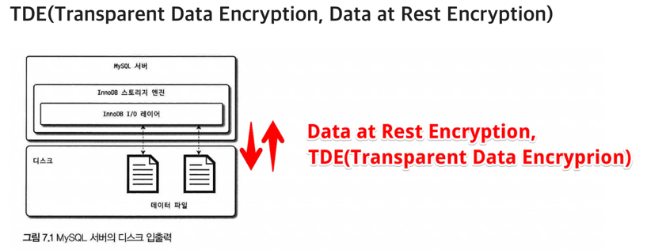
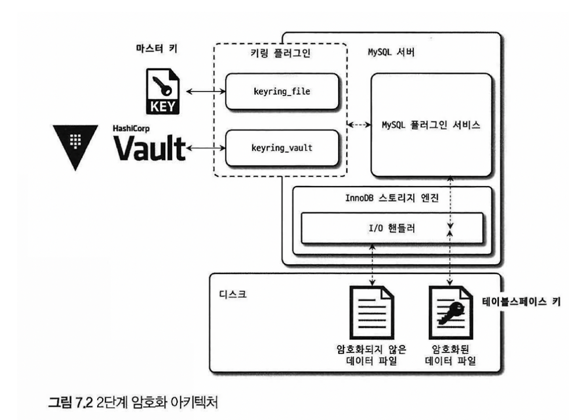

# 7. 데이터 암호화
## AP 단에서 암호화 VS DB 단에서 암호화
### AP 단에서 암호화
데이터의 암호화 과정을 AP 단에서 수행하는 경우다.  주로 중요한 정보를 가진 컬럼 단위로 암호화를 수행한다. AP단에서 데이터를 암호화 해 넣을 경우, 암호화된 컬럼은 인덱스를 생성 하더라도 인덱스를 100% 활용하지 못할 수 있다.  where 절에서 = 검색을 제외한, BETWEEN ... AND와 같은 범위 기반 검색이나 ORDER BY 후 LIMIT을 걸어 몇 개만 데이터를 가져오는 경우에 암호화 되기 전 값을 기준으로 정렬할 수 없기 때문이다. 
### DB 단에서 암호화
MySQL 자체에서 암호화를 수행하는 경우를 말한다.  테이블 단위로 암호화를 적용한다.   보안 감사에서 필수적으로 언급되는 부분이고, 핀테크 서비스처럼 중요한 정보는 AP에서 암호화 한 데이터를 또 한 번 DB 서버에서 다시 암호화 하는 이중 암호화 방법을 선택하기도 한다.

### TDE

MySQL에서의 데이터는 메모리나 네트워크 전송단계가 아닌 디스크에 저장하는 단계에서만 암호화 되는 특성을 말한다 MySQL에서 암호화된 데이터는 MySQL 서버와 디스크 사이에 write, read 작업에서만 일어나기 때문에 MySQL 서버 내에서 사용자의 쿼리를 처리하는 과정에서는 테이블의 데이터가 내부적으로 암호화 처리되어 있는지 여부를 식별하거나 신경쓸 필요가 없는데, 이러한 암호화 방식을 TDE라고 한다.

### MySQL TDE에서 암호화 key 관리

MySQL 서버의 TDE에서의 암호화 키는 키링(KeyRing)플러그인에 의해 관리 된다.
다양한 플러그인이 제공되지만, MySQL 8.0 버전 커뮤니티 에디션에서는 File-Based 플로그인 인 keyring_file 플러그인만 사용 가능하고, 나머지 플러그인은 모든 엔터프라이즈 에디션에서만 사용가능하다.

### 2단계(2-Tier)키 관리
각 키링 플러그인의 내부적인 동작 방식은 모두 동일하게 2단계(2-tier) 키 관리 방식을 사용한다.

## 마스터키와 테이블스페이스키
### master key
테이블스페이스 키를 암호화 하는데 사용되는 키 KMS나 Vault같은 외부 키 관리 솔루션 또는 디스크에 파일 형태로 저장된다. 외부의 파일을 이용하기 때문에 노출될 가능성이 있어서 주기적으로 바꿔줘야한다.

### 테이블 스페이스 키(private key)
실제로 테이블 데이터를 암호화 하는데 사용하는 키  마스터키로 암호화되어 디스크의 테이블의 데이터 파일 헤더에 저장된다.  MySQL 서버 외부로 노출되지 않기 때문에 주기적으로 변경할 필요가 없고, 그리고 만약 변경 한다고 해도,  암호화된 테이블 데이터를 전부 다시 복호화 한 후, 다시 암호화 해야하기 때문에 과도한 시스템 부하가 생길 수 있다.

### AES -256 암호화 알고리즘
MySQL TDE에서 사용되는 암호화 알고리즘으로, 이 알고리즘 외엔 지원되지 않는다.(AES 256비트)

### 암호화 성능
MySQL 서버에서의 암호화는 디스크로부터 데이터를 write, read 부분에만 적용되기 때문에 (TDE) 디스크로부터 암호화된 데이터 페이지가 복호화 처리를 거친 후 한 번 메모리에 적재되면 그 이후로는 암호화되지 않은 테이블과 동일한 성능을 보인다. 
즉, MySQL에서의 암호화된 데이터는 디스크로부터 데이터를 읽거나 쓸 때, 암호화와 복호화 처리를 더 해야하므로 이때 추가시간이 더 걸릴 수 있다.

### 읽기 지연
메모리 내 버퍼풀에 읽으려는 데이터가 없다면, 디스크로부터 데이터를 꺼내와야 하는데,  이때 데이터를 복호화 하는 과정을 해야하므로 이 복호화 시간 동안 쿼리가 지연될 수 있다.
### 쓰기 지연
암호화된 테이블 내 데이터가 변경되면 다시 디스크로 변경 사항을 동기화 시킬때, 암호화 하는 과정을 해야하므로 디스크에 저장 할 때도 추가로 시간이 더 걸린다.  하지만, 디스크 쓰기 작업의 경우 백그라운드 쓰레드에서 실행되기 때문에 실제 사용자의 쿼리를 처리하는 시간이 길어지지는 않는다.

# 정리
### 1. 데이터 암호화
데이터 파일에서만 제공하다 이후 리두, 언두 로그 등 모두 암호화 기능을 지원한다.

이는 보안 감사에서 필수적인 요소이다.

### 2. MySQL 서버의 데이터 암호화
데이터베이스 서버와 디스크 사이의 데이터를 읽고 쓰는 지점에서 암호화, 복호화를 수행한다. 즉, InnoDB 의 I/O 레이어에서만 실행된다.

이 방식을 TDE(Transparent Data Encryption) 이라 한다. 사용자와 MySQL 내부에서 아무런 차이가 없다.

TDE 에서 암호화 키는 키링 플러그인에 의해 관리된다. 서버는 마스터 키와 테이블스페이스 키를 가진다.

암호화된 테이블이 생성될 때마다 해당 테이블을 위한 임의의 테이블스페이스 키를 발급한다. 그리고 마스터 키를 이용해 테이블스페이스 키를 암호화해서 데이터 파일 헤더에 저장한다.

마스터키는 외부의 파일을 사용하기에 주기적으로 바꾸고, 이때마다 모든 테이블의 테이블스페이스 키를 복호화 후 다시 새로운 마스터 키로 암호화한다.

TDE 는 디스크로 읽어올 때 복호화하기에 버퍼 풀에 한 번 적재되면 암호화되지 않은 테이블과 동일한 성능을 보인다. 하지만 새로운 페이지를 불러올 때 복호화 시간만큼 지연 시간이 발생한다.

복제시에는 모든 노드들이 각자의 마스터 키를 가지고 있어야한다.

### 3.  keyring_file 플러그인 설치
암호화의 키 관리는 플러그인 방식으로 제공된다. keyring_file 플러그인은 마스터 키를 디스크에 평문으로 관리한다.

TDE 플러그인은 MySQL 서버 시작 시 가장 빨리 초기화 되어야하기에 시스템 변수에 라이브러리를 명시해줘야한다.

### 테이블 암호화
일반적인 테이블 생성 구문에 마지막 ENCRYPTION = 'Y' 옵션만 추가하면 된다.

필드에 암호화 된 내용을 집어넣으면 인덱스를 처리할 때 암호화 된 값을 기준으로 정렬되기에 암호화 전의 값을 기준으로 정렬할 수 없다. 하지만 TDE 는 서버 내에서는 모두 복호화되어있기에 이런 제약이 없다.

테이블스페이스 이동 시에 원본과 목적지 마스터 키가 다르기에 신경써줘야한다. 이때도 명령어를 통해 임시 마스터키를 발급하고 이를 통해 암호화하기에 나중에 해당 임시 마스터키와 함께 이동시키면 복구할 수 있다.

### 언두 로그 및 리두 로그 암호화
서버 내부 메모리는 복호화되었지만 이 평문 데이터가 테이블 데이터 이외에 디스크 파일로 기록되면 여전히 보안의 문제가 있다. 즉, 리두, 언두, 바이너리 로그에는 복호화된 상태로 기록되기에 여기에서도 암호화가 필요하다.

MySQL 서버는 리두, 언두 로그를 평문으로 저장하다가 암호화가 활성화되면 그때부터 생성되는 리두, 언두 로그를 암호화한다.

리두 로그와 언두 로그 데이터 모두 각각의 테이블스페이스 키로 암호화되고, 해당 키는 마스터 키로 암호화된다.

### 바이너리 로그 암호화
바이너리 로그는 의도적으로 상당히 긴 시간동안 보관되어야한다.

MySQL 은 바이너리 로그와 릴레이 로그 파일 데이터의 암호화를 위해 2단계 암호화 키 관리 방식을 사용한다.

데이터들은 파일 키로 암호화해서 디스크에 저장하고 파일 키는 바이너리 로그 암호화 키로 암호화 후 로그 파일의 헤더에 저장한다. 이때 바이너리 로그 암호화 키 는 테이블 암호화의 마스터키 같은 역할을 한다.

