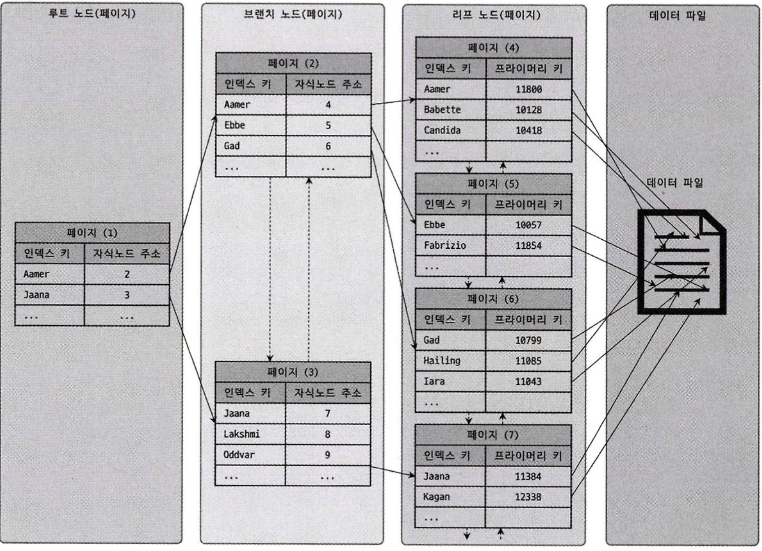
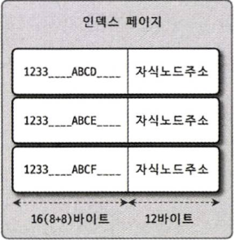
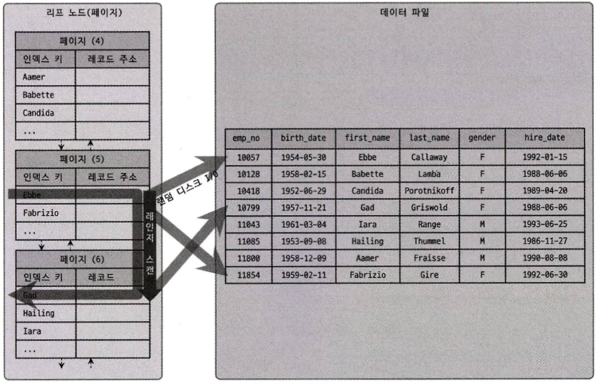
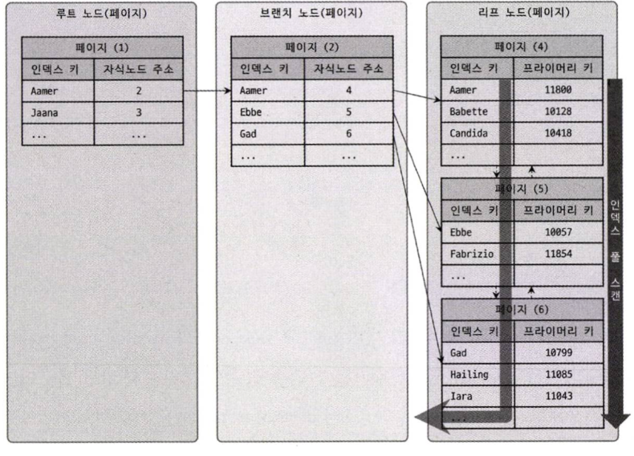
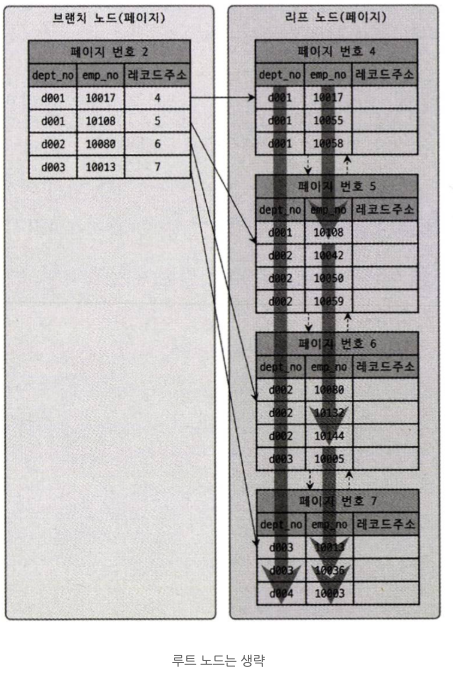
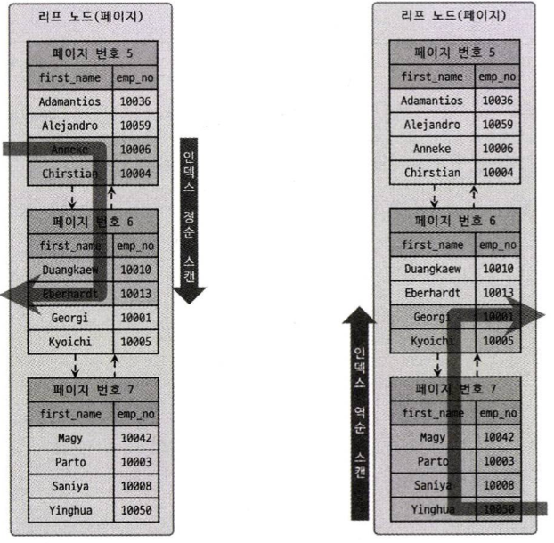
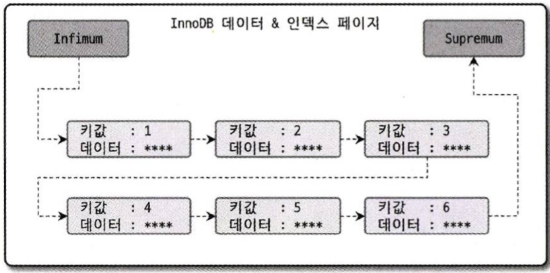
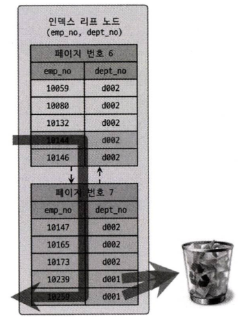
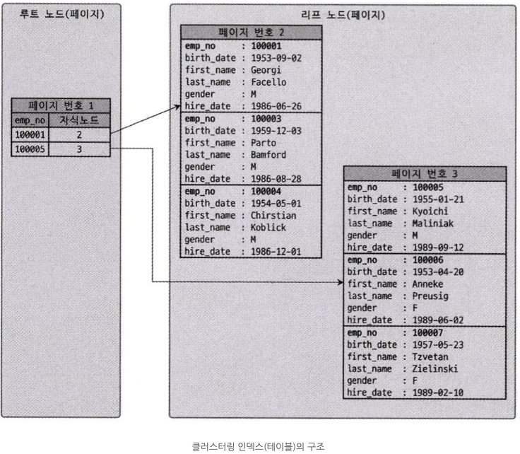

기존의 MyISAM 스토리지엔진에서만 제공하던 전문검색이나 위치 기반 검색 기능도 InnoDB 스토리지 엔진에서 사용할 수 있게 개선됐어도 여전히 관리자의 역할은 매우 중요합니다.
<br>그래서 인덱스는 중요하며, 쿼리 튜닝의 기본이다.

# 디스크 읽기 방식
DB의 성능 튜닝은 어떻게 디스크 I/O를 줄이느냐가 관건이다.
## HDD와 SSD
컴퓨터 주요장치는 대부분 전자식 장치지만 디스크 드라이브는 기계식 장치다.
<br>그래서 db서버에선 항상 디스크 장치가 병목


# Index

인덱스는 컬럼의 값과 해당 레코드가 저장된 주소를 키와 값의 쌍으로 삼아 주어진 순서로 미리 정렬해 저장해 두고 원하는 결과를 최대한 빠르게 찾아갈 수 있도록 한다.

인덱스를 쉽게 설명해 책으로 비유하자면 색인으로 설명할 수 있다.<br>
책의 색인을 통해 알아낼 수 있는 페이지 번호는 데이터 파일에 저장된 레코드의 주소에 비유될 것이고, 해당 페이지의 내용은 데이터 파일에 비유할 수 있다.
 
또한 색인과 DBMS 인덱스의 중요한 공통점은 바로 정렬이다.
<br> 색인의 내용이 너무 많으면 원하는 검색어를 찾아내는데 시간이 걸릴 것이다.<br>
이때 색인의 정보가 정렬(ㄱ, ㄴ, ㄷ, …)이 되어있다면 원하는 정보를 최대한 빠르게 찾아갈 수 있다.<br> 인덱스도 마찬가지로 컬럼의 값을 주어진 순서로 미리 정렬해서 보관하므로 원하는 결과를 최대한 빠르게 찾아갈 수 있다.


## 인덱스 사용 목적
DBMS에서 테이블의 모든 데이터를 검색해서 원하는 결과를 가져오려면 시간이 오래 걸린다.
<br>따라서 인덱스를 생성해놓고 이 시간을 단축시키는 것이 목적이다. <br>즉, 데이터의 읽기 속도를 높이는 기능으로 볼 수 있다.

읽기 속도는 향상되지만 데이터의 추가나 삭제 시 인덱스 또한 재정렬 과정을 거쳐야하므로 INSERT, UPDATE, DELETE와 같은 데이터 저장 성능은 떨어질 수밖에 없다. 
<br>따라서 무분별한 인덱스 추가는 지양해야 하며 저장 속도를 얼마나 희생할지, 읽기 속도를 얼마나 더 빠르게 만들어야 하는지에 따라 인덱스의 추가 여부를 결정해야 한다.


## 인덱스의 역할별 구분
- 프라이머리 키(PK)
  - 레코드를 대표하는 컬럼의 값으로 만들어진 인덱스를 의미한다.
  - 해당 레코드를 식별할 수 있는 값이기 때문에 식별자라고도 부른다.
  - Null을 허용하지 않으며 중복을 허용하지 않는다.
- 보조 키(세컨더리 인덱스)
  - 프라이머리 키를 제외한 나머지 모든 인덱스는 세컨더리 인덱스로 분류한다.
  - 유니크 인덱스는 프라이머리 키와 비슷하고 프라이머리 키를 대체해 사용할 수 있어 대체 키라고도 부른다.

## 인덱스의 알고리즘 별 구분
- B-Tree 인덱스
  - 가장 일반적으로 사용되는 인덱스 알고리즘으로, 오래전부터 도입된 알고리즘이기 때문에 성숙도가 높음
  - 컬럼의 값을 변형하지 않고 원래의 값을 이용해 인덱싱하는 알고리즘
  - B-Tree의 응용 버전으로 R-Tree 인덱스가 있다.
- Hash 인덱스
  - 컬럼의 값으로 해시값을 계산해서 인덱싱하는 알고리즘
  - 매우 빠른 검색을 지원한다.
  - 값을 변형해서 인덱싱하므로 prefix 일치와 같이 값의 일부만 검색하거나 범위 검색 시 Hash 인덱스를 사용할 수 없다.
  - 메모리 기반의 DB에서 많이 사용한다.

## B-Tree 인덱스
인덱싱 알고리즘 가운데 가장 일반적으로 사용되고, 가장 먼저 도입된 알고리즘으로 범용적인 목적으로 사용되는 인덱스 알고리즘이다. <br>
컬럼의 값을 변형시키지 않고 인덱스 구조체 내에서 항상 정렬된 상태로 유지된다. <br>
일반적으로 DMBS에서는 B-Tree의 변형 알고리즘인 B+-Tree 또는 B*-Tree가 사용된다.

- B-Tree 인덱스는 Balanced-Tree를 의미한다. Binary가 아닌 것에 주의!

### 구조 및 특성


B-Tree는 트리 구조의 최상위에 하나의 루트 노드가 존재하고 그 하위에 자식 노드가 붙어있는 구조를 가지고 있다.<br> 가장 하위의 노드를 “리프 노드(Leaf node)”라 하고, 루트 노드도 리프 노드도 아닌 중간의 노드를 “브랜치 노드”라고 한다.

인덱스의 리프 노드는 실제 데이터 레코드를 찾아가기 위한 주솟값을 가지고 있으며, 인덱스의 키 값은 모두 정렬되어 있지만 데이터 파일의 레코드는 임의의 순서로 저장되어 있다. (Insert 되고 Delete 되는 과정 때문에 빈 공간이 생김)

### InnoDB 테이블의 인덱스와 데이터 파일의 관계
InnoDB 스토리지 엔진을 사용하는 테이블에서는 프라이머리 키가 ROWID의 역할(물리적 주솟값)을 한다.<br>
하지만 세컨더리 인덱스는 프라이머리 키를 주소처럼 사용하기 때문에 물리적인 주소가 아닌 논리적인 주소를 가진다고 볼 수 있다.

따라서 InnoDB 테이블에서 인덱스를 통해 레코드를 읽을 때는 데이터 파일을 바로 찾아가지 못하고 다음과 같은 과정을 거친다.


인덱스에 저장돼 있는 PK 값을 이용해 프라이머리 키 인덱스를 한번 더 검색한 후, 프라이머리 키 인덱스의 리프 페이지에 저장돼 있는 레코드를 읽는다.
<br> 즉, 모든 세컨더리 인덱스 검색에서 프라이머리 키를 저장하고 있는 B-Tree를 한번 더 검색해야만 데이터 레코드를 읽을 수 있다.

## B-Tree 인덱스 키 추가 및 삭제
테이블에 레코드를 저장하거나 변경하는 경우 인덱스 키 추가나 삭제 작업이 발생한다. <br>
이러한 키 추가나 삭제가 어떻게 처리되는지 알아두면 쿼리 성능을 쉽게 예측할 수 있다.

### 인덱스 키 추가
1. 새로운 키 값이 B-Tree에 저장될 때는 저장될 키 값을 이용해 B-Tree상의 적절한 위치를 검색
2. 저장될 위치가 결정되면 레코드의 키 값과 레코드의 주소 정보를 B-Tree 리프 노드에 저장<br>
   2-1. 만약 리프 노드가 꽉 차서 더는 저장할 수 없는 경우 리프 노드를 분리 <br>
   2-2. 리프 노드가 분리되는 경우 상위 브랜치 노드까지 처리해줘야 함(상대적으로 쓰기 작업의 비용이 상승)
   
### 인덱스 추가 시 계략적 비용 계산

앞서 언급했듯, 인덱스 추가가 INSERT나 UPDATE 문장에 어떤 영향을 줄지 쿼리 성능을 예측하고 싶어 하는 사람이 많다. <br>이를 명확하게 답하려면 테이블 컬럼 수, 컬럼의 크기, 인덱스 컬럼의 특성 등을 확인해야 한다.

계략적으로 계산하는 방법은 테이블에 레코드 추가 비용을 1이라고 가정하고 해당 테이블의 인덱스 추가 작업 비용을 1.5 정도로 예측하는 것이다.

예를 들어, 테이블에 인덱스가 3개 있다면 인덱스가 하나도 없는 경우는 작업 비용이 1이고 3개인 경우 5.5(1.5 * 3 + 1) 정도의 비용이 드는 것으로 예측한다. (디스크로부터 인덱스 페이지를 읽고 쓰기를 하는데 걸리는 비용)

### 인덱스 키 삭제
1. 키 값이 저장된 B-Tree 리프 노드를 검색
2. 삭제 마크 추가(디스크 I/O 필요)
   - 버퍼링되어 지연 처리 가능

### 인덱스 키 변경
1. B-Tree 키 값을 삭제 (인덱스 키 삭제)
2. 다시 새로운 키 값을 추가 (인덱스 키 추가)
   - (InnoDB 스토리지 엔진을 사용하는 테이블)체인지 버퍼를 이용해 지연 처리 가능

### 인덱스 키 검색
인덱스 검색 작업은 B-Tree 루트 노드부터 브랜치 노드를 거쳐 리프 노드까지 이동하면서 비교 작업을 수행한다. <br>
이 과정을 “트리 탐색"이라고 하며, 인덱스 트리 탐색은 SELECT뿐 아니라 UPDATE나 DELETE를 처리하기 위해 레코드를 먼저 검색할 때도 사용된다.

다음은 B-Tree 인덱스를 이용한 키 검색이 가능한 경우와 불가능한 경우를 나타낸다.

- 100% 일치(동등 연산, = ‘test') 또는 값의 앞부분만 일치하는 경우(LIKE 연산, “test%”) 사용 가능
- 부등호 (< , >) 비교 조건에서 사용 가능
- 키 값의 뒷부분만 검색하는 경우(LIKE 연산, “%test”) 사용 불가능
- 키 값에 변형이 가해지는 경우 사용 불가능

InnoDB 테이블에서 지원하는 레코드 잠금이나 넥스트 키락(갭 락)이 검색을 수행한 인덱스를 잠근 후 테이블의 레코드를 잠그는 방식으로 구현돼 있다.
<br>이는 UPDATE나 DELETE를 수행할 때 적절한 인덱스가 없으면 불필요하게 많은 레코드를 잠근다. 
<br>따라서 InnoDB 스토리지 엔진에서는 인덱스 설계가 굉장히 중요하고 많은 부분에 영향을 미치게 되는 것이다.


## B-Tree 인덱스 사용에 영향을 미치는 요소
B-Tree 인덱스는 인덱스를 구성하는 컬럼의 크기와 레코드 건수, 유니크한 인덱스 키 값의 개수 등에 검색이나 변경 작업의 성능이 영향을 받는다.
<br> 인덱스의 키 값의 크기를 작게 하거나 유니크한(중복도가 낮은) 값으로 만들면 인덱스 성능이 좋아진다.

### 인덱스 키 값의 크기
InnoDB 스토리지 엔진은 디스크에 데이터를 저장하는 가장 기본 단위 - page || Block
<br>디스크의 모든 읽기 및 쓰기 작업의 최소 작업 단위다.
<br> page - InnoDB 스토리지 엔진의 버퍼 풀에서 data를 버퍼링하는 기본 단위
<br> index도 결국은 페이지 단위로 관리된다.

이진(binary) 트리는 각 노드가 자식 노드를 2개만 가지는데, 일반적으로 DBMS의 B-Tree는 자식 노드의 개수가 가변적인 구조다.
<br> 인덱스의 페이지 크기와 키 값의 크기에 따라 결정되기 때문이다.
<br>
다시 말해, 인덱스는 다음과 같이 페이지 단위로 관리된다.



따라서 인덱스의 페이지 크기와 키 값의 크기에 따라 B-Tree가 자식 노드를 몇 개까지 가질 수 있는지 결정된다.

그렇다면 16KB짜리 인덱스 페이지가 몇 개의 키를 저장할 수 있을까?
위 그림처럼 16 * 1024 / (16(키 값의 크기) + 12(자식 노드 주소 크기)) = 585 개의 키를 저장할 수 있다. 이때, 키 값이 두 배인 32Byte로 늘어났다고 가정하면 16 * 1024 / (32(키 값의 크기) + 12(자식노드 주소 크기)) = 372개 저장할 수 있다.

예를 들어, 500개의 레코드를 읽을 때 키 값이 16바이트인 인덱스 페이지는 디스크를 한 번만 읽으면 되지만, 키 값이 32바이트인 인덱스 페이지는 디스크를 두 번 읽어야 한다. 즉, 키 값이 커지면 디스크를 읽어야 하는 횟수가 늘어나고 그만큼 느려진다.

인덱스 크기가 커지면 커질수록 메모리에 캐시 해 둘 수 있는 레코드 수는 줄어들기 때문에 자연히 메모리 효율이 떨어지는 결과를 가져온다.

### B-Tree 깊이
B-Tree 깊이는 앞서 살펴본 인덱스 키 값의 평균 크기와 관계가 있다.
B-Tree 깊이가 3인 경우를 예로 들어 설명해보자면, 키 값이 16바이트인 경우 최대 2억(585 * 585 * 585)개 정도의 키 값을 담을 수 있지만, 32바이트인 경우 담을 수 있는 키 값이 5천만(372 * 372 * 372)개로 줄어든다.

인덱스 키 값의 크기가 커질수록 인덱스 키 값의 개수가 적어지고 B-Tree의 깊이도 깊어진다.<br> B-Tree의 깊이는 값을 검색할 때 몇 번이나 랜덤 I/O를 수행해야 하는지와 직결되는 문제로, 깊이가 깊을수록 디스크 읽기가 많아진다.

### 선택도(기수성)
선택도(Selectivity) 또는 기수성(Cardinality)은 거의 같은 의미로 사용되며, 모든 인덱스 키 값 가운데 유니크한 값의 수를 의미한다.<br> 인덱스 키 값 가운데 중복된 값이 많아지면 기수성은 낮아지고 선택도 또한 떨어진다.

선택도(기수성)는 인덱스 성능에 큰 영향을 미치는 요소이며 선택도가 높을수록 검색 대상이 줄어들기 때문에 그만큼 빨리 처리된다. <br> 전체 레코드 건수를 유니크한 값의 개수로 나눠보면 하나의 키 값으로 검색했을 때 대략 몇 건의 레코드가 일치할지 예측할 수 있다.

tb_city라는 테이블에 1만 건의 국가와 도시가 중복해서 저장돼 있지 않고 country 컬럼에만 인덱스가 준비돼 있다고 가정해보자.
```SQL
SELECT * FROM tb_city
WHERE country='KOREA' AND city='SEOUL';
```
이제 위 쿼리를 실행했을 때, country 컬럼의 유니크 값 개수에 따라 인덱스의 효율성이 어떻게 달라지는지 살펴보자.

- country 칼럼의 유니크 값이 10개일 때
  - country=’KOREA’ 라는 조건으로 인덱스를 검색하면 1만 건의 데이터 중 1,000건(10,000 / 10)의 데이터가 일치할 것이라 예상할 수 있다.
  - city=’SEOUL’인 레코드는 1건이므로 1,000건 중 999건이 불필요하게 읽히는 것으로 볼 수 있다.

- country 칼럼의 유니크 값이 1,000개일 때
  - country=’KOREA’ 라는 조건으로 인덱스를 검색하면 1만 건의 데이터 중 10건(10,000 / 1,000)의 데이터가 일치할 것이라 예상할 수 있다.
  - city=’SEOUL’인 레코드는 1건이므로 10건 중 9건이 불필요하게 읽히는 것으로 볼 수 있다.

같은 쿼리를 실행해 같은 결과를 받았지만, MySQL 서버가 수행하는 작업 내용에는 차이가 크다는 것을 알 수 있다.<br>이처럼 인덱스에서 유니크한 값의 개수는 인덱스나 쿼리의 효율성에 큰 영향을 미친다.

### 읽어야 하는 레코드의 수

인덱스를 통해 테이블 레코드를 읽는 것은 인덱스를 거치지 않고 읽는 것보다 높은 비용이 드는 작업이다. 따라서 인덱스를 통해 레코드를 읽어오는 방법과 인덱스를 거치지 않고 읽어오는 방법 중 어느 것이 효율적인지 판단해야 한다.

일반적으로 읽어야 할 레코드 수가 전체 테이블 레코드의 20~25%를 넘어서면 테이블을 모두 직접 읽어서 필터링을 수행하는 것이 더 효율적이다.

예를 들어, 전체 100만 건의 레코드 가운데 50만 건을 읽어야 하는 작업은 전체 테이블의 50%를 읽는 작업이다. 즉, 손익 분기점인 20~25%보다 훨씬 크기 때문에 테이블 전체를 직접 읽는 것이 인덱스를 통해 읽는 것보다 더 효율적이다.

## B-Tree 인덱스를 통한 데이터 읽기
MySQL(각 스토리지 엔진)이 어떻게 인덱스를 이용(경유)해서 실제 레코드를 읽어 내는지 알아야 한다.

MySQL이 인덱스를 이용하는 대표적인 3가지 방법

### 1. 인덱스 레인지 스캔
나머지 두 가지 접근 방식보다는 빠르다.
인덱스 레인지 스캔은 검색해야 할 인덱스의 범위가 결정됐을 떄 사용한다.

```sql
SELECT * FROM employees WHERE first.name BETWEEN 'Ebbe' AND 'Gad';
```
위 쿼리가 실행되면 아래 그림과 같이 루트 노드에서부터 브랜치 노드를 거쳐 최종적으로 리프 노드까지 찾아 들어가 필요한 레코드의 시작점을 찾는다. 
(두꺼운 화살표는 실제 스캔하는 범위)


두꺼운 선은 스캔해야 할 위치 검색을 위한 비교 작업을, 두꺼운 화살표가 지나가는 리프 노드의 레코드 구간은 실제 스캔하는 범위다.
<br>시작 지점을 찾으면 그때부터는 리프 노드의 레코드만 차례대로 쭉 읽으면 된다. 
<br>만약 리프 노드의 끝까지 읽으면 리프 노드 간 링크를 이용해 다음 리프 노드를 찾아 다시 스캔을 시작한다.

위 그림은 실제 인덱스만 읽는 경우를 나타낸다. <br> 하지만 B-Tree 인덱스의 리프 노드를 스캔하면서 실제 데이터 파일의 레코드를 읽어와야 하는 경우도 많은데, 이 과정을 더 자세히 나타내면 다음과 같다.



인덱스는 정렬되어있기 때문에 인덱스의 컬럼의 정순 또는 역순으로 레코드를 가져온다. <br> 또한, 리프 노드에서 검색 조건에 일치하는 건들은 데이터 파일에서 레코드를 읽어오는데 이때 한 건당 랜덤 I/O가 발생한다.

> 커버링 인덱스 ?<br>
인덱스 키와 레코드 주소를 이용해 레코드가 저장된 페이지를 가져오고 최종 레코드를 읽어오는 과정이 필요 없는 인덱스다.<br> 디스크를 읽지 않으므로 랜덤 읽기가 줄어들어 성능이 빨라진다.


### 2. index 풀 스캔
인덱스의 처음부터 끝까지 모두 읽는 방식을 말한다.
대표적으로 쿼리 조건절에 사용된 컬럼이 인덱스의 첫 번째 컬럼이 아닌 경우 인덱스 풀 스캔 방식이 사용된다.

```sql
// (A, B, C)라는 인덱스가 있다고 가정
SELECT * FROM employees WHERE B = 'b' AND C = 'c';

--> 조건절에 사용된 컬럼이 인덱스의 첫 번째(A) 컬럼이 아니므로 인덱스 풀 스캔이 일어난다.
```

인덱스 풀 스캔의 처리 방식을 그림으로 살펴보면



1. 인덱스 리프 노드의 제일 앞 또는 제일 뒤로 이동한다.
2. 해당 위치에서 리프 노드를 연결하는 링크드 리스트를 따라 처음부터 끝까지 스캔한다.

인덱스 풀 스캔은 테이블 전체를 읽는 것보다 적은 디스크 I/O가 발생하기 때문에 테이블 전체를 읽는 것보다는 낫다고 볼 수 있지만 인덱스를 사용하는 측면에서는 효율적인 방식은 아니다.  즉, 인덱스를 효율적으로 사용하지 못하는 것으로 볼 수 있다.

### 3. 루스 인덱스 스캔
MySQL의 루스 인덱스 스캔은 오라클의 인덱스 스킵 스캔과 작동 방식이 비슷하다. 루스 인덱스 스캔은 말 그대로 느슨하게 또는 듬성듬성하게 인덱스를 읽는 것을 의미한다.

인덱스 레인지 스캔과 비슷하게 작동하지만 중간에 필요하지 않은 인덱스 키 값은 무시하고 넘어가는 형태로 처리된다. 일반적으로 GROUP BY 또는 MAX(), MIN() 함수에 대해 최적화를 하는 경우 사용한다.

MySQL 5.7 버전까지는 기능이 많이 제한적이었지만, MySQL 8.0 버전부터 최적화를 지원하기 시작했다.

### 인덱스 스킵 스캔
db 서버에서 인덱스의 핵심은 **값이 정렬돼 있다**는 것이다.
8.0버전부터는 옵티마이저가 칼럼을 건너 뛰어서 원하는 칼럼만으로도 인덱스 검색이 가능하게 해주는 인덱스 스킵 스캔 최적화 기능이 도입했다.
즉, 인덱스 스킵 스캔은 MySQL 8.0 버전에 추가된 최적화 기능으로 조건절에 첫 번째 인덱스가 없어도 두 번째 인덱스만으로 인덱스를 검색할 수 있게 해주는 기능이다.
예시로 앞에서 예로 들었던 쿼리를 다시 한번 살펴보자.

```sql
// (A, B, C)라는 인덱스가 있다고 가정
SELECT * FROM employees WHERE B = 'b' AND C = 'c';

--> 조건절에 사용된 컬럼이 인덱스의 첫 번째(A) 컬럼이 아니므로 인덱스 풀 스캔이 일어난다.
```
다시 말해, 앞에서 공부했던 인덱스의 경우 조건절에 사용된 컬럼이 인덱스의 첫 번째 컬럼이 아닌 경우 인덱스를 사용할 수 없었다. <br>하지만 MySQL 8.0 버전에 인덱스 스킵 스캔 최적화 기능이 도입되면서 옵티마이저가 A 컬럼을 건너뛰어서 B, C 컬럼만으로도 인덱스 검색이 가능하게 되었다.

GROUP BY의 인덱스 처리에만 사용할 수 있었던 루스 인덱스 스캔과는 다르게 인덱스 스킵 스캔은 WHERE 조건절의 검색에 사용 가능해져, 그 용도가 훨씬 넓어졌다.
 
{237page 테이블 이미지 보면 type에 index가 보임. 이는 index를 첨부터 끝까지 읽는다는 것(풀 인덱스 스캔)이다}

인덱스를 "효율적"으로 이용 = '인덱스를 이용한다' -> 인덱스에서 꼭 필요한 부분만 접근하는 것을 의미한다.

#### 단점
1. where 조건절에 조건이 없는 인덱스의 선행 칼럼의 유니크한 값의 개수가 적어야 한다
2. 쿼리가 인덱스에 존재하는 칼럼만으로 처리 가능해야 한다(커버링 인덱스)

즉, 인덱스의 선행 칼럼이 가진 유니크한 값의 개수가 소량일 때만 적용 가능한 최적하다.

## 다중 칼럼 인덱스 (복합 칼럼 인덱스)
지금까지 살펴본 인덱스는 모두 1개의 컬럼만 포함된 인덱스였다. 하지만 실제 서비스에서는 2개 이상의 컬럼을 포함하는 인덱스가 더 많이 사용된다.

두 개 이상의 컬럼으로 구성된 인덱스를 다중 컬럼 인덱스라고 하며, 그 구조는 다음과 같다.



리프 노드의 인덱스를 자세히 살펴보면 다중 컬럼 인덱스의 중요한 포인트가 나온다.<br>
바로 인덱스의 두 번째 컬럼이 첫 번째 칼럼에 의존해 정렬되어 있다는 것이다.<br> 이는 두 번째 컬럼이 첫 번째 컬럼이 똑같은 레코드에서만 의미가 있다는 것을 나타낸다.<br> 이처럼 다중 컬럼 인덱스에서는 컬럼의 위치가 상당히 중요하기 때문에 이를 아주 신중히 결정해야 한다.

## B-Tree 인덱스의 정렬 및 스캔 방향
인덱스를 생성할 때 설정한 정렬 규칙에 따라 인덱스의 키 값이 정렬된다.<br> 하지만 인덱스가 오름차순으로 생성됐다고 해서 항상 오름차순으로만 읽는 것은 아니다.<br> 인덱스를 어느 방향으로 읽을지는 쿼리에 따라 옵티마이저가 실시간으로 만들어내는 실행 계획에 따라 결정된다.

### 인덱스 스캔 방향
MySQL 옵티마이저는 인덱스의 스캔 방향을 전환해서 사용하도록 실행 계획을 만들어 낸다. <br>인덱스는 생성 시점에 오름차순 또는 내림차순으로 정렬 방향이 결정되지만 쿼리가 그 인덱스를 사용하는 시점에 인덱스 스캔 방향에 따라 오름차순 또는 내림차순 정렬 효과를 얻을 수 있다.

인덱스는 항상 정렬되어있으므로 최솟값부터 스캔을 시작하면 오름차순으로, 최댓값부터 읽으면 내림차순으로 값을 가져올 수 있기 때문이다. <br>따라서 ORDER BY 처리나 MIN() 또는 MAX() 함수 등의 최적화가 필요한 경우 인덱스를 읽는 순서만 변경해서 인덱스 생성 시 지정한 정렬 규칙에 대한 문제점을 해결할 수 있다.



### 내림차순 인덱스
내림차순인지 오름차순인지와 관계없이 인덱스를 읽는 순서만 변경해서 해결한다.<br>InnoDB에서 인덱스 역순 스캔이 인덱스 정순 스캔에 비해 느릴 수 밖에 없는 2가지 이유

1. 페이지 잠금이 인덱스 정순 스캔에 적합한 구조
2. 페이지 내에 인덱스 레코드가 단방향으로만 연결된 구조



InnoDB 스토리지 엔진에서 정순 스캔과 역순 스캔은 페이지 간의 양방향 연결 고리를 통해 전진하느냐 후진하느냐의 차이만 있지만 위와 같은 이유로 인해 인덱스 정순 스캔이 더 빠른 성능을 가지게 된다.

## B-Tree 인덱스의 가용성과 효율성
우리는 어떤 조건에서 인덱스를 사용할 수 있고 어떨 때 사용할 수 없는지 식별할 수 있어야 한다. <br>그래야만 쿼리를 최적화하거나, 쿼리에 맞게 인덱스를 최적으로 생성할 수 있기 때문이다.

### 비교 조건의 종류와 효율성
다음 예제로 비교 조건에 따라 인덱스의 효율이 어떻게 달라지는지 살펴보자.

```sql
SELECT * FROM dept_emp
WHERE dept_no= 'd002' AND emp_no >= 10114 ;
```

- 케이스 A : INDEX(dept_no, emp_no)
- 케이스 B : INDEX(emp_no, dept_no)
케이스 A인 경우, 먼저 dept_no가 ‘d002’이고 emp_no가 10114보다 큰 레코드를 찾는다. <br>이후에는 dept_no가 ‘d002’가 아닐 때까지 인덱스를 쭉 읽기만 하면 된다.


비교 작업을 꼭 필요한 부분에만 수행한 것으로 상당히 효율적인 인덱스라고 볼 수 있다.

반면에 케이스 B의 경우, emp_no가 10114 보다 큰 레코드이고 dept_no가 ‘d002’인 레코드를 찾는다. 이후 찾은 모든 레코드에 dept_no가 ‘d002’인지 비교하는 작업을 수행한다.



케이스 B는 케이스 A에 비해 많은 비교 작업을 수행해야 한다. 왜 이런 현상이 발생할까? <br> 그 이유는 다중 컬럼 인덱스에서는 2번째 컬럼이 1번째 컬럼에 의존해 다시 정렬되기 때문이다.<br> 즉, 케이스 A는 2번째 컬럼인 emp_no가 비교 작업의 범위를 줄이는데(작업 범위 결정 조건) 도움을 주지만 케이스 B는 범위를 좁히지 못하고 단순히 비교 용도(필터링 조건)로만 사용되기 때문이다.

이처럼 작업 범위를 결정하는 조건은 많으면 많을수록 쿼리의 처리 성능을 높여준다. <br>하지만 필터링 조건은 많다고 해서 성능을 높이지 못하고 오히려 느리게 만들 때가 있으니 주의하자.

### 인덱스의 가용성
B-Tree 인덱스의 특징은 왼쪽 값에 의존해 오른쪽 값이 정렬돼 있다는 것이다. <br> 이 말은 값의 왼쪽 부분이 없으면 인덱스 레인지 스캔 검색이 불가능하다는 것을 나타낸다.
```sql
SELECT * FROM employees WHERE first_name LIKE '%mer1';
```
위 쿼리는 인덱스 레인지 스캔을 사용할 수 없다. <br>그 이유는 first_name 컬럼에 저장된 값의 왼쪽부터 비교해가며 일치하는 레코드를 찾아야 하는데, 조건 값의 왼쪽 부분(’%mer1’)이 정해져 있지 않기 때문이다.

또 다른 예로 인덱스가 (dep_no, emp_no)로 생성되어 있다면 아래의 쿼리는 인덱스를 효율적으로 사용하지 못한다.

```sql
SELECT * FROM dept_emp WHERE emp_no>=10144;
```
다중 컬럼 인덱스로 생성된 인덱스이므로 dept_no를 먼저 정렬한 후, 다시 emp_no 컬럼값으로 정렬돼 있기 때문이다. <br> 이렇듯 B-Tree의 특성상 인덱스를 효율적으로 사용할 수 없는 조건들이 존재한다. 그 조건들은 다음과 같다.

- NOT-EQUAL로 비교된 경우 (NOT IN, NOT BETWEEN, IS NOT NULL)
  - WHERE column <> 'N'
  - WHERE column NOT IN (10,11,12)
  - WHERE column IS NOT NULL
- LIKE %xxx 형태 문자열 패턴 비교인 경우
  - WHERE column LIKE '%test‘
  - WHERE column LIKE '%test%‘
  - WHERE column LIKE '_test‘
- 스토어드 함수나 다른 연산자로 인덱스 컬럼이 변형된 후 비교된 경우
  - WHERE SUBSTRING(column,1, 1) = 'X'
  - WHERE DAYOFMONTH(column) = 1
- 인덱스 컬럼의 타입을 변환해야 비교가 가능한 경우
  - WHERE char_column = 10 → char를 int와 비교
- 문자열 데이터 타입의 콜레이션이 다른 경우
  - WHERE utf8_bin_char_column = euckr_bin_char_column

## 멀티 밸류 인덱스
전문 검색 인덱스를 제외한 모든 인덱스는 인덱스 키와 데이터 레코드가 1:1 관계를 가진다. <br>하지만 멀티 밸류 인덱스는 하나의 데이터 레코드가 여러 개의 키 값을 가질 수 있는 형태의 인덱스다.

JSON의 배열 타입의 필드에 저장된 원소들에 대한 인덱스를 지원하기 위해 MySQL 8.0 버전에서 업그레이드됐다.
```sql
// 멀티 밸류 인덱스 생성
CREATE TABLE user (
            user_id BIGINT AUTO_INCREMENT PRIMARY KEY, 
            first_name VARCHAR(10),
            last_name VARCHAR(10),
            credit_info JSON,
            INDEX mx_creditscores (
                (CAST(credit_info->'$.credit_scores' AS UNSIGNED ARRAY))
            )
);

// INSERT
INSERT INTO user VALUES (1, 'Matt', 'Lee1', '{"credit.scores":[360, 353, 351]}');
```

위와 같은 멀티 밸류 인덱스를 활용하려면 반드시 다음 함수들을 활용해서 검색해야만 옵티마이저가 실행 계획을 수립할 수 있다.

- MEMBER OF()
- JSON_CONTAINS()
- JSON_OVERLAPS()

```sql
SELECT * FROM user WHERE 360 MEMBER OF(credit.info->'$.credit_scores');

+----------+------------+----------+--------------------------------------+
| user_id  | first_name |last_name | credit_info                          |
+----------+------------+----------+--------------------------------------+
|       1  | Matt       | Lee      | {"credit_scores": [360, 353, 351]}   |
+----------+------------+----------+--------------------------------------+
```
 

## 클러스터링 인덱스
프라이머리 키 값이 비슷한 레코드끼리 묶어서 저장하는 것을 클러스터링 인덱스라고 표현한다. <br>이는 테이블의 프라이머리 키에 대해서만 적용되는 내용이며 InnoDB 스토리지 엔진에서만 지원한다.

여기서 중요한 점은 프라이머리 키 값에 의해 레코드의 저장 위치가 결정된다는 것이다. <br>이 말은 프라이머리 키 값이 변경되면 물리적인 저장 위치도 변경되어야 한다는 것을 나타낸다. <br>따라서 클러스터링 된 테이블은 프라이머리 키 값 자체에 대한 의존도가 상당히 크기 때문에 신중히 프라이머리 키를 결정해야 한다.

클러스터링 인덱스는 알고리즘이라기보다 테이블 레코드 저장 방식으로 볼 수 있다.<br> 그래서 클러스터링 인덱스와 클러스터링 테이블은 동의어로 사용되기도 한다.


클러스터링 인덱스(테이블)의 구조링

 

### 세컨더리 인덱스에 미치는 영향
InnoDB 테이블의 모든 세컨더리 인덱스는 해당 레코드가 저장된 주소가 아니라 프라이머리 키 값을 저장하도록 구현돼 있다. <br>만약 세컨더리 인덱스가 프라이머리 키 값이 아닌 실제 레코드 주소를 가지고 있었다면 클러스터링 키 값이 변경될 때마다 레코드의 주소가 변경되고, 해당 테이블의 모든 인덱스에 저장된 주솟값을 변경해야 하는 오버헤드가 발생했을 것이기 때문이다.

employees 테이블에서 first_name 칼럼으로 검색하는 경우 프라이머리 키로 클러스터링 된 InnoDB 동작 예시를 살펴보자.
```sql
CREATE TABLE employees ( 
    emp_no INT NOT NULL,
    first_name VARCHAR(20) NOT NULL, 
    PRIMARY KEY (emp_no),
    INDEX ix_firstname (first_name)
);

mysql) SELECT * FROM employees WHERE first_name='Aamer';
```

1. ix_firstname 인덱스를 검색
2. 레코드의 프라이머리 키 값을 확인
3. 확인한 프라이머리 키 인덱스를 검색해 최종 레코드를 가져옴

InnoDB는 MyISAM처럼 실제 레코드 주소를 확인하는 것이 아니라 레코드의 프라이머리 키 값을 확인하고 그 프라이머리 키 값의 인덱스를 검색해 레코드를 가져온다.
MyISAM에 비해 조금 더 복잡하게 처리되지만, 프라이머리 키(클러스터링 인덱스)는 더 큰 장점을 제공하기 때문에 성능 저하에 대해 너무 걱정할 필요가 없다.

 

### 클러스터링 인덱스의 장점과 단점
- 장점
  - 프라이머리 키(클러스터링 인덱스)로 검색할 때 처리 성능이 매우 빠르다.
    - 특히, 프라이머리 키를 범위 검색하는 경우 매우 빠름
  - 테이블의 모든 세컨더리 인덱스가 프라이머리 키를 가지고 있기 때문에 인덱스만으로 처리될 수 있는 경우가 많다.(커버링 인덱스)
- 단점
  - 테이블의 모든 세컨더리 인덱스가 클러스터링 키를 갖기 때문에 클러스터링 키 값의 크기가 클 경우 전체적으로 인덱스의 크기가 커진다.
  - 세컨더리 인덱스를 통해 검색할 때 프라이머리 키로 다시 한번 검색해야 하므로 처리 성능이 느리다.
  - INSERT 할 때 프라이머리 키에 의해 레코드 위치가 결정되므로 처리 성능이 느리다.
  - 프라이머리 키를 변경할 때 레코드를 DELETE 하고 INSERT 하는 작업이 필요하기 때문에 성능이 느리다.
  - 클러스터링 인덱스의 장점과 단점을 요약해보면 장점은 빠른 읽기(SELECT)이며 단점은 느린 쓰기(INSERT, UPDATE, DELETE)라고 볼 수 있다. 일반적인 웹 서비스는 읽기가 80% ~ 90%를 차지하므로 느린 쓰기를 감수하고 빠른 읽기를 유지하는 것이 중요하다. 따라서 클러스터링 인덱스는 합리적인 선택이라고 볼 수 있다.

 

### 클러스터링 테이블 사용 시 주의사항
- 클러스터링 인덱스 키의 크기를 신경 쓰자.
  - 모든 세컨더리 인덱스는 프라이머리 키를 가지기 때문에 프라이머리 키의 크기가 커지면 세컨더리 인덱스의 크기도 함께 커진다.
  - 프라이머리 키가 10바이트에서 50바이트로 커지면 레코드 건수가 100만 건이면 190MB, 1000만 건이면 1.9GB 증가한다.
- 프라이머리 키는 Auto-Increment보다는 업무적인 컬럼으로 생성하자.
- 클러스터링 키(프라이머리 키) 값에 의해 레코드의 위치가 결정되므로 아주 중요하다. 또한, 프라이머리 키는 검색 성능을 매우 빠르게 만들어준다. 만약 컬럼의 크기가 크더라도 업무적으로 해당 레코드를 대표한다면 그 컬럼을 프라이머리 키로 설정하자.
- 프라이머리 키를 반드시 명시하자.
- 프라이머리 키를 정의하지 않으면 InnoDB는 내부적으로 일련번호 컬럼을 추가한다. 하지만 해당 일련번호는 사용자에게 보이지 않으므로 사용할 수가 없다. Auto-Increment로 프라이머리 키를 명시한 경우와 명시하지 않은 경우는 결국 같지만 프라이머리 키를 명시한 경우에는 사용자가 사용할 수 있으므로 반드시 프라이머리 키를 명시하자.
- Auto-Increment 컬럼을 인조 식별자로 사용하는 경우
- 프라이머리 키를 대체하기 위해 인위 적으로 추가된 프라이머리 키를 인조 식별자라고 한다. 여러 개의 컬럼이 복합으로 프라이머리 키가 만들어지는 경우 키의 크기가 길어진다. 이때 세컨더리 인덱스가 필요하고 프라이머리 키가 길어지면 이는 메모리 낭비로 이어질 수 있다. 이런 경우 Auto-Increment 컬럼을 추가하고 이를 프라이머리 키로 설정하자.
 

### 유니크 인덱스
유니크 인덱스는 인덱스에 같은 값이 2개 이상 저장될 수 없음을 의미하며, 이는 인덱스라기보다는 제약 조건에 가깝다고 볼 수 있다.<br> 프라이머리 키는 Null이 허용되지 않는 유니크 인덱스와 같지만 클러스터링 키의 역할도 하므로 유니크 인덱스와는 근복적으로 다르다.

 

### 인덱스 읽기
많은 사람들이 유니크 인덱스와 일반 세컨더리 인덱스의 읽기 성능이 차이 난다고 생각하지만 이는 사실이 아니다.<br> 유니크하지 않은 세컨더리 인덱스는 중복된 값이 허용되므로 더 많은 컬럼을 읽을 뿐 인덱스 성능과는 무관하다.<br> 만약 읽어야 할 레코드 건 수가 똑같다면 성능상 차이는 아주 미미하다.

 

### 인덱스 쓰기
새로운 레코드가 Insert 될 때 인덱스 쓰기 작업이 필요하다.
그런데 유니크 인덱스의 키 값을 쓸 때는 키 값에 대한 중복 체크 과정이 별도로 필요하기 때문에 일반 세컨더리 인덱스 쓰기보다 느리게 동작한다. <br>또한, 키의 중복 체크를 하는 과정 때문에 작업 자체를 버퍼링하지 못한다. 따라서 변경 작업이 더 느리게 작동한다.

MySQL에서는 유니크 인덱스 중복 체크 시 읽기 잠금을 사용하고, 쓰기를 할 때는 쓰기 잠금을 사용하는데 이때 데드락이 빈번하게 발생하니 주의하자.

 

### 유니크 인덱스 사용 시 주의사항
- 성능이 좋아질 것으로 생각하고 불필요한 유니크 인덱스를 생성하지 말자.
- 똑같은 컬럼에 대해 프라이머리 키와 유니크 인덱스를 동일하게 생성하지 말자.(불필요한 중복임)
 

### 외래 키
외래 키는 InnoDB 스토리지 엔진에서 생성할 수 있으며, 외래 키 제약이 설정되면 연관 테이블 컬럼에 인데스까지 생성된다. 이러한 InnoDB의 외래키 관리에는 중요한 두 가지 특징이 있다.

1. 테이블의 변경(쓰기 잠금)이 발생하는 경우에만 잠금 경합(잠금 대기)이 발생한다.<br>
자식 테이블의 외래 키 컬럼의 변경(INSERT, UPDATE)은 부모 테이블의 확인이 필요하고,<br> 이 상태에서 부모 테이블의 레코드가 쓰기 잠금이 걸려 있으면 해당 쓰기 잠금이 해제될 때까지 기다리게 된다.

2. 외래 키와 연관되지 않은 컬럼의 변경은 최대한 잠금 경합을 발생시키지 않는다.<br>
자식 테이블의 외래 키가 아닌 컬럼의 변경은 외래 키로 인한 잠금 확장이 발생하지 않는다.

물리적인 외래 키의 고려 사항은 부모 테이블에 참조키가 존재하는지 체크하기 위해 테이블에 읽기 잠금을 거는 것을 말한다. <br>외래 키를 물리적으로 생성하려면 이러한 현상으로 인한 잠금 경합까지 고려해 모델링을 진행해야 한다. <br>만약 잠금이 다른 테이블로 확장되면 그만큼 동시 처리 성능이 떨어지기 때문이다.


## 스터디 당시 나왔던 궁금증
1. 테이블 레코드 = 클러스터링 인덱스 = pk 인덱스 
=> 이거지 않나? 왜 책에선 이렇게 쉽게 표현해주지 않은거지 ...?

 
### 클러스터링 인덱스(Clustering Index)
테이블의 실제 데이터 레코드가 인덱스의 리프 노드에 정렬된 형태로 저장되는 인덱스를 말해요.
→ MySQL(InnoDB)에서는 항상 PK(Primary Key)가 클러스터링 인덱스가 됩니다.

### PK 인덱스 (Primary Key Index)
테이블에 정의한 Primary Key 제약조건에 의해 생성되는 인덱스.
→ InnoDB에서는 이 PK 인덱스가 곧 클러스터링 인덱스 역할을 해요.

### 테이블 레코드
InnoDB는 별도의 "힙 구조" 테이블이 없고, 데이터 레코드 자체가 클러스터링 인덱스의 리프 노드에 저장됩니다.
그래서 흔히 “테이블 = 클러스터링 인덱스” 라고 설명할 수 있어


논리적인 개념인지 물리적인 개념인지의 차이 (물리 - 레코드, 논리 - index 로도 저장되는 방식이니까..)

# GPT 선생

1. 범용 DB 개념 때문
다른 DBMS(예: Oracle, PostgreSQL)에서는 테이블 = 힙 구조(Heap Table)이고, 인덱스는 별도로 존재하는 경우가 많아요.<br> MySQL InnoDB만의 특수성을 강조하려다 보니 “그냥 테이블 = PK 인덱스”라고 단순화하면 오해의 여지가 생겨요.

2. InnoDB 옵션 다양성
- PK가 없으면? → InnoDB는 첫 번째 Unique Not Null 인덱스를 클러스터링 인덱스로 사용.
- 그것도 없으면? → 내부적으로 6바이트 RowID를 만들어 클러스터링 인덱스로 삼습니다.<br>
그래서 항상 “PK = 클러스터링 인덱스 = 테이블”이라고만 하면 이 예외 케이스가 빠집니다.

3. 보조 인덱스(Secondary Index)와의 대비 필요
보조 인덱스는 리프 노드에 PK 값을 저장하고, 다시 클러스터링 인덱스를 통해 실제 레코드를 찾아야 합니다.
즉, 클러스터링 인덱스와 보조 인덱스의 차이를 강조하기 위해 용어를 구분해 두는 게 더 명확합니다.

### 📌 실무 포인트

InnoDB에서 PK = 클러스터링 인덱스 = 테이블 데이터 구조가 맞습니다.

다만 “항상 PK”라고 단정짓지 말고, PK가 없을 때의 대체 규칙까지 알아두면 면접이나 설계 시에 유리합니다.

보조 인덱스는 항상 PK를 거쳐야 실제 레코드 접근 가능하다는 점을 기억해두세요.