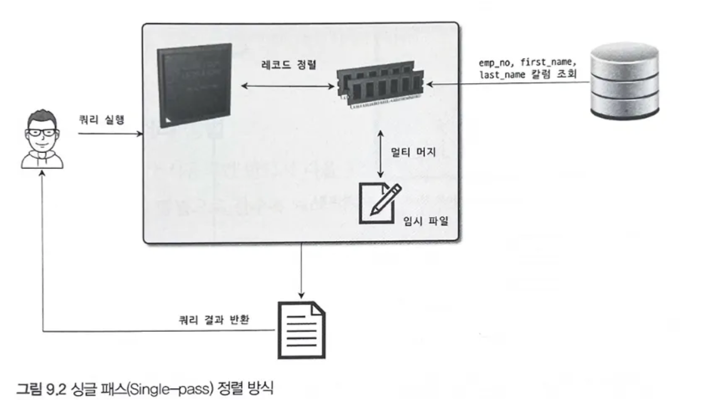
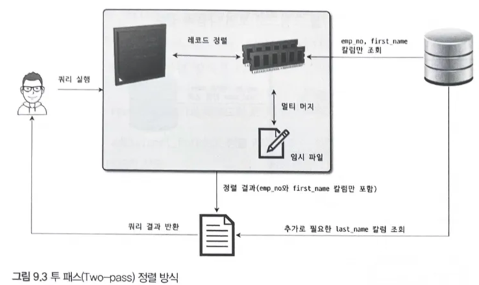
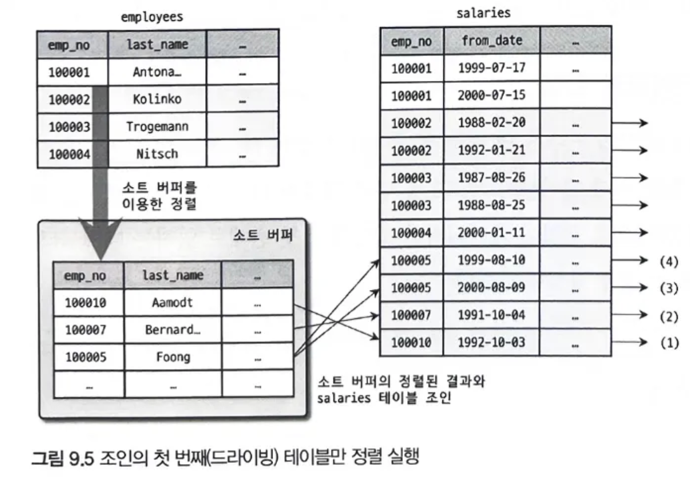
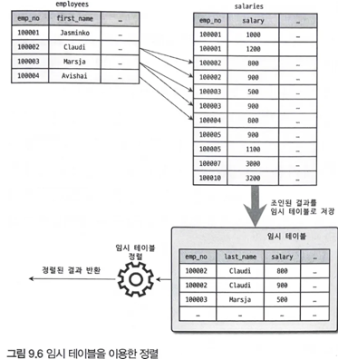
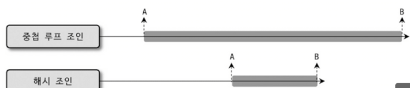

MySQL 서버로 요청된 쿼리는 결과는 동일하지만 내부적으로 결과를 만들어내는 방법은 다양하다. 이런 방법들 중 최적의 방법을 선택해야하는데, 이를 옵티마이저가 수행한다.

MySQL 에서는 `EXPLAIN` 이라는 명령으로 쿼리의 실행 계획을 확인할 수 있다.

# **9.1 개요**

쿼리 실행 절차는 크게 3단계로 나눌 수 있다.

1. 사용자로부터 요청된 SQL 문장을 잘게 쪼개 서버가 이해할 수 있는 수준으로 분리한다.
2. SQL의 파싱 정보를 확인하며, 어떤 테이블로부터 읽고 인덱스를 사용해 테이블을 읽을 지 선택한다.
3. 두 번째 단계에서 결정된 읽기 순서나 인덱스를 이용해 스토리지 엔진으로부터 데이터를 가져온다.

첫 번째 단계를 `SQL 파싱`이라 하며, `SQL 파서` 라는 모듈로 처리한다. 문법적인 오류는 이 단계에서 걸러지며, 결과로 `SQL 파스 트리` 가 만들어진다.

두 번째 단계는 `최적화 및 실행 계획 수립` 이며, SQL 파스 트리를 통해 다음 내용을 처리한다.

- 불필요한 조건 제거 및 복잡한 연산의 단순화
- 여러 테이블 조인이 있는 경우 어떤 순서로 읽을 지 결정
- 각 테이블에 사용된 조건과 인덱스 통계 정보로 사용할 인덱스 결정
- 가져온 레코드들을 임시 테이블에 넣고 한 번더 가공 여부 결정

세 번째 단계는 수립된 실행 계획대로 실제 요청하고 작업을 수행한다.

### **옵티마이저의 종류**

크게 비용 기반 최적화 방법과 규칙 기반 최적화 방법으로 나눌 수 있다.

규칙 기반 최적화는 기본적으로 옵티마이저에 내장된 우선순위에 따라 실행 계획을 수립한다. 

이때 통계 정보등을 조사하지 않기에 같은 쿼리에 대해 같은 실행 방법을 만들어낸다.

비용 기반 최적화는 쿼리를 처리하기 위해 여러 가지 방법을 만들고 가장 낮은 비용의 방식을 선택한다.

현재는 대부분 비용 기반 옵티마이저를 채택하고 있으며 MySQL 도 동일하다.

# **9.2 기본 데이터 처리**

### **풀 테이블 스캔**

옵티마이저는 주로 다음 조건에서 풀 테이블 스캔을 선택한다.

- 테이블의 레코드 건수가 너무 적어 인덱스보다 풀 테이블 스캔이 빠를 경우
- WHERE 절이나 ON 절에 인덱스를 이용할 수 있는 적절한 조건이 없는 경우
- 인덱스 레인지 스캔을 사용할 수 있는 쿼리라도 옵티마이저가 판단한 조건 일치 레코드 건수가 너무 많은 경우

MySQL 의 InnoDB 에서도 풀 테이블 스캔 시 한 번에 여러 페이지를 읽어올 수 있기에 꽤 빠른 처리가 가능하다.

`SELECT COUNT(*) FROM ,..`

위 같은 쿼리는 풀 테이블 스캔보다는 풀 인덱스 스캔이 훨씬 적은 비용이기에 해당 방법을 사용할 것이다.

### **병렬 처리**

하나의 쿼리를 여러 스레드가 작업을 나누어 동시에 처리하는 것이다.

실제 병렬 처리용 스레드가 늘어날수록 쿼리 처리에 걸리는 시간이 줄어드는 것을 확인할 수 있다.

### **ORDER BY 처리**

대부분 정렬은 필수적으로 사용된다.

 처리 방법은 인덱스 이용과 Filesort 라는 별도의 처리를 이용하는 방법이 있다.

**인덱스를 이용하는 방법**

장점

- INSERT, UPDATE, DELETE 쿼리가 실행될 때 이미 인덱스가 정렬되어있어 순서대로 읽기만 하면 된다.

단점

- INSERT, UPDATE, DELETE 작업 시 부가적인 인덱스 추가/삭제 작업이 필요하기에 느리다.
- 인덱스 때문에 디스크 공간이 더 많이 필요하다.
- 인덱스의 개수가 늘어날수록 InnoDB 의 버퍼 풀을 위한 메모리가 많이 필요하다.

**Filesort 이용**

장점

- 인덱스를 사용하지 않아도 된다.
- 정렬할 레코드가 많지 않으면 메모리에서 처리되므로 충분히 빠르다.

단점

- 정렬 작업이 쿼리 실행 시 처리되므로 레코드 대상 건수가 많아질수록 쿼리의 응답 속도가 느리다.

일단 모든 정렬을 인덱스를 이용하기에는 무리가 있다. 특히 아래같은 이유가 존재한다.

- 정렬 기준이 너무 많아 요건 별 모든 인덱스 생성이 불가능
- GROUP BY 의 결과 또는 DISTINCT 같은 처리의 결과를 정렬할 경우
- UNION 의 결과와 같이 임시 테이블의 결과를 다시 정렬해야 하는 경우
- 랜덤하게 결과 레코드를 가져와야 하는 경우

**소트 버퍼**

MySQL 은 정렬을 수행하기 위해 별도의 메모리 공간을 할당받아 사용하는데 이를 소트 버퍼라 한다. 소트 버퍼는 정렬이 필요한 경우에만 할당되며 크기는 가변적이며 완료시 즉시 반납된다.

만약 정렬한 데이터가 많다면 레코드를 여러 조각으로 나눠 처리하는데 이 과정에서 임시 저장을 위해 디스크를 사용한다. 메모리를 통한 정렬을 수행하고 그 결과를 임시로 디스크에 저장한다. 각 버퍼 크기만큼 정렬된 레코드를 다시 병합하면서 정렬을 수행한다. 이 병합 작업을 멀티 머지라 한다.

레코드 건수가 많을 수록 디스크 쓰기 읽기가 많아진다. 소트 버퍼의 크기가 커지면 무조건 빨라질 것 같지만 아니다. 일반적으로는 56KB 에서 1 MB 미만이 적절하다. 소트 버퍼의 크기가 너무 크면 서버의 메모리가 부족해질 수 있다.

**정렬 알고리즘**

레코드 정렬 시 전체를 담을지 또는 정렬 기준 칼럼만 담을지에 따라 `싱글 패스` 와 `투 패스` 2가지 정렬 모드로 나눌 수 있다. 어떤 모드인지는 옵티마이저 옵션을 통해 확인 가능하다.

**싱글 패스 정렬 방식**



소트 버퍼에 정렬 기준 칼럼을 포함해 모든 칼럼을 담아 정렬하는 방식이다. 처음 테이블을 읽을 때 모든 칼럼을 읽어 소트 버퍼에 담는다. 정렬이 완료되면 정렬 버퍼의 내용을 그대로 클라이언트에 넘겨준다.

**투 패스 정렬 방식**



정렬 대상 칼럼과 프라이머리 키 값만 소트 버퍼에 담아 정렬 후 다시 프라이머리 키로 테이블을 읽어 칼럼을 가져오는 방식이다.

투 패스는 테이블을 두 번 읽어야하기에 불합리하지만 많은 소트 버퍼 공간이 필요하다.

**정렬 처리 방법**

쿼리에 ORDER BY 가 사용되면 반드시 3가지 처리 방법 중 하나로 정렬된다.

- 인덱스를 사용한 정렬
- 조인에서 드라이빙 테이블만 정렬: "Using filesort" 메시지가 표시됨
- 조인에서 조인 결과를 임시 테이블로 저장 후 정렬: "Using temporary; Using filesort" 메시지가 표시됨

<b> -> 옵티마이저는 우선 인덱스 이용 여부를 확인한다.</b>

 만약 사용할 수 없다면 Filesort 과정을 거치는데, 이는 WHERE 조건에 일치하는 레코드를 검색해 정렬 버퍼에 저장하면서 정렬을 처리하는 방식이다. 

이때 정렬 대상 레코드를 최소화하기 위해 2가지 방법 중 하나를 선택한다.

- 조인의 드라이빙 테이블만 정리 후 조인
- 조인이 끝나고 일치하는 레코드를 모두 가져온 후 정렬

**인덱스를 이용한 정렬**

반드시 `ORDER BY` 에 명시된 칼럼이 제일 먼저 읽는 테이블에 속하고, 순서대로 생성된 인덱스가 있어야한다. 또한 WHERE 절에 첫 번쨰로 읽는 테이블의 칼럼에 대한 조건이 있으면 같은 인덱스를 쓸 수 있어야한다.

실제로 인덱스는 정렬되어있기에 순서대로 읽기만 하면 된다. MySQL 엔진에서는 별도의 정렬을 위한 추가 작업을 수행하지 않는다. 따라서 ORDER BY 가 없더라도 정렬된 형태를 반환받을 수 있다.

**조인이 드라이빙 테이블만 정렬**



조인이 수행되면 레코드 건수가 배로 불어나기에 조인 전 첫 번째 테이블의 레코드를 먼저 정렬하는 것이 차선책이다. 이 방법을 위해서는 첫 번째로 읽히는 테이블의 칼럼만으로 ORDER BY 절을 작성해야한다.

우선 WHERE 절의 검색 조건에서 유리한 테이블이 드라이빙 테이블로 선택된다. 이때 ORDER BY 칼럼 또한 드라이빙 테이블에 포함되었다면 정렬을 먼저 수행할 수 있다.

**임시 테이블을 이용한 정렬**



이 방법은 정렬할 레코드가 많기에 가장 느리다. 

ORDER BY 칼럼이 드리븐 테이블에 있는 경우 조인된 데이터로 정렬할 수 밖에 없다.

**성능 비교**

쿼리에서 인덱스를 사용하지 못하는 정렬이나 그루핑 작업이 처리되는 방법을 2가지 방식으로 구분할 수 있다.

**스트리밍 방식**

서버 쪽에서 처리할 데이터가 얼마인지에 관계없이 조건에 일치하는 레코드가 검색될때마다 바로바로 클라이언트로 전송해주는 방식을 의미한다. 이 방식으로 쿼리를 처리할 경우 클라이언트는 쿼리를 요청하고 곧바로 원했던 첫 번째 레코드를 전달받는다.

쿼리가 스트리밍 방식으로 처리될 수 있다면 클라이언트는 MySQL 서버가 일치하는 레코드를 찾는 즉시 전달받기 때문에 동시에 데이터의 가공 작업을 시작할 수 있다. 웹 서비스 같은 OLTP 환경에서는 쿼리의 요청에서부터 첫 번째 레코드를 전달받게 되기까지의 응답 시간이 중요하다. 스트리밍 방식으로 처리되는 쿼리는 쿼리가 얼마나 많은 레코드를 조회하느냐에 상관없이 빠른 응답 시간을 보장해준다.

또한 스트리밍 방식으로 처리되는 쿼리에서는 LIMIT 처럼 결과 건수를 제한하는 조건들은 쿼리의 전체 실행 시간을 상당히 줄여줄 수 있다.

**버퍼링 방식**

ORDER BY나 GROUP BY 같은 처리는 쿼리의 결과가 스트리밍되는 것을 불가능하게 한다. 우선 WHERE 조건에 일치하는 모든 레코드를 가져온 후 정렬하거나 그루핑해서 차례대로 보내야 하기 때문이다.

어느 테이블이 먼저 드라이빙되어 조인되는지도 중요하지만 어떤 정렬 방식으로 처리되는지는 더 큰 성능 차이를 만든다. 가능하다면 인덱스를 사용한 정렬로 유도하고 그렇지 못하다면 최소한 드라이빙 테이블만 정렬해도 되는 수준으로 유도하는 것도 좋은 튜닝 방법이라고 할 수 있다.

## **GROUP BY 처리**

GROUP BY 또한 스트리밍된 처리를 할 수 없게 하는 처리 중 하나이다. HAVING 절을 인덱스로 처리할 수 없기에 튜닝하기 위해 인덱스를 생성하거나 다른 방법을 고민할 필요는 없다.

**인덱스 스캔을 이용하는 GROUP BY (타이트 인덱스 스캔)**

조인의 드라이빙 테이블에 속한 칼럼만 이용해 그루핑할 때 GROUP BY 칼럼으로 이미 인덱스가 있다면 그 인덱스를 차례대로 읽으면서 그루핑 작업을 수행하고 그 결과로 조인을 처리한다. GROUP BY가 인덱스를 사용해서 처리된다 하더라도 그룹 함수 등의 그룹값을 처리해야 해서 임시 테이블이 필요할 때도 있다. GROUP BY가 인덱스를 통해 처리되는 쿼리는 이미 정렬된 인덱스를 읽는 것이므로 쿼리 실행 시점에 추가적인 정렬 작업이나 내부 임시 테이블은 필요하지 않다. 이러한 그루핑 방식을 사용하는 쿼리의 실행 계획에서는 Extra 컬럼에 별도로 GROUP BY 관련 코멘트나 임시 테이블 사용 또는 정렬 관련 코멘트가 표시되지 않는다.

**루스 인덱스 스캔을 이용하는 GROUP BY**

루스 인덱스 스캔 방식은 인덱스의 레코드를 건너뛰면서 필요한 부분만 읽어서 가져오는 것을 의미하는데 옵티마이저가 루스 인덱스 스캔을 사용할 때는 실행 계획 Extra 컬럼에 "Using index for group-by" 코멘트가 표시된다.

**임시 테이블을 사용하는 GROUP BY**

GROUP BY의 기준 컬럼이 드라이빙 테이블에 있든 드리븐 테이블에 있든 관계없이 인덱스를 전혀 사용하지 못할 때는 임시 테이블을 사용해서 처리된다.

## ***DISTINCT* 처리**

특정 칼럼의 유니크한 값만 조회하기 위해 사용된다. 집계함수의 유무에 따라 키워드가 미치는 범위가 달라진다.

**SELECT DISTINCT ...**

GROUP BY 와 동일한 방식으로 처리된다. 내부적으로 동일하기에 아래 두 쿼리는 내부적으로 같은 작업을 수행한다.

```sql
mysql > SELECT DISTINCT emp_no FROM salaries;
mysql > SELECT emp_no FROM salaries GROUP BY emp_no;
```

DISTINCT 는 레코드를 유니크하게 조회하는 것이지 특정 칼럼만 유니크하게 조회하는 것이 아님에 주의하자.

**집합 함수와 함께 사용된 DISTINCT**

집합 함수와 함께 사용되면 다른 형태로 해석된다. 집합 함수 내에서 사용된 DISTINCT 는 그 집합 함수의 인자로 전달된 칼럼 값이 유니크한 것들만 가져온다.

이 쿼리는 내부적으로 임시 테이블을 사용하지만 메세지는 표시되지 않는다.

실제 두 테이블을 조인한 결과에서 특정 칼럼 값만 저장하기에 레코드 많아지면 느려질 수 밖에 없다.

### **내부 임시 테이블 활용**

레코드를 정렬하거나 그루핑 시 내부적인 임시 테이블을 사용한다. 임시 테이블은 메모리에서 생성되며 테이블의 크기가 커지면 디스크로 옮겨진다.

**임시 테이블이 필요한 쿼리**

유니크 인덱스를 가지는 내부 임시 테이블이 만들어지는 쿼리

- ORDER BY와 GROUP BY에 명시된 컬럼이 다른 쿼리
- ORDER BY나 GROUP BY에 명시된 컬럼이 조인의 순서상 첫 번째 테이블이 아닌 쿼리
- DISTINCT와 ORDER BY가 동시에 쿼리에 존재하는 경우
- DISTINCT가 인덱스로 처리되지 못하는 쿼리
- UNION이나 UNION DISTINCT가 사용된 쿼리(select_type 컬럼이 UNION RESULT인 경우)
- 유니크 인덱스가 없는 내부 임시 테이블이 만들어지는 쿼리
- 쿼리의 실행 계획에서 select_type이 DERIVED인 쿼리

일반적으로 유니크 인덱스가 있는 내부 임시 테이블은 그렇지 않은 쿼리보다 처리 성능이 상당히 느리다.

**임시 테이블이 디스크에 생성되는 경우**

내부 임시 테이블은 기본적으로는 메모리상에 만들어지지만 다음과 같은 조건을 만족하면 메모리 임시 테이블을 사용할 수 없게 된다. 이 경우에는 디스크 기반의 임시 테이블을 사용한다.

- UNION 이나 UNION ALL 에서 SELECT 되는 컬럼 중에서 길이가 512바이트 이상인 크기의 컬럼이 있는 경우
- GROUP BY나 DISTINCT 컬럼에서 512바이트 이상인 크기의 컬럼이 있는 경우
- 메모리 임시 테이블의 크기가 tmp_table_size 또는 max_heap_table_size 시스템 변수보다 크거나 temptable_max_ram 시스템 변수 값보다 큰 경우

## *고급 최적화*

옵티마이저는 최적의 실행 계획을 수립하기 위해 통계 정보와 옵티마이저 옵션을 결합하여 이용한다.

옵티마이저 옵션은 크게 조인 관련 옵티마이저 옵션과 옵티마이저 스위치로 구분된다.

### *옵티마이저 스위치 옵션*

옵티마이저 스위치 옵션은 `optimizer_switch` 시스템 변수를 이용하여 제어하는데, 여러 옵션을 세트로 묶어 설정하는 방식으로 사용한다.

옵티마이저 스위치 옵션은 `optimizer_switch` 시스템 변수를 이용하여 제어하는데 옵션들은 아래와 같다.

| 옵티마이저 스위치 이름 | 기본값 | 설명 |
| --- | --- | --- |
| batched_key_access | off | BKA 조인 알고리즘 사용 여부 |
| block_nested_loop | on | Block Nested Loop 조인 알고리즘 사용 여부 |
| engine_condition_pushdown | on | Engine Condition Pushdown 기능 사용 여부 |
| index_condition_pushdown | on | Index Condition Pushdown 기능 사용 여부 |
| use_index_extensions | on | Index Extension 최적화 사용 여부 |
| index_merge | on | Index Merge 최적화 사용 여부 |
| index_merge_intersection | on | Index Merge Intersection 최적화 사용 여부 |
| index_merge_sort_union | on | Index Merge Sort Union 최적화 사용 여부 |
| index_merge_union | on | Index Merge Union 최적화 사용 여부 |
| mrr | on | MRR 최적화 사용 여부 |
| mrr_cost_based | on | 비용 기반 MRR 최적화 사용 여부 |
| semijoin | on | 세미 조인 최적화 사용 여부 |
| firstmatch | on | FirstMatch 세미 조인 최적화 사용 여부 |
| loosescan | on | LooseScan 세미 조인 최적화 사용 여부 |
| materialization | on | Materialization 최적화 사용 여부 |
| subquery_materialization_cost_based | on | 비용 기반 Materialization 최적화 사용 여부 |

위 옵션은 글로벌, 현재 커넥션, 현재 쿼리에 대해서 등 다양한 범위로 설정할 수 있다.

- ***네스티드 루프 조인* (Nested Loop Join)**가장 자주 사용되는 조인 방식이고, 이 방식은 드라이빙 테이블의 레코드를 한 건 읽어서 드리븐 테이블의 일치하는 레코드를 찾아 조인을 수행하는 방식이다.
- 아래와 같은 쿼리로 예시를 들어보자.
    
    ```sql
    SELECT *
    FROM employees e
    INNER JOIN salaries s
    	ON s.emp_no=e.emp_no;
    ```
    
    ```sql
    for(row1 IN employees) {
    	for(row2 IN salaries) {
    		if(row1.emp_no == row2.emp_no) return (row1, row2);
    	}
    }
    ```
    

위 쿼리는 `employees` 테이블이 드라이빙 테이블이 되어 순서대로 레코드를 한 건 읽고, 드리븐 테이블인 salaries 에서 조건에 만족하는 레코드를 찾아서 바로 반환한다. 이를 의사 코드로 표현하면 아래와 같다.

위 코드에서 알 수 있듯이 레코드를 읽어서 다른 버퍼 공간에 저장하지 않고 즉시 드리븐 테이블의 레코드를 찾아 반환한다.

- MRR과 배치 키 엑세스 (mrr & batched_key_access)<br>MySQL 서버에서 지원하던 조인 방식은 Nested Loop Join 방식인데 이 방식으로 레코드를 읽고 바로 조인을 하면 스토리지 엔진에서는 아무런 최적화를 할 수 없다.<br> 이를 보완하기 위해 MySQL에서는 레코드를 읽고 바로 조인을 하지 않고 조인 버퍼에 버퍼링하고, 버퍼에 레코드가 가득 차면 버퍼링된 레코드를 스토리지 엔진으로 한 번에 요청한다. 
이 과정에서 레코드를 읽을 때 디스크 및 버퍼 풀 접근을 최소화하여 성능을 향상시킬 수 있다.<br> 
이러한 읽기 방식을 MRR(Multi Range Read)라고 하며, MRR을 응용한 조인 방식을 **BKA** 조인이라 한다. BKA 조인은 쿼리에 따라 큰 도움이 되는 경우도 있지만, 부가적인 정렬로 인해 성능에 악영향을 미칠 수 있다.

- 블록 네스티드 루프 조인 (block_nested_loop)<br>네스티드 루프 조인과의 가장 큰 차이는 조인 버퍼 사용 여부와 테이블이 어떤 순서로 조인되느냐이다.<br>
 조인 알고리즘에서 “Block”이라는 단어가 사용되면 조인용으로 버퍼가 사용됐다는 것을 의미한다. 
  <br>만약 드리븐 테이블의 레코드를 찾을 때 인덱스를 사용할 수 없다면 드라이빙 테이블의 레코드 수 만큼 드리븐 테이블을 풀 스캔하게된다. 
  <br>만약 어떤 방식으로도 위 상황을 피할 수 없다면 드라이빙 테이블에서 읽은 레코드를 메모리에 캐시한 뒤 드리븐 테이블과 메모리 캐시를 조인하는 형태로 처리한다. 
  <br>이 때 사용되는 메모리의 캐시를 **조인 버퍼**라고 한다. 
결국 블록 네스티드 루프 조인 방식은 조인 버퍼를 이용하여 조인을 하는데, 이 때 드라이빙 테이블의 결과를 조인 버퍼에 담아두고 드리븐 테이블을 먼저 읽고 조인 버퍼에서 일치하는 레코드를 찾는 방식으로 처리된다.<br> 주의할 점은 일반적으로 조인이 수행된 후 가져오는 결과는 드라이빙 테이블의 순서에 의해 결정되지만, 조인 버퍼가 사용되는 조인에서는 결과의 정렬 순서가 달라질 수 있다는 것이다.

- 인덱스 컨디션 푸시다운 (index_condition_pushdown)<br>인덱스 컨디션 푸시 다운은 `WHERE` 절의 조건 중 일부를 스토리지 엔진 레벨에서 평가하도록 "푸시 다운"하여, 필요하지 않은 레코드를 더 빠르게 걸러내는데 도움을 준다.
    - **장점**
        - 효율적인 레코드 필터링이 가능하다.
        - 불필요한 레코드를 걸러내기 위한 작업이 줄어들어 CPU 사용이 줄어든다.
    - **단점**
        - 특정 쿼리나 데이터 셋에서는 성능 저하의 원인이 될 수 있다.
        - InnoDB, MEMORY 스토리지 엔진에서만 사용된다.
        
        → 대부분의 경우에선 활성화 하는 것이 좋다.
        

- **인덱스 확장 (use_index_extensions)**<br>`use_index_extensions` 옵션은 세컨더리 인덱스에 추가된 PK의 활용여부를 결정하는 옵션이다.
- **인덱스 머지 (index_merge)**<br>하나의 테이블에 2개 이상의 인덱스를 이용해서 나온 결과를 병합하는 방식으로 처리된다.
- **인덱스 머지 - 교집합 (index_merge_intersection)**<br>
교집합의 경우는 2개 이상의 인덱스를 이용해서 나온 여러 결과들을 `AND` 연산자로 연결할 경우 실행된다. 
실행 계획의 Extra 컬럼에 `Using intersect(idx_1, PRIMARY)` 라는 메시지가 있다면 `idx_1`와 PK로 검색한 두 결과를 교집합했다는 뜻이다.
→ 만약 1개의 인덱스를 사용하는 것이 더 효율적이면 `index_merge_intersection` 최적화를 비활성화 하자.
- **인덱스 머지 - 합집합 (index_merge_union)**<br>합집합의 경우는 2개 이상의 인덱스를 이용해서 나온 여러 결과들을 `OR` 연산자로 연결할 경우 실행된다.
위와 같은 쿼리의 실행 계획에 `Using union(idx_1, idx_2` 이러한 메시지가 나왔다면 두 인덱스로 검색한 값을 합집합 했다는 것이다. 
이때, 합집합 연산을 진행하며 중복되는 데이터가 있을 수 있는데, `first_name='Matt'`인 레코드와 `hire_date='1987-03-31'`인 레코드는 인덱스 스캔을 하게되면 PK로 정렬되어 있으므로 두 결과를 우선 순위 큐 알고리즘을 통해 합치면서 중복을 제거한다.

```sql
// idx_1(first_name), idx_2(hire_date) 두 세컨더리 인덱스가 생성되어 있다.
SELECT * FROM employees WHERE first_name='Matt' OR hire_date='1987-03-31';
```

- **참고 1,**<br>모든 세컨더리 인덱스는 클러스터링 인덱스인 PK를 포함하고 있으므로 같은 값 끼리는 PK로 정렬된다.
- **참고 2,** <br>두 조건이 `AND`로 연결된 경우에는 두 조건 중 하나라도 인덱스를 사용할 수 있으면 인덱스 레인지 스캔으로 쿼리가 실행되지만 `OR`로 연결된 경우에는 둘 중 하나라도 인덱스를 사용하지 못하면 풀 테이블 스캔으로 처리된다.
- **인덱스 머지 - 정렬 후 합집합 (index_merge_sort_union)**<br>만약 별도의 정렬이 필요한 경우에는 “Sort union”알고리즘을 사용한다. 이전 예제처럼 동등 조건을 사용하면 정렬이 필요 없지만, `BETWEEN` 같은 경우는 정렬이 필요하다. 
이렇게 합집합 연산 전에 정렬을 해야하는 경우 Extra 컬럼에 `Using sort_union` 문구가 표시된다.
- **세미 조인 (semijoin)**<br>실제 조인을 수행하진 않고 다른 테이블에 조건에 맞는 레코드가 있는지 체크하는 쿼리를 세미 조인이라 한다. 일단 세미조인 최적화 옵션은 ON으로 해놓자. 
아래 쿼리가 세미 조인의 대표적인 예시이다.

```sql
SELECT *
FROM employees e
WHERE e.emp_no IN
	(SELECT de.emp_no FROM dept_emp de WHERE de.from_date='1995-01-01');
```

- **테이블 풀 아웃 (Table Pull-out)**<br>테이블 풀 아웃 최적화는 세미 조인의 서브쿼리에 사용된 테이블을 아우터 쿼리로 끄집어낸 후에 쿼리를 조인 쿼리로 재작성하는 형태이다.
    
    ```sql
    SELECT *
    FROM employees e
    WHERE e.emp_no IN
    	(SELECT de.emp_no FROM dept_emp de WHERE de.dept_no='d009');
    ```
    
    ```sql
    SELECT e.*
    FROM dept_emp de
    	JOIN employees e
    WHERE e.emp_no=de.emp_no AND de.dept_no='d009';
    ```
    
    위 쿼리에 테이블 풀 아웃 최적화를 적용하면 아래와 같은 쿼리로 바뀐다.
    즉, 기존 서브쿼리를 조인으로 풀어서 사용한 형태이다. 테이블 풀 아웃 최적화는 서브쿼리 부분에서 유니크 인덱스나 PK로 검색하여 결과가 1건인 경우에만 사용가능하다. 
    또한, 테이블 풀 아웃은 다른 최적화와 함께 적용될 수 있으므로 가능하면 최대한 적용한다.
    
- **퍼스트 매치 (firstmatch)**<br>퍼스트 매치 최적화는 `IN(subquery)` 형태의 세미 조인을 `EXISTS(subquery)` 형태로 튜닝한 것과 비슷한 방법으로 실행된다. <br> 위 쿼리는 `first_name='Matt'`인 레코드들을 찾고 그 결과와 `titles` 테이블을 조인하는 식으로 실행된다. 조인하는 과정에서 `e.emp_no`가 1이고, `e.first_name`이 ‘Matt’인 레코드와 `e.emp_no`가 3이고, `e.first_name`이 ‘Matt’인 레코드를 찾은 상태라고 하자.<br>  `t.emp_no`가 1인 레코드들 중 `t.from_date BETWEEN '1995-01-01' AND '1995-01-30'` 인 레코드를 하나만 발견하면 더이상 `emp_no`가 1인 경우에 대해서는 탐색하지 않는다.<br> 그런 뒤 `emp_no`가 2인 레코드에 대해서도 동일한 작업을 시행한다.
    
    ```sql
    SELECT *
    FROM employees e
    WHERE e.first_name='Matt'
    	AND e.emp_no IN (
    		SELECT t.emp_no FROM titles t
    		WHERE t.from_date BETWEEN '1995-01-01' AND '1995-01-30'
    	);
    ```
    
- **루스 스캔 (loosescan)**
세미 조인 서브쿼리 최적화의 루스 스캔은 GROUP BY의 루스 인덱스 스캔과 비슷한 방식을 사용한다.
위 쿼리는 dept_emp 테이블에 존재하는 모든 부서 번호에 대해 부서 정보를 읽어 오는 쿼리다. 
`dept_emp` 테이블은 `dept_no`를 기준으로 그루핑하면 9건 밖에 없다. → `dept_emp` 테이블을 루스 인덱스 스캔으로 유니크한 `dept_no`만 읽으면 효율적 실행이 가능하다.
    
    ```sql
    // departments 테이블의 레코드는 9건, dept_emp 테이블의 레코드는 33만건
    SELECT *
    FROM departments d
    WHERE d.dept_no IN (
    	SELECT de.dept_no FROM dept_emp de);
    ```
    
- **구체화 (materialization)**<br>Materialization 최적화는 세미 조인에 사용된 서브쿼리를 통째로 구체화해서 쿼리를 최적화하는 방식이다. 구체화는 쉽게 표현하면 내부 임시 테이블을 생성한다는 것을 의미한다. 보통 FirstMatch 최적화가 도움이 안되는 경우에 사용된다. 서브 쿼리의 결과로 임시 테이블을 만들고, 임시 테이블과 대상 테이블을 조인해서 결과를 반환하는 식이다. Materialization 최적화는 서브쿼리가 코릴레이트 서브쿼리가 아니여야 사용가능하고, `GROUP BY`나 집합 함수가 사용되어도 사용 가능하다.
- **중복 제거 (Duplicated Weed-out)**
Duplicate Weedout은 세미 조인 서브쿼리를 일반적인 `INNER JOIN` 쿼리로 바꿔서 실행하고 중복된 레코드를 제거하는 방법으로 처리되는 최적화 알고리즘이다. 보통 이 방법으로 최적화되는 경우는 다른 최적화 방법이 많이 있다.
- **컨디션 팬아웃 (condition_fanout_filter)**<br>`condition_fanout_filter` 최적화를 활성화하면 옵티마이저가 조건을 충족하는 레코드 수를 더 정확히 예측할 수 있다. 
조인 시 테이블의 순서는 쿼리의 성능에 매우 큰 영향을 미치는데, 예상 레코드 수가 정확해 지면 옵티마이저가 더 효율적인 순서로 조인이 실행되도록 계획을 세울 수 있다. 
대신 `condition_fanout_filter` 최적화를 활성화하면 계산을 위해 더 많은 자원을 사용한다. 
그러므로 쿼리의 실행 계획이 잘못된적이 별로 없다면 별로 도움이 되지 않는다.
- **파생 테이블 머지 (derived_merge)**<br>이전 버전 MySQL에선 `FROM`절에 사용된 서브쿼리는 먼저 실행해서 임시 테이블로 만드는 식으로 처리했다. 이 실행 계획은 임시 테이블을 생성하고 조건에 맞는 레코드를 읽어서 임시 테이블에 `INSERT`한다. 그리고 다시 임시 테이블을 읽으므로 오버헤드가 추가된다. 만약 임시 테이블의 크기가 메모리에 못 들어갈 정도로 커지면 성능은 많이 느려질 것이다. `derived_merge`최적화 옵션은 파생 테이블로 만들어지는 서브쿼리를 외부 쿼리와 병합하는 식으로 최적화한다.
- **인비저블 인덱스 (use_invisible_indexes)**<br>인덱스를 삭제하지 않으면서 옵티마이저가 사용하지 못하도록 할 수 있다. `use_invisible_indexes` 옵티마이저 옵션을 이용하면 `INVISIBLE`로 설정된 인덱스도 사용할 수 있다.
- **스킵 스캔 (skip_scan)**<br>인덱스 스킵 스캔은 인덱스의 선행 컬럼이 아닌 컬럼을 조건으로 쓸 때 사용할 수 있는 최적화 방법이다.
 만약 인덱스 선행 컬럼의 카디널리티가 크면 스킵 스캔최적화를 비활성화 하는 것이 좋다.
- **해시 조인 (hash_join)**<br>해시 조인은 첫 레코드를 찾는데는 오래걸리지만, 마지막 레코드를 찾는 시점은 더 빠르다. 
즉, 중첩 루프 조인은 첫 레코드는 빠르게 받기 때문에 최고 응답 속도 전략(OLTP에 유리)에 적합하고, 해시 조인은 최고 스루풋 전략(OLAP에 유리)에 적합하다.

해시 조인은 두 단계로 나뉘어 처리된다.



- **빌드 단계**: 조인 대상 테이블 중 레코드 건수가 적은 테이블을 메모리에 해시 테이블을 생성한다.
- **프로브 단계**: 나머지 테이블의 레코드를 읽어서 해시 테이블의 일치 레코드를 찾는다.
    
    보통 네스티드 루프 조인을 사용할 수 없는 경우 해시 조인이 사용된다.
    
- **인덱스 정렬 선호 (prefer_ordering_index)**

```sql
SELECT *
FROM employees
WHERE hire_date BETWEEN '1985-01-01' AND '1985-02-01'
ORDER BY emp_no;
```

위 쿼리는 대표적으로 아래 2가지 실행 계획을 선택할 수 있다.

1. `hire_date` 컬럼으로 생성된 인덱스를 이용해 조건에 맞는 레코드를 찾고 `emp_no`로 정렬
2. PK를 정순으로 읽으며 조건에 맞는 레코드를 찾아서 반환
    
    일반적으로는 `hire_date` 컬럼의 조건에 부합되는 레코드 건수가 많지 않다면 1번이 효율적일 것이다.
    
    하지만, 옵티마이저가 `ORDER BY`절의 인덱스에 가중치를 너무 부여하여 2번이 선택될 수 있다.
    
    이렇게 자주 실수를 한다면 `prefer_ordering_index` 옵션을 OFF로 변경하자.
    

### 조인 최적화 알고리즘

Exhaustive 검색 알고리즘, Greedy 검색 알고리즘 두 가지가 있다.

조인 테이블 개수가 많아지면 실행 계획을 수립하는 데만 많은 시간이 걸린다.

---

## 쿼리 힌트

MySQL에서 사용 가능한 쿼리 힌트는 인덱스 힌트, 옵티마이저 힌트 두 가지로 구분할 수 있다.

쿼리 힌트는 옵티마이저에게 올바른 방향으로 실행 계획을 수립할 수 있도록 알려주는 역할을 한다.

### 인덱스 힌트

인덱스 힌트는 `SELECT`, `UPDATE` 문에서만 사용할 수 있고, 가능하면 옵티마이저 힌트를 사용할 것을 추천한다.

- **STRAIGHT_JOIN**`STRAIGHT_JOIN`은 `SELECT STRAIGHT_JOIN ~` 이러한 형태로 쓰이고, `FROM`절에 명시된 테이블의 순서대로 조인을 수행하도록 유도한다.
- **USE / FORCE / IGNORE INDEX**`~ INDEX` 힌트를 사용하기 위해선 위 쿼리와 같이 인덱스를 가지는 테이블 뒤에 힌트를 명시해야한다. `FOR ORDER BY/GROUP BY/JOIN` 를 붙혀 인덱스의 용도를 제한할 수 있다. `USE`는 인덱스 사용 권장, `FORCE`는 더 강하게 사용 권장(잘 안씀), `IGNORE`는 인덱스를 못 사용하게 한다.
    
    ```sql
    SELECT *
    FROM table_1 USE INDEX [FOR ORDER BY/GROUP BY/JOIN](idx_1)
    ```
    
- **SQL_CALC_FOUND_ROWS**LIMIT이 걸려있어도 끝까지 검색하여 결과를 반환하도록 하는 힌트이다.

### 옵티마이저 힌트

옵티마이저 힌트는 영향 범위에 따라 4가지로 나눌 수 있다.

- **인덱스**: 특정 인덱스의 이름을 사용할 수 있는 옵티마이저 힌트
- **테이블**: 특정 테이블의 이름을 사용할 수 있는 옵티마이저 힌트
- **쿼리 블록**: 힌트가 명시된 쿼리 블록에 대해서 영향을 미치는 옵티마이저 힌트
- **글로벌(쿼리 전체)**: 전체 쿼리에 대해서 영향을 미치는 힌트

참고로 모든 인덱스 수준의 힌트는 아래와 같이 테이블명이 선행되어야 한다.

```sql
SELECT /*+ INDEX(employees ix_firstname) */ *
FROM employees
WHERE first_name='Matt';
```

- **MAX_EXECUTION_TIME**<br>쿼리의 최대 실행 시간을 설정하는 힌트다. 밀리초 단위의 시간을 설정할 수 있으며, 지정된 시간을 초과하면 쿼리가 실패한다.
- **SET_VAR**<br>MySQL 서버의 시스템 변수를 설정하는 힌트이다.
- **SEMIJOIN & NO_SEMIJOIN**<br>`SEMIJOIN(세미_조인_최적화_전략_이름)` 힌트는 어떤 세미 조인 최적화 전략을 사용할지를 제어할 수 있다. 만약 세미 조인을 사용하고 싶지 않다면 `NO_SEMIJOIN` 힌트를 사용하면된다.
- **SUBQUERY**<br>서브쿼리 최적화는 세미 조인 최적화가 사용되지 못할 때 사용하는 방법으로 `INTOEXISTS`와 `MATERIALIZATION` 두 가지 방법이 있다.
- **BNL & NO_BNL & HASHJOIN & NO_HASHJOIN**<br>해시 조인을 유도하고 싶으면 `BNL(테이블1, 테이블2)` 이렇게 힌트를 작성하고, 사용하지 않게 한다면 `NO_BNL` 힌트를 사용하면 된다.
- **JOIN 관련**<br>JOIN 순서를 위한 4가지 힌트가 있다.
    - `JOIN_FIXED_ORDER()`: `FROM`절의 테이블 순서대로 조인을 실행
    - `JOIN_ORDER(tb1,tb2, ...)`: 힌트에 명시된 테이블 순서대로 조인을 실행
    - `JOIN_PREFIX(tb1)`: 드라이빙 테이블을 설정
    - `JOIN_SUFFIX(tb1, tb2, …)`: 드리븐 테이블을 설정
- **MERGE & NO_MERGE**<br>`MERGE(서브쿼리_이름)`: 임시 테이블을 사용하지 않게 서브 쿼리를 외부 쿼리와 병합 `NO_MERGE(서브쿼리_이름)`: 임시 테이블을 사용하도록 강제
- **INDEX_MERGE & NO_INDEX_MERGE**<br>인덱스 머지를 강제하거나 사용하지 않도록 하는 힌트이다.
- **NO_ICP**<br>인덱스 컨디션 푸시다운 최적화는 성능 향상에 도움이 되므로 사용하는 방향으로 실행 계획을 수립한다. 그런데 ICP로 인해 실행 계획 비용 계산이 잘못되어 잘못된 실행 계획이 수립될 수도 있다. 그래서 `NO_ICP` 힌트로 ICP를 비활성화할 수 있다.
- **SKIP_SCAN & NO_SKIP_SCAN**<br>인덱스 스킵 스캔을 강제하거나 사용하지 않도록 하는 힌트이다.
- **INDEX & NO_INDEX**<br>이전에 사용되던 인덱스 힌트를 대체하는 용도로 제공되는 힌트이다.