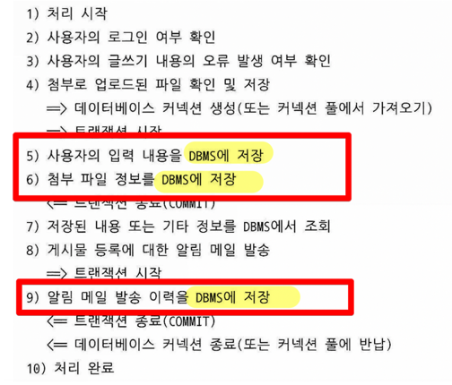
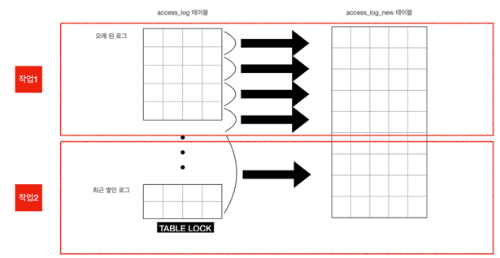

## 트랜 잭션이란 ?
- 데이터 정합성을 보장하는 기능
  - 정합성: (서로 다른 커넥션에서) 데이터가 서로 일치하는 상태
- 작업의 완전성을 보장해 주는 기능
  - 작업의 완전성: 논리적인 작업을 모두 완벽하게 처리 or 처리 실패 시 모두 원 상태로 복구해서 부분 업데이트를 방지하는 기능

## 1. 트랜잭션의 ACID 특성
ACID는 데이터베이스에서 트랜잭션의 무결성을 보장하기 위해 꼭 필요한 4가지 요소를 의미한다.

### 1. Atomicity 원자성
작업의 일부만 적용되는(Partial update) 현상이 발생 하지 않고, 작업의 완전성을 보장해 주는 것
트랜잭션 내 여러 작업들은 하나의 작업처럼 동작한다. 하나라도 실패하면 전체가 다 실패한 결과를, 전체가 다 성공해야 트랜잭션이 성공한 결과를 내보내야 한다.
- ATM 현금 인출<br>
현금이 나왔는데 계좌 잔액에서 돈이 빠지지 않거나, 반대로 잔액이 줄었는데 현금이 안 나오면 안 되죠. 출금 전체 과정이 성공해야 하고, 실패하면 아무 일도 없던 것처럼 되돌려야 합니다.

### 2. Consistency 일관성
트랜잭션이 성공적으로 완료되면 일관적인 DB상태를 유지해야한다.
여기서 일관적인 DB상태란 무엇일까? 데이터가 제약조건들을 다 만족하면서 모순되지 않은 상태를 유지하고있는것을 말한다. 예를들어 내 계좌가 마이너스 잔액을 허용하지 않는다고 가정하면, 여기서 제약 조건은 "마이너스 잔액을 허용하지 않음"이 된다. 즉, 잔액은 0원 미만이 될수 없다. 만약 계좌 잔액이 200만원인데 결제 트랜잭션에서 400만원을 결제 한다면, 그 결제 트랜잭션은 제약조건을 위배하고 모순된 상황을 만들어 내므로 실패해야 할것이다.
- 도서관 대출<br>
책 1권만 있는 상황에서 동시에 두 명이 빌려갔다면 시스템이 잘못된 겁니다. 반드시 “빌린 사람 = 1명, 책 재고 = 0” 이런 식으로 규칙이 지켜져야 합니다.

### 3. Isolation 고립성
고립성은 동시 트랜잭션을 처리하는데 사용 됨.
동일한 테이블의 데이터를 수정하는 두 개의 트랜잭션이 동시에 발생하면 문제가 발생할 수 있기 때문에 하나의 트랜잭션이 수행되는 동안 다른 트랜잭션을 끼어들지 못하는 특성을 말한다.
- 식당 예약<br>
마지막 남은 자리 하나를 두 팀이 동시에 예약하려 하면, 실제론 한 팀만 성공해야 합니다. 겉보기에 “내가 예약하는 동안 다른 사람 예약이 섞이지 않는 것처럼” 보장되어야 한다.

### 4. Durability 지속성
트랜잭션이 정상적으로 완료되었다면 이 트랜잭션으로 인한 결과는 영구적으로 보존 되야 하는 특성을 말한다.

### 5. ACID 속성의 예시 - 쇼핑몰
#### 예시 1) 온라인 쇼핑몰
1. Atomicity (원자성, All or Nothing)
사용자가 결제를 진행할 때, 장바구니 → 결제 승인 → 재고 차감 → 주문 생성 단계가 모두 완료되어야 주문이 성공.
<br>중간에 카드 승인 실패나 네트워크 오류가 발생하면, 전체 주문이 취소되고 처음 상태(결제 전, 재고 원복)로 되돌아감.

2. Consistency (일관성)<br>
재고가 10개인 상품은 판매가 진행될 때마다 정확히 차감되어야 함.<br>
10개를 팔았는데 DB에 여전히 10개로 남아 있다면 불일치.

따라서 “주문 수량 + 잔여 재고 = 원래 재고”라는 규칙이 항상 유지되어야 함.

3. Isolation (고립성)<br>
같은 상품의 재고가 1개 남았을 때, A와 B가 동시에 결제 요청을 보내더라도 실제로는 한 명만 성공해야 함.<br>
각 사용자는 자신의 주문이 독립적으로 처리되는 것처럼 보아야 하며, 서로의 트랜잭션이 중간에 끼어들면 안 됨.

4. Durability (지속성)<br>
고객이 “주문 완료” 메시지를 받았다면, 서버가 꺼지거나 장애가 나더라도 DB에 주문 내역과 결제 내역이 반드시 저장되어야 함.
나중에 고객센터에서 주문 조회했을 때 기록이 없어지는 일은 없어야 함.

#### 예시 2) 쿠팡과 같은 예약구매 사이트에서 새로 출시한 아이폰을 사는 과정을 생각해보면

- 사용자가 결제와 함께 전체 결제 프로세스를 모두 완료한 경우에만 주문이 성공한 것으로 간주되야 한다. 만약 프로세스 중 하나라도 실패하게 된다면 전체 결제 과정이 실패한 것으로 생각하고 처음으로 되돌아 가야한다. (Atomicity, 원자성)<br>
- 사용자가 아이폰의 예약 주문을 성공적으로 완료하면 웹사이트에서는 잔여 수량이 1개 줄어야 한다. 만약 안 줄고 그대로면 일관성이 없어진것으로 볼 수 있다. (Consistency, 일관성)<br>
- 구매 가능 수량이 1개 남은 시점에서 동시에 2명의 유저가 동시에 결제를 한다고해도 1명의 유저만 결제를 성공해야 하고 나머지 1명은 결제를 실패해야 한다.(Isolation, 고립성)<br>
- 만약 사용자가 아이폰을 구매하던 중 오류로 인해 트랜잭션이 실패되면 아이폰 구매를 시도하기 전 상태의 데이터로 돌아가야 한다. (Durability, 지속성)<br>

## 2. MySQL에서의 트랜잭션
하나의 쿼리에도 트랜잭션을 적용하는게 의미가 있을까?<br>
트랜잭션은 꼭 여러개의 변경 작업을 수행하는 쿼리가 조합됐을때만 의미 있는 것은 아니다.<br> 트랜잭션은 쿼리가 하나든, 두개 이상이든 상관없이 작업이 100% 적용되거나 아무것도 적용되지 않아야 하는것을 보장해주는것이다.
<br>부분 업데이트의 예시 MyISAM vs INNODB<br>
MyISAM : partial update 문제 발생 🫨
```sql
mysql> CREATE TABLE tab_myisam ( fdpk INT NOT NULL, PRIMARY KEY (fdpk) ) ENGINE=MyISAM;
mysql> INSERT INTO tab_myisam (fdpk) VALUES (3);

mysql> INSERT INTO tab_myisam (fdpk) VALUES (1),(2),(3);
ERROR 1062 (23000): Duplicate entry '3' for key 'tab_myisam.PRIMARY'

mysql> SELECT * FROM tab_myisam;
+------+
| fdpk |
+------+
|    1 |
|    2 |
|    3 |
+------+
3 rows in set (0.00 sec)
```
INNODB : partial update 문제 발생하지 않는다.
```sql
mysql> CREATE TABLE tab_innodb ( fdpk INT NOT NULL, PRIMARY KEY (fdpk) ) ENGINE=INNODB;
mysql> INSERT INTO tab_innodb (fdpk) VALUES (3);

mysql> INSERT INTO tab_innodb (fdpk) VALUES (1),(2),(3);
ERROR 1062 (23000): Duplicate entry '3' for key 'tab_innodb.PRIMARY'

mysql> SELECT * FROM tab_innodb;
+------+
| fdpk |
+------+
|    3 |
+------+
1 row in set (0.01 sec)
```
부분 업데이트가 발생하면, 실패한 쿼리로 인해 남은 레코드를 다시 삭제하는 재처리 작업이 필요할 수 있는데, INNODB에서는 트랜잭션이 지원되기 때문에 이러한 부분이 방지되는 이점이 있다.

## 3. 트랜잭션의 적절한 범위
트랜잭션의 경우 꼭 필요한 최소한의 코드에만 적용하는 것이 좋다.<br>
데이터베이스의 커넥션 갯수가 제한적이기 때문이다. 각 프로그램이 커넥션을 소유하는 시간이 길어질 수 록 사용가능한 여유 커넥션의 갯수가 줄어들어 어느 순간에는 각 프로그램에서 커넥션을 가져가기 위해 기다려야 하는 상황이 발생 할 수 있기 때문이다.



 
-  단순 확인 및 조회 작업의 경우, 트랜잭션에 포함할 필요는 없다.<br>
-  작업의 성격이 다를 경우, 위와같이 다른 트랜잭션으로 분리하는 것이 좋다.
 

## 4. MySQL 엔진의 잠금
### 글로벌 락
한 세션에서 글로벌 락을 획득하면 다른 세션에서 SELECT를 제외한 대부분의 DDL 문장이나 DML 문장을 실행 하는 경우 글로벌 락이 해제될때까지 해당 문장이 대기 상태로 남는다.<br>
글로벌 락이 영향을 미치는 범위는 MySQL 서버 전체이기 때문에, 테이블이나 데이터베이스가 다르더라도 영향을 받는다.


### 🤔 그렇다면, 도대체 언제 사용해야 할까?
전체 데이터의 변경 작업을 멈추어야 할 경우에 적용할 수 있다.

그런데 InnoDB의 경우 트랜잭션을 지원하기 때문에 이렇게 전체 데이터의 변경 작업을 멈추어야 할 필요는 없다.<br>
글로벌 락은 전체 MySQL 서버에 큰 영향을 미치기 때문에 웹 서비스용으로 사용되는 MySQL 서버에서는 가급적 사용하지 않는 것이 좋다.

mysqldump를 사용해 백업을 수행한다면 사용하는 옵션에 따라 내부적으로 글로벌 락을 걸고 백업 작업을 수행할 수 있으므로, MySQL 서버에 어떤 잠금을 걸게 되는지 자세히 확인해보는것이 좋다.

cf. MySQL 8.0 버전 부터는 조금 더 가벼운 글로벌락인, 백업 락이 도입되었다.<br>
백업 락은 일반적인 테이블의 데이터 변경은 허용된다.<br>
일반적인 MySQL 서버 구성은 소스 서버(Source server)와 레플리카 서버(Replica server)로 구성되는데, 보통 백업 작업의 경우 레플리카 서버에서 실행한다. 이때 글로벌 락을 걸면 레플리카 서버에서 수행하는 복제 작업이 지연 될 수 있기 때문에 서비스에 문제가 생길 수 도 있다. 백업 락은 이러한 목적으로 도입되었다.<br>

### 테이블 락
개별 테이블 단위로 설정 되는 잠금

### 명시적 테이블 락
특별한 상황이 아니면 애플리케이션에서 사용할 필요가 거의 없다. 명시적으로 테이블을 잠그는 작업은 글로벌 락과 동일하게 온라인 작업에 상당한 영향을 미치기 때문이다.

```sql
// 테이블 락 획득
LOCK TABLES table_name [ READ | WRITE ];

// 테이블 락 반납
UNLOCK TABLES;
```

테이블 락을 걸면 다른 세션에서 테이블 락이 풀릴때까지 작업이 멈춘다.

테이블락을 해제 하는 순간, 다른 세션에서 멈춰있던 작업이 실행된다.

### 묵시적 테이블 락
MyISAM 이나 MEMORY에서는 테이블에 데이터를 변경하는 쿼리(DML)를 실행하면 자동으로 테이블에 락을 획득한다. 쿼리가 완료 된 후 획득한 테이블 락은 자동으로 반환된다.<br>
InnoDB의 경우, 레코드 기반의 잠금 을 제공하기 때문에 단순 데이터 변경 쿼리(DML)로 인해 테이블 자체에 락을 획득 하지는 않고, 스키마를 변경하는 쿼리(DDL) 의 경우에만 테이블 락이 설정 된다.

### 네임드 락
테이블이나 레코드가 아닌 사용자가 지정한 문자열에 대해 잠금을 설정 할 수 있다.<br>
네임드 락은 자주 사용되지는 않지만, 데이터베이스 서버 1대에 5대의 웹서버가 접속해서 서비스 해야 하는 상황에서 배치 프로그램 처럼 한꺼번에 많은 레코드를 변경하는 경우에 사용될 수 있다.<br>
위와 같이 여러 서비스가 접속해 있는 상황에서 한꺼번에 많은 데이터를 수정하는 경우, 데드락의 원인이 되곤하는데 이때 동일한 데이터를 변경하거나 참조하는 프로그램끼리 분류해서 네임드 락을 걸고 쿼리를 수행하면 데드락과 같은 상황이 발생하는 것을 막을 수 있다.

```sql
// 네임드락 획득 : 2초간 mylock이라는 락을 생성 - 성공 일 경우 1을 반환, 아닐 경우 0 이나 NULL 반환
SELECT GET_LOCK('mylock', 2); 

// 네임드락 상태 확인
SELECT IS_FREE_LOCK('mylock');

// 네임드락 반환
SELECT RELEASE_LOCK('mylock');
```

하나의 세션에서 네임드 락을 획득 하면,<br>
다른 세션에서도 동일한 문자열의 네임드 락을 획득한 후 사용하는 작업의 경우 멈춤이 발생한다.<br>
MySQL 8.0 버전 부터는 네임드 락을 중첩해서 사용할 수 있게 되었다.
```sql
SELECT GET_LOCK('user_define_lock1', 10);

// -> 여기에서 user_define_lock1에 대한 작업들 수행

SELECT GET_LOCK('user_define_lock2', 10);

// -> 여기에서는 user_define_lock2에 대한 작업들 수행

SELECT RELEASE_LOCK('user_define_lock2'); // user_define_lock2 반납
SELECT RELEASE_LOCK('user_define_lock2'); // user_define_lock1 반납

혹은

SELECT RELEASE_ALL_LOCKS(); // 전체 네임드락 반납
```
 

### 메타데이터 락
테이블이나 뷰의 이름, 구조 등을 변경 하는 경우에 자동으로 획득 하는 잠금

### RENAME TABLE 시 `Table not found` 오류 방지 방법
RENAME TABLE로 테이블 이름을 변경 하는 경우, 원본 이름과 변경될 이름 두개 모두 한꺼번에 잠금을 설정한다.<br>
임시로 사용하던 테이블을 실제 운영 테이블로 사용하려는 경우, 아래와 같이 RENAME TABLE 명령 2개를 사용하면 아주 짧은 시간이지만 rank 테이블이 존재하지 않는 순간이 생기게 되고 그때 Table not found 오류가 발생 될 수 있다.<br>
```sql
RENAME TABLE rank to rank_backup;
RENAME TABLE rank_new to rank;
```
아래와 같이 하나의 RENAME TABLE 명령문에 두개의 작업을 한꺼번에 실행하면 Table not found 상황을 발생 시키지 않을 수 있다.
```sql
RENAME TABLE rank_new to rank, rank_new to rank;
```
#### 로그 테이블 구조 변경 하기 : 테이블 락과 메타데이터 락을 함께 사용하는 케이스
로그 테이블과 같이 UPDATE, DELETE가 없이 INSERT만 있는 테이블의 구조를 변경하는 경우 다음과 같은 방법들을 생각할 수 있다.
 

### 1. DDL로 구조 변경하기

DDL은 단일 스레드로 작동하기 때문에 상당히 많은 시간이 소요 될 수 있다. 시간이 너무 오래 걸리는 경우 언두 로그도 함께 증가하게 되고 이에 따라 MySQL 서버의 성능이 저하 될 수 있다.
 

### 2. 새로운 구조의 임시 테이블 만들어서 복사하는 방법

새로운 구조의 임시 테이블 생성하고 최근 데이터까지는 PK 범위별로 나누어 멀티 쓰레드로 빠르게 복사한다. (아래 그림에서 작업1)
나머지 데이터의 경우 테이블에 락을 걸고 복사 작업 수행, 복사 작업 수행 후 임시 테이블을 실제 운용 테이블로 이름 바꾼다.(아래 그림에서 작업2)
이때 작업2에서 테이블락과 메타데이터락이 함께 사용 된다.

 
새로운 구조의 테이블 생성
```sql
CREATE TABLE access_log_new (
	id BIGINT NOT NULL AUTO_INCREMENT,
	client_ip INT UNSIGNED,
	access_dttm TIMESTAMP,
	...
	PRIMARY KEY(id)
) KEY_BLOCK_SIZE=4;
```

*위의 KEY_BLOCK_SIZE=4 의 경우, 테이블 압축을 사용하겠다는 것인데 6장에서 자세하게 다룬다.<br>
작업1 : 오래 된 로그 새 테이블로 복사하기<br>
PK 기준으로 10000개씩 짤라서 멀티 쓰레드로 동시에 복사 작업 수행
```sql
mysql_thread1> INSERT INTO access_log_new SELECT * FROM access_log WHERE id>=0 AND id<10000;
mysql_thread1> INSERT INTO access_log_new SELECT * FROM access_log WHERE id>=10000 AND id<20000;
mysql_thread1> INSERT INTO access_log_new SELECT * FROM access_log WHERE id>=20000 AND id<30000;
mysql_thread1> INSERT INTO access_log_new SELECT * FROM access_log WHERE id>=30000 AND id<40000;
```

작업2 : 남은 데이터 복사하기<br>
복사하는 도중 새로운 로그가 INSERT된다면 문제가 될 수 있다.<br> 이를 막기 위해 테이블 잠금을 설정하고 작업을 수행한다. 테이블 잠금으로 인해 복사하는 동안 새로운 로그가 INSERT 될 수 없게 된다.
최대한 작업1에서 최근 데이터까지 미리 복사해 두어야 잠금 시간을 최소화해서 서비스에 미치는 영향을 줄일 수 있다.
```sql
SET autocommit=0; 

LOCK TABLES access_log WRITE, access_log_new WRITE;

SELECT MAX(id) as @MAX_ID FROM access_log_new;
INSERT INTO access_log_new SELECT * FROM access_log WHERE pk>@MAX_ID;
COMMIT;

RENAME TABLE access_log TO access_log_old, access_log_new TO access_log;
UNLOCK TABLES;

DROP TABLE access_log_old;
```
 
## 5. InnoDB 스토리지 엔진의 잠금
InnoDB 스토리지 엔진에서는 잠금 정보가 상당히 적은 공간으로 관리되는 레코드 기반의 잠금 기능을 제공하기 때문에 레코드락이 페이지락, 테이블 락으로 레벨업 되는 락 에스컬레이션이 없다.
 


### 레코드 락
레코드 자체만을 잠그는 것<br>
InnoDB 스토리지 엔진은 레코드 자체가 아니라 사실은 인덱스의 레코드를 잠근다.<br>
인덱스가 하나도 없는 테이블이라도 내부적으로는 클러스터 인덱스를 생성해 가지고 있기 때문에 그 클러스터 인덱스를 이용해 잠금을 설정한다.

#### 레코드 자체를 잠그느냐, 아니면 인덱스를 잠그느냐 에서 오는 중요한 차이가 있다.<br>
업데이트 시 Where 절에 있는 컬럼 중 인덱스를 가지고 있는 컬럼의 인덱스 자체에 락을 걸어버리기 때문에 레코드 1개를 업데이트 하는 경우라도, 여러 레코드에 잠금이 걸릴 수 있다.<br>
first_name 에만 인덱스가 지정되어 있는 employees 테이블에서 다음과 같이 하나의 row를 업데이트 하는 상황을 예를 들어보면<br>
```sql
SELECT COUNT(*) FROM employees WHERE first_name='Georgi' AND last_name='Klassen';
```
`first_name='Georgi' AND last_name='Klassen'` 인 하나의 row만 업데이트를 함에도 불구하고, InnoDB는 first_name 인덱스 자체에 락을 걸기 때문에, 인덱스 테이블 상에 first_name='Georgi' 인 모든 레코드에 락을 걸어버린다.

업데이트 시, 위와 같이 적절히 인덱스가 설정 되어있지 않으면 이렇게 잠금의 범위가 커져서 동시성이 상당히 떨어 질 수 있다.

#### 그렇다면, 테이블에 인덱스가 하나도 없으면 어떻게 될까?
테이블을 풀스캔 하면서 UPDATE 작업을 하는데, 이 과정에서 테이블에 있는 모든 레코드를 잠궈버리게 된다.<br>
그래서 UPDATE 와 같이 잠금이 걸리는 작업 같은 경우, 잠금의 범위를 최소화 하도록 인덱스 설계를 잘 하는것이 중요하다.

<br><br><br><br>


참고 및 이미지 출처 : https://neverfadeaway.tistory.com/62